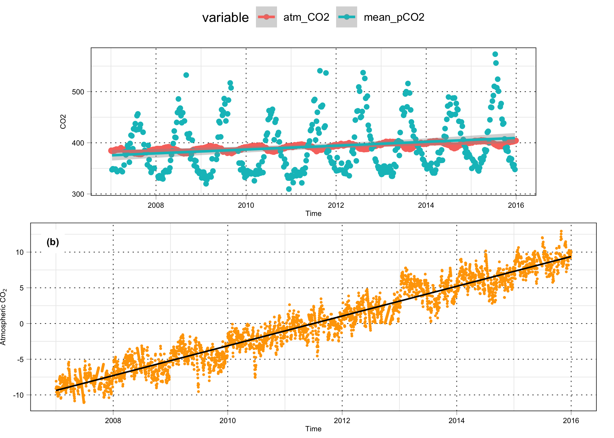

```{r setup, include=FALSE}
rm(list = ls())
require(tidyverse)
require(readxl)
require(pander)
require(seacarb)
library(cowplot)
library(scales)
library(RColorBrewer)
library(gridExtra)
library(reshape2)
library(xtable)
library(zoo)
library(lubridate)
library(nlme)
library(lmtest)
library(readr)
library(dygraphs)
library(grid)
library(viridis)
library(animation)
library(directlabels)
library(tibble)
library(xts)
require("knitr")
library(broom)
library("lmodel2") # modele II regression
#library(plyr)
library(pander)

#define who is the user and define path
if (Sys.getenv("LOGNAME") == "gattuso") {
  path = "../../pCloud\ Sync/Documents/experiments/exp153_carbonates_point_B/"
  path_sami = "../../pCloud\ Sync/Documents/experiments/exp176_sami/sami_data/sami_raw_export/Data_deployment/EOL/"
}
if (Sys.getenv("LOGNAME") == "samir") {
  path = "../../pCloud Sync/exp153_carbonates_point_B/"
  path_sami = "../../pCloud\ Sync/exp176_sami/sami_data/sami_raw_export/Data_deployment/EOL/"
}

Sys.setenv(TZ='UTC')
dc1 <- "#482173FF" #discrete color 1
dc2 <- "#51C56AFF" #discrete color 2: 
dc3 <- "#482173FF" #discrete color 1
dc4 <- "#51C56AFF" #discrete color 2: 

#################### Regression function 
####
# function regression plot with model II equation (MA) in title
## Dans labs ajout de la variable TITRE pour mettre titre avant chaque graphe
ggreg2 <- function (fit, xdata, ydata) { # x and y are the names of the variables
  fit_data <- data.frame(fit$x, fit$y)
  colnames(fit_data) = c(xdata, ydata)
reg <- fit$regression.results[2,] #one selects MA only
intercept <- reg$Intercept
slope <- reg$Slope
  ggplot(data = fit_data, aes_string(x = xdata, y = ydata)) + 
  geom_point(size = 2, col = "blue") +
  geom_abline(aes(intercept = fit$regression.results[2,2], slope = fit$regression.results[2,3]),
              colour = "blue")  + 
  labs(title = paste(titre,"\n Adj R2 = ", signif(fit$rsquare, 3),
                     "; Intercept =", signif(intercept, 3),
                     "; Slope =", signif(slope, 3),
                     "; P =", signif(fit$P.param, 3)))
}

size_labs <- 3
face_font <- "plain"

Mytheme <- function(size_labs = 3, face_font="plain", ...) {
  theme_bw() +
  theme(axis.text.x = element_text(face=face_font, size=size_labs, color="black"),
        axis.title.x = element_text(face=face_font, size=size_labs, margin=margin(0,0,0,0,"pt")),
        axis.text.y = element_text(face=face_font, color="black", size=size_labs),
        axis.title.y = element_text(face=face_font, size=size_labs),
        axis.ticks.x = element_line(size=0.1),
        axis.ticks.y = element_line(size=0.1),
        axis.ticks.length = unit(1.1, "mm"),
        panel.grid.major = element_line(size = 0.25, color="black", linetype="dotted"),
        aspect.ratio = 1 / 3,
        plot.margin = margin(t = 0, r = 1, b = 0, l = 0, unit = "lines")
  )
}

Mytheme_facet <- function(size_labs = 3, face_font="plain") {
  theme_bw() +
  theme(axis.text.x = element_text(face=face_font, size=size_labs, color="black"),
        axis.title.x = element_text(face=face_font, size=size_labs, margin=margin(0,0,0,0,"pt")),
        axis.text.y = element_text(face=face_font, color="black", size=size_labs),
        axis.title.y = element_text(face=face_font, size=size_labs),
        axis.ticks.x = element_line(size=0.1),
        axis.ticks.y = element_line(size=0.1),
        axis.ticks.length = unit(1.1, "mm"),
        panel.grid.major = element_blank(),
        panel.grid.minor = element_blank(),
        aspect.ratio = 1,
        plot.margin = margin(t = 0, r = 1, b = 0, l = 0, unit = "lines")
  )
}
# to add panel numbers at top left 
size_grob <- 8
grob_A <- grobTree(rectGrob(x=0.04, y=0.90, width=0.04, height=0.12,
                            default.units="npc",
                            just=c("centre", "centre"),
                            gp=gpar(col="white", fill="white"),
                            vp=NULL),
                   textGrob("(a)",x=0.04, y=0.90, 
                            just=c("centre", "centre"),
                            gp=gpar(col="black",
                                    fontsize=size_grob,
                                    fontface="bold")))
grob_B <- grobTree(rectGrob(x=0.04, y=0.90, width=0.04, height=0.12,
                            default.units="npc",
                            just=c("centre", "centre"),
                            gp=gpar(col="white", fill="white"),
                            vp=NULL),
                   textGrob("(b)",x=0.04, y=0.90, 
                            just=c("centre", "centre"),
                            gp=gpar(col="black",
                                    fontsize=size_grob,
                                    fontface="bold")))
grob_C <- grobTree(rectGrob(x=0.04, y=0.90, width=0.04, height=0.12,
                            default.units="npc",
                            just=c("centre", "centre"),
                            gp=gpar(col="white", fill="white"),
                            vp=NULL),
                   textGrob("(c)",x=0.04, y=0.90, 
                            just=c("centre", "centre"),
                            gp=gpar(col="black",
                                    fontsize=size_grob,
                                    fontface="bold")))
grob_D <- grobTree(rectGrob(x=0.04, y=0.90, width=0.04, height=0.12,
                            default.units="npc",
                            just=c("centre", "centre"),
                            gp=gpar(col="white", fill="white"),
                            vp=NULL),
                   textGrob("(d)",x=0.04, y=0.90, 
                            just=c("centre", "centre"),
                            gp=gpar(col="black",
                                    fontsize=size_grob,
                                    fontface="bold")))
grob_E <- grobTree(rectGrob(x=0.04, y=0.90, width=0.04, height=0.12,
                            default.units="npc",
                            just=c("centre", "centre"),
                            gp=gpar(col="white", fill="white"),
                            vp=NULL),
                   textGrob("(e)",x=0.04, y=0.90, 
                            just=c("centre", "centre"),
                            gp=gpar(col="black",
                                    fontsize=size_grob,
                                    fontface="bold")))
grob_F <- grobTree(rectGrob(x=0.04, y=0.90, width=0.04, height=0.12,
                            default.units="npc",
                            just=c("centre", "centre"),
                            gp=gpar(col="white", fill="white"),
                            vp=NULL),
                   textGrob("(f)",x=0.04, y=0.90, 
                            just=c("centre", "centre"),
                            gp=gpar(col="black",
                                    fontsize=size_grob,
                                    fontface="bold")))
grob_G <- grobTree(rectGrob(x=0.04, y=0.90, width=0.04, height=0.12,
                            default.units="npc",
                            just=c("centre", "centre"),
                            gp=gpar(col="white", fill="white"),
                            vp=NULL),
                   textGrob("(g)",x=0.04, y=0.90, 
                            just=c("centre", "centre"),
                            gp=gpar(col="black",
                                    fontsize=size_grob,
                                    fontface="bold")))
grob_H <- grobTree(rectGrob(x=0.04, y=0.90, width=0.04, height=0.12,
                            default.units="npc",
                            just=c("centre", "centre"),
                            gp=gpar(col="white", fill="white"),
                            vp=NULL),
                   textGrob("(h)",x=0.04, y=0.90, 
                            just=c("centre", "centre"),
                            gp=gpar(col="black",
                                    fontsize=size_grob,
                                    fontface="bold")))
grob_I <- grobTree(rectGrob(x=0.04, y=0.90, width=0.04, height=0.12,
                            default.units="npc",
                            just=c("centre", "centre"),
                            gp=gpar(col="white", fill="white"),
                            vp=NULL),
                   textGrob("(i)",x=0.04, y=0.90, 
                            just=c("centre", "centre"),
                            gp=gpar(col="black",
                                    fontsize=size_grob,
                                    fontface="bold")))
grob_J <- grobTree(rectGrob(x=0.04, y=0.90, width=0.04, height=0.12,
                            default.units="npc",
                            just=c("centre", "centre"),
                            gp=gpar(col="white", fill="white"),
                            vp=NULL),
                   textGrob("(j)",x=0.04, y=0.90, 
                            just=c("centre", "centre"),
                            gp=gpar(col="black",
                                    fontsize=size_grob,
                                    fontface="bold")))
grob_K <- grobTree(rectGrob(x=0.04, y=0.90, width=0.04, height=0.12,
                            default.units="npc",
                            just=c("centre", "centre"),
                            gp=gpar(col="white", fill="white"),
                            vp=NULL),
                   textGrob("(k)",x=0.04, y=0.90, 
                            just=c("centre", "centre"),
                            gp=gpar(col="black",
                                    fontsize=size_grob,
                                    fontface="bold")))
grob_L <- grobTree(rectGrob(x=0.04, y=0.90, width=0.04, height=0.12,
                            default.units="npc",
                            just=c("centre", "centre"),
                            gp=gpar(col="white", fill="white"),
                            vp=NULL),
                   textGrob("(l)",x=0.04, y=0.90, 
                            just=c("centre", "centre"),
                            gp=gpar(col="black",
                                    fontsize=size_grob,
                                    fontface="bold")))
grob_M <- grobTree(rectGrob(x=0.04, y=0.90, width=0.04, height=0.12,
                            default.units="npc",
                            just=c("centre", "centre"),
                            gp=gpar(col="white", fill="white"),
                            vp=NULL),
                   textGrob("(m)",x=0.04, y=0.90, 
                            just=c("centre", "centre"),
                            gp=gpar(col="black",
                                    fontsize=size_grob,
                                    fontface="bold")))
grob_N <- grobTree(rectGrob(x=0.04, y=0.90, width=0.04, height=0.12,
                            default.units="npc",
                            just=c("centre", "centre"),
                            gp=gpar(col="white", fill="white"),
                            vp=NULL),
                   textGrob("(n)",x=0.04, y=0.90, 
                            just=c("centre", "centre"),
                            gp=gpar(col="black",
                                    fontsize=size_grob,
                                    fontface="bold")))

# to add panel numbers at bottom left 
size_grob <- 9
grob_A_bl <- grobTree(rectGrob(x=0.04, y=0.1, width=0.04, height=0.12,
                            default.units="npc",
                            just=c("centre", "centre"),
                            gp=gpar(col="white", fill="white"),
                            vp=NULL),
                   textGrob("(a)",x=0.04, y=0.1, 
                            just=c("centre", "centre"),
                            gp=gpar(col="black",
                                    fontsize=size_grob,
                                    fontface="bold")))
grob_B_bl <- grobTree(rectGrob(x=0.04, y=0.1, width=0.04, height=0.12,
                            default.units="npc",
                            just=c("centre", "centre"),
                            gp=gpar(col="white", fill="white"),
                            vp=NULL),
                   textGrob("(b)",x=0.04, y=0.1, 
                            just=c("centre", "centre"),
                            gp=gpar(col="black",
                                    fontsize=size_grob,
                                    fontface="bold")))
grob_C_bl <- grobTree(rectGrob(x=0.04, y=0.1, width=0.04, height=0.12,
                            default.units="npc",
                            just=c("centre", "centre"),
                            gp=gpar(col="white", fill="white"),
                            vp=NULL),
                   textGrob("(c)",x=0.04, y=0.1, 
                            just=c("centre", "centre"),
                            gp=gpar(col="black",
                                    fontsize=size_grob,
                                    fontface="bold")))
grob_D_bl <- grobTree(rectGrob(x=0.04, y=0.1, width=0.04, height=0.12,
                            default.units="npc",
                            just=c("centre", "centre"),
                            gp=gpar(col="white", fill="white"),
                            vp=NULL),
                   textGrob("(d)",x=0.04, y=0.1, 
                            just=c("centre", "centre"),
                            gp=gpar(col="black",
                                    fontsize=size_grob,
                                    fontface="bold")))
grob_E_bl <- grobTree(rectGrob(x=0.04, y=0.1, width=0.04, height=0.12,
                            default.units="npc",
                            just=c("centre", "centre"),
                            gp=gpar(col="white", fill="white"),
                            vp=NULL),
                   textGrob("(e)",x=0.04, y=0.1, 
                            just=c("centre", "centre"),
                            gp=gpar(col="black",
                                    fontsize=size_grob,
                                    fontface="bold")))
grob_F_bl <- grobTree(rectGrob(x=0.04, y=0.1, width=0.04, height=0.12,
                            default.units="npc",
                            just=c("centre", "centre"),
                            gp=gpar(col="white", fill="white"),
                            vp=NULL),
                   textGrob("(f)",x=0.04, y=0.1, 
                            just=c("centre", "centre"),
                            gp=gpar(col="black",
                                    fontsize=size_grob,
                                    fontface="bold")))
grob_G_bl <- grobTree(rectGrob(x=0.04, y=0.1, width=0.04, height=0.12,
                            default.units="npc",
                            just=c("centre", "centre"),
                            gp=gpar(col="white", fill="white"),
                            vp=NULL),
                   textGrob("(g)",x=0.04, y=0.1, 
                            just=c("centre", "centre"),
                            gp=gpar(col="black",
                                    fontsize=size_grob,
                                    fontface="bold")))
grob_H_bl <- grobTree(rectGrob(x=0.04, y=0.1, width=0.04, height=0.12,
                            default.units="npc",
                            just=c("centre", "centre"),
                            gp=gpar(col="white", fill="white"),
                            vp=NULL),
                   textGrob("(h)",x=0.04, y=0.1, 
                            just=c("centre", "centre"),
                            gp=gpar(col="black",
                                    fontsize=size_grob,
                                    fontface="bold")))
grob_I_bl <- grobTree(rectGrob(x=0.04, y=0.1, width=0.04, height=0.12,
                            default.units="npc",
                            just=c("centre", "centre"),
                            gp=gpar(col="white", fill="white"),
                            vp=NULL),
                   textGrob("(i)",x=0.04, y=0.1, 
                            just=c("centre", "centre"),
                            gp=gpar(col="black",
                                    fontsize=size_grob,
                                    fontface="bold")))
grob_J_bl <-grobTree(rectGrob(x=0.04, y=0.1, width=0.04, height=0.12,
                            default.units="npc",
                            just=c("centre", "centre"),
                            gp=gpar(col="white", fill="white"),
                            vp=NULL),
                   textGrob("(j)",x=0.04, y=0.1, 
                            just=c("centre", "centre"),
                            gp=gpar(col="black",
                                    fontsize=size_grob,
                                    fontface="bold")))
grob_K_bl <- grobTree(rectGrob(x=0.04, y=0.1, width=0.04, height=0.12,
                            default.units="npc",
                            just=c("centre", "centre"),
                            gp=gpar(col="white", fill="white"),
                            vp=NULL),
                   textGrob("(k)",x=0.04, y=0.1, 
                            just=c("centre", "centre"),
                            gp=gpar(col="black",
                                    fontsize=size_grob,
                                    fontface="bold")))
grob_L_bl <- grobTree(rectGrob(x=0.04, y=0.1, width=0.04, height=0.12,
                            default.units="npc",
                            just=c("centre", "centre"),
                            gp=gpar(col="white", fill="white"),
                            vp=NULL),
                   textGrob("(l)",x=0.04, y=0.1, 
                            just=c("centre", "centre"),
                            gp=gpar(col="black",
                                    fontsize=size_grob,
                                    fontface="bold")))
grob_M_bl <- grobTree(rectGrob(x=0.04, y=0.1, width=0.04, height=0.12,
                            default.units="npc",
                            just=c("centre", "centre"),
                            gp=gpar(col="white", fill="white"),
                            vp=NULL),
                   textGrob("(m)",x=0.04, y=0.1, 
                            just=c("centre", "centre"),
                            gp=gpar(col="black",
                                    fontsize=size_grob,
                                    fontface="bold")))
grob_N_bl <- grobTree(rectGrob(x=0.04, y=0.1, width=0.04, height=0.12,
                            default.units="npc",
                            just=c("centre", "centre"),
                            gp=gpar(col="white", fill="white"),
                            vp=NULL),
                   textGrob("(n)",x=0.04, y=0.1, 
                            just=c("centre", "centre"),
                            gp=gpar(col="black",
                                    fontsize=size_grob,
                                    fontface="bold")))
######## To add regression line on ggplots
# use as annotate(aes(x = 25, y = 300, label = lm_eqn(lm(y ~ x, df))), parse = TRUE)
# http://stackoverflow.com/questions/7549694/ggplot2-adding-regression-line-equation-and-r2-on-graph
lm_eqn = function(m) {
  l <- list(a = format(coef(m)[1], digits = 2),
      b = format(abs(coef(m)[2]), digits = 2),
      r2 = format(summary(m)$r.squared, digits = 3));
  if (coef(m)[2] >= 0)  {
    eq <- substitute(italic(y) == a + b %.% italic(x)*","~~italic(r)^2~"="~r2,l)
  } else {
    eq <- substitute(italic(y) == a - b %.% italic(x)*","~~italic(r)^2~"="~r2,l)    
  }
  as.character(as.expression(eq));                 
}

######## function to make regression plot with model I equation in title
ggreg <- function (fit, point_size=2) {
  ggplot(fit$model, aes_string(x = names(fit$model)[2],
                               y = names(fit$model)[1])) +
    geom_point(size = point_size, col = "blue") +
    stat_smooth(method = "lm", col = "black") +
    labs(title = paste(title, "\nAdj R2 = ",signif(summary(fit)$adj.r.squared, 5),
                       "; Intercept =",signif(fit$coef[[1]],5 ),
                       "; Slope =",signif(fit$coef[[2]], 5),
                       "; P =",signif(summary(fit)$coef[2,4], 5))) +
    theme(plot.title = element_text(size=7))
}

########### Regression function 
####
# function regression plot with model II equation (MA) in title
## Dans labs ajout de la variable TITRE pour mettre titre avant chaque graphe
ggreg2 <- function (fit, xdata, ydata) { # x and y are the names of the variables
  fit_data <- data.frame(fit$x, fit$y)
  colnames(fit_data) = c(xdata, ydata)
reg <- fit$regression.results[2,] #one selects MA only
intercept <- reg$Intercept
slope <- reg$Slope
  ggplot(data = fit_data, aes_string(x = xdata, y = ydata)) + 
  geom_point(size = 3, col = "blue") +
  geom_abline(aes(intercept = fit$regression.results[2,2], slope = fit$regression.results[2,3]),
              colour = "blue")  + 
  labs(title = paste(titre,"\n Adj R2 = ", signif(fit$rsquare, 3),
                     "; Intercept =", signif(intercept, 3),
                     "; Slope =", signif(slope, 3),
                     "; P =", signif(fit$P.param, 3)))
}

mytheme <- theme_bw() +
  theme(axis.text.x=element_text(size=16, color="black"),
        axis.title.x=element_text(face="bold", size=16),
        axis.text.y=element_text(size=16, color="black"),
        axis.title.y=element_text(face="bold", size=16),
        plot.title = element_text(face="bold", size=14)
)
```

```{r test regression, include=FALSE}
# This is to test linear regressions with dates
# Conclusion is that the slope is per day but I have decided to use decimal_date() to avoid any confusion
dt <- as_date(c("1916-06-16", "2016-06-15"))
temp <- c(20, 21)
dat <- data.frame(dt, temp)
reg <- lm(data=dat,temp ~ dt)
slope <- 365*coef(reg)[2]
```

# {.tabset .tabset-fade .tabset-pills}

## Material and methods

Samples were collected from XX-l Niskin bottles, transferred to glass bottles, overfilled and then poisoned to maintain the integrity of the sample chemistry as recommended by Dickson et al. (2007).  The _Service National d'Analyse des Paramètres Océaniques du CO$_2$_, at the _Université Pierre et Marie Curie_, determined the concentration of dissolved inorganic carbon ($C_\mathrm{T}$) and total alkalinity ($A_\mathrm{T}$), by potentiometric titration, following the methods described by (Edmond1970) and (DOE1994).

Calculations of the carbonate system parameters were performed using the R package \emph{seacarb} (Lavigne2014). The total concentrations of silicate and phosphate were used when available. Otherwise they were set to 0. The total boron concentration was calculated using the formulation of (Lee2010b). The following constants were used: $K_1$ and $K_2$ from (Lueker2000, $K_f$ from (Perez1987b) and $K_s$ from (Dickson1990).

### Data available and quality control
All data are used in the following; none were eliminated according to the quality flags (\textbf{this remains to be done}).

#### Les codes du SNAPOCO2

Les "quality flags" "qflag\_sample", "qflag\_ta", "qflag\_DIC" qui apparaissent dans les fichiers de données du LOCEAN sont établis sur la base des codes WOCE (World Ocean Circulation Experiment) : WOCE Operations Manual (1994), WHP Office Report 90-1, WOCE Report N.67/91, p52-53. Woods Hole, Mass., USA.

- Données AT et CT et water sample quality flag : (i.e pour les étapes : "qflag\_ta"et "qflag\_DIC")
  - flag 0 : Dosage avorté (échantillon perdu),
	- flag 2 : dosage correct,
	- flag 3 : dosage douteux

- Codification quality flag réception flacon : (i.e pour l'étape : "qflag\_sample")
	- A : OK;
	- B : mal rempli;
	- C : flacon cassé;
	- D : bouchon cassé;
	- E : dépôt, particule dans le flacon;
	- F : sel au goulot;
	- G : manque de graisse au goulot;
	- H : pas d'élastique.


#### Les codes de Villefranche (inspirés des codes SOMLIT)

- Codification qflag\_taking concernant le prélèvement des échantillons en mer : (i.e pour l'étape : "qflag\_taking")
	- 0 : ancien code qui signifie OK
	- 2 : nouveau code qui signifie OK
	- 3 : prélèvement douteux
	- 4 : prélèvement mauvais

- Codification qflag\_final, qui correspond au code "final" des résultats TA et DIC (i.e pour l'étape : "qflag\_final"). Comme TA et DIC sont déterminés par la même titration, qflag\_ta et qflag\_DIC devrait être identiques. Ce n'est pas le cas en décembre 2009 où il manque des qflag\_DIC. On a alors considéré que qflag\_final = qflag\_ta.

	- 0 : Dosage avorté (échantillon perdu)
	- 2 : résultat OK
	- 3 : résultat douteux
	- 4 : résultat mauvais

## Point B

```{r read data in output_vlfrcc, include=FALSE}
dat_somlit <- readr::read_csv(file = "output_jp/data/output_vlfrcc.csv", col_names = TRUE, na = c("NA", "NaN"))

dat0m <- dplyr::filter(dat_somlit, depth==0)
dat50m <- dplyr::filter(dat_somlit, depth==50)
```

## **Atmospheric vs. Seawater pCO2**
```{r CO2, include=FALSE}
#read_csv(file=paste0(path,"/data/CO2_data_PlateauRosa_daily_1993-2015_R.csv"), col_names=TRUE, col_types = typ, skip=7)
#tidyr::unite(col="datetime", year, month, day, sep = "-" )%>%
#tidyr::unite(col="datetime", year, month, day, sep = "-" )%>%

typ <- c("cccccccdddddddddddddddddddd") # column type
CO2_pr <- tbl_df(
  read_csv(file=paste0(path,"/data/CO2_data_PlateauRosa_daily_1993-2018_R.txt"), comment="#", col_types = typ)) %>%
  tidyr::unite(col = date, year, month, day, sep = "-", remove = FALSE) %>% 
dplyr::rename(dt = date,
              atm_CO2 = value) %>%
  dplyr::mutate(dt = ymd(dt),
                year = year(dt)) %>%
  dplyr::filter(dt >= "2007-01-01")
NAs_by_year <- dplyr::summarise(dplyr::group_by(CO2_pr, year), NAs=sum(is.na(atm_CO2))) # N NAs per year
duration <- CO2_pr$dt[length(CO2_pr$dt)] - CO2_pr$dt[1]
CO2_pr_zoo <- zooreg(CO2_pr$atm_CO2, order.by=CO2_pr$dt) # create zoo time series
CO2_pr_zoo_i <- na.approx(CO2_pr_zoo) # interpolate NAs
CO2_pr_i <- tbl_df(fortify.zoo(CO2_pr_zoo_i)) %>% # change to df
  dplyr::rename(dt=Index, atm_CO2=CO2_pr_zoo_i) %>%
  dplyr::mutate(year=year(dt), monthd = month(dt), month = month(dt, label = TRUE, abbr = FALSE))
# # add seawater pCO2
# tmp <- dplyr::ungroup(dat0m) %>%
#   dplyr::select(sampling_date, mean_pCO2)
# tmp$dt <- as.Date(tmp$sampling_date)
# CO2_pr_i <- dplyr::left_join(CO2_pr_i, tmp)
# Calculate monthly means
tmp <- CO2_pr_i %>%
  dplyr::group_by(monthd) %>%
  dplyr::summarise(atm_CO2__month = mean(atm_CO2, na.rm = TRUE))

# Calculate anomalies
ano_atm_CO2 <- dplyr::left_join(ungroup(CO2_pr_i), tmp, by = "monthd") %>%
  dplyr::mutate(atm_CO2_ano = atm_CO2 - atm_CO2__month)

#regression atmospheric CO2
lms <- summary(lm(data = CO2_pr_i, atm_CO2 ~ decimal_date(dt)))
prob <- pf(lms$fstatistic[1],lms$fstatistic[2],lms$fstatistic[3],lower.tail=FALSE)
reg_atm_CO2 <- cbind(as.numeric(c(lms$coefficients[2,1], lms$coefficients[2,2],
                               lms$coefficients[2,4], lms$coefficients[1,1],
                          lms$coefficients[1,2],
                          lms$coefficients[1,4], lms$fstatistic[1], lms$fstatistic[3], lms$r.squared, prob)))
colnames(reg_atm_CO2) <- c("atm_CO2 interpolated")
row.names(reg_atm_CO2) <- c("Slope", "SE Slope", "P Slope","Intercept","SE int.","P int.", "F", "df",
                    "R2","P value")

#regression atmospheric CO2 anomalies
lms <- summary(lm(data = ano_atm_CO2, atm_CO2_ano ~ decimal_date(dt)))
prob <- pf(lms$fstatistic[1],lms$fstatistic[2],lms$fstatistic[3],lower.tail=FALSE)
reg_atm_CO2_ano <- cbind(as.numeric(c(lms$coefficients[2,1], lms$coefficients[2,2],
                               lms$coefficients[2,4], lms$coefficients[1,1],
                          lms$coefficients[1,2],
                          lms$coefficients[1,4], lms$fstatistic[1], lms$fstatistic[3], lms$r.squared, prob)))
colnames(reg_atm_CO2_ano) <- c("ano_atm_CO2")
row.names(reg_atm_CO2_ano) <- c("Slope", "SE Slope", "P Slope","Intercept","SE int.","P int.", "F", "df",
                    "R2","P value")
# bind the two regression tables
reg_atm_CO2 <- cbind(reg_atm_CO2, reg_atm_CO2_ano)

# plots CO2
# CO2_pr_i_melt <- CO2_pr_i %>%
#   select(dt, atm_CO2, mean_pCO2) %>%
#   melt(id.var = "dt")
CO2_pr_i_melt <- CO2_pr_i %>%
  dplyr::select(dt, atm_CO2) %>% #, mean_pCO2) %>%
  gather(key = variable, value=value, -dt, na.rm = TRUE)

fig_CO2_time_series <- ggplot(data=CO2_pr_i_melt) +
  geom_point(aes(x=dt, y=value, colour=variable)) +
  geom_smooth(aes(x=dt, y=value,color=variable), method = "lm") +
  labs(title=NULL, x="Time", y="CO2") +
  Mytheme() +
  theme(legend.position="top") +
  guides(col = guide_legend(ncol = 2, byrow = TRUE))
  annotation_custom(grob_A)

fig_CO2_ano <- ggplot(data = ano_atm_CO2, aes(x = as.POSIXct(dt), y = atm_CO2_ano)) +
  scale_x_datetime(breaks = date_breaks("2 year"), labels = date_format("%Y")) +
  geom_point(colour="orange", na.rm=TRUE, size=0.4) +
  geom_smooth(method=lm, colour="black", fill="grey", size=0.6) +
  labs(title=NULL, x="Time", y=expression(paste("Atmospheric ", CO[2]))) +
  Mytheme() +
  annotation_custom(grob_B)

# fig_delta_CO2 <- ggplot(data = CO2_pr_i, aes(x = as.POSIXct(dt), y = mean_pCO2 - atm_CO2), na.rm=TRUE) +
#   scale_x_datetime(breaks = date_breaks("2 year"), labels = date_format("%Y")) +
#   geom_point(colour="orange", na.rm=TRUE, size=0.4) +
#   #geom_smooth(method=lm, colour="black", fill="grey", size=0.6) +
#   labs(title="Positive values indicate a source for the atmosphere", x="Time", y=expression(paste("Seawater ", pCO[2], " - atmospheric ", CO[2]))) +
#   Mytheme() +
#   geom_hline(yintercept = 0)

g <- arrangeGrob(fig_CO2_time_series, fig_CO2_ano, ncol=1)
ggsave("figures/fig_atm_CO2.png", g)
```

Atmospheric concentration of CO2 measured at Plateau Rosa from 1993 to 2019 were downloaded from
<https://gaw.kishou.go.jp/search/file/0064-6039-1001-01-01-9999>
<!-- <http://ds.data.jma.go.jp/gmd/wdcgg/cgi-bin/wdcgg/download.cgi?index=PRS645N00-RSE&param=200612120114&select=inventory>.  -->
Note that contributors should be contacted for proper acknowledgement for use of the data or offer of co-authorship
<http://ds.data.jma.go.jp/gmd/wdcgg/cgi-bin/wdcgg/accessdata.cgi?lang=&contributor_index=200612120057>

There are missing data:

```{r kable NAs atm CO2}
  kable(NAs_by_year, digits = c(0,0), padding = 0, caption="Number of days without atmospheric CO2 data.")

# The rate of increase of seawater pCO2 (`r round(reg_var_1m[7,1], digit=2)` uatm per year) is much larger than that of atmospheric CO2 (`r round(reg_atm_CO2[1,1], digit=2)` ppm per year).
```

Missing values were filled by linear interpolation between nearest values in order to obtain the same sampling number per year. The rate of increase was calculated by regressing the CO$_2$ concentration (`r round(reg_atm_CO2[1,1], digit=2)` ppm per year) and the anomaly (`r round(reg_atm_CO2[1,2], digit=2)` ppm per year) following subtraction of monthly means against time.




```{r Table reg atm CO2}
  kable(reg_atm_CO2, digits = c(2,2), caption="Regressions of atmospheric CO2 (time series and anomalies).")
```

## **seafet pH**

```{r seafet pH, echo=FALSE, warning = FALSE, message = FALSE, out.width='100%'}
continuous_discrete <- read.table(paste0(path, "data/continuous_discrete.csv"), header=TRUE, sep=",", dec=".", as.is=TRUE)

continuous_discrete$datetime <- ymd_hms(continuous_discrete$date)
#round time into nearest hour
continuous_discrete$datetime <-round_date(continuous_discrete$datetime,unit = "hour" )

## PLOT
sf_xts <- dplyr::select(continuous_discrete, datetime, pHT_sfint, T_seaF, pHspec_Tptb, pHcalc_ptB)
sf_xts <- as.xts(sf_xts, order.by=sf_xts$datetime)

dygraph(sf_xts, ylab = "") %>%
  dySeries("pHT_sfint", drawPoints = TRUE, pointSize=2, label = "pH corrected")%>%
  dySeries("pHspec_Tptb", drawPoints = TRUE, pointSize=3, color = "red", label = "pH spectro (T ptB)") %>%
  dySeries("pHcalc_ptB", drawPoints = TRUE, pointSize=3, label = "pH calc (T ptB)") %>%
 dySeries(axis = "y2","T_seaF", drawPoints = TRUE, pointSize=2, label = "T_seaF") %>%
 # dyLegend(show = "always", width = 600)%>%
dyOptions(
    drawGrid = TRUE,
    drawPoints = TRUE,
    useDataTimezone = TRUE)%>%
  dyRangeSelector(height = 30)
```

## **SAMI pH**

### Deployment

```{r sami pH, echo=FALSE, warning = FALSE, message = FALSE, out.width='100%'}
# read deployment file
file_list <- list.files(path  = path_sami, pattern = "Raw_SAMI.*.txt")

if (length(file_list) == 0) {stop()} # script does not run if there is no data file to read
ii <- 0
for (file in file_list){
  ii <- ii + 1
  tmp <- read.table(paste(path_sami, file, sep = ""), header = F, dec = ".", as.is = TRUE, sep = "\t", skip = 4, fill = TRUE)
# YOU MUST add manually the deployement number in the title file
# The following take last digit in the title file
  tmp$deployment_sami <- as.numeric(substr(str_extract(file, "-[0-9][0-9]"),2,3))
  if (ii == 1) {sami <- tmp} else {sami <- rbind(sami, tmp)}
}

colnames(sami)  <- c("datetime","ph_sami", "ph_error_sami", "temp_int_sami", "temp_ext_sami","flag_sami", "deployment_sami")

# # put the file in the processed file
# if (length(file_list) > 0) {
#   for (file in file_list){
#     # move new zip files from PointB to processed PointB
#     system(paste0("mv ../../pCloud Sync/piSami-pH/sami_data/sami_processed/Salinity_corrected/PointB/", file, " ../../pCloud Sync/piSami-pH/sami_data/sami_processed/Salinity_corrected/PointB/PointB_processed"))
#   }
# }

# Convert datetime
sami$datetime <- mdy_hms(sami$datetime, tz="UTC")

# supprimer les données erronées
sami <- sami %>%
  dplyr::filter(flag_sami == 0 & ph_sami >= 7.95 & ph_sami <= 8.2)

save(sami, file = paste0(path, "data/sami/sami_all_eol.csv"))

## Events
sami_events <- c("2019-12-16 11:00:00", "2020-02-25 16:00:00","2020-06-17 08:00:00","2020-06-19 10:00:00","2020-07-15 10:00:00","2020-07-17 18:00:00")

## PLOT
sami_xts <- dplyr::select(sami, datetime, ph_sami, temp_int_sami, temp_ext_sami)
sami_xts <- as.xts(sami_xts, order.by=sami_xts$datetime)
dygraph(sami_xts, ylab = "") %>%
  dySeries("ph_sami", drawPoints = TRUE, pointSize=2, label = "ph_sami")%>%
  dySeries(axis = "y2","temp_int_sami", drawPoints = TRUE, pointSize=2, label = "temp_int_sami") %>%
  dySeries(axis = "y2", "temp_ext_sami", drawPoints = TRUE, pointSize=2, label = "temp_ext_sami") %>%
   dyEvent(as.POSIXct("2020-07-16 12:00:00", tz="GMT"), "reagent bag changed", labelLoc = "bottom", color="red") %>%
   dyEvent(as.POSIXct("2020-07-16 11:30:00", tz="GMT"), "end of TRIS calib", labelLoc = "bottom", color="red") %>%
   dyEvent(as.POSIXct("2019-12-05 11:00:00", tz="GMT"), "end of TRIS calib", labelLoc = "bottom", color="red") %>%
  dyShading(from = sami_events[1], to = sami_events[2], color = "#CCCCCC") %>%
  dyShading(from = sami_events[2], to = sami_events[3], color = "#E0E0E0") %>%
  dyShading(from = sami_events[3], to = sami_events[4], color = "white") %>%
   dyShading(from = sami_events[4], to = sami_events[5], color = "#CCCCCC") %>%
 # dyLegend(show = "always", width = 600)%>%
  #dyAxis("y",valueRange = c(-0.1, 0.11))%>%
dyOptions(
    drawGrid = TRUE,
    drawPoints = TRUE,
    useDataTimezone = TRUE)%>%
  dyRangeSelector(height = 30)
```

## **SAMI - Sunburst Infos**

Here are gathered important emails from Sunburst concerning SAMI handling (reggie@sunburstsensors.com):
 
### **TRIS infos (29/10/2019 à 18:53)**
 
**The blank signals are stable, indicating no air bubbles in the lines. Absorbances show a good curve in the expected range, indicating that the pump and valve are working properly.**
pH measurements are extremely temperature sensitive.  In order to get best results, the following procedures must be followed:
- the PiSAMI must be completely submersed in the sample and equilibrated to the sample temperature
- if the sample is in a bottle, the bottle must be submersed in the same water as the PiSAMI
- when comparing discrete pH to PiSAMI pH, the measurements must be either made at the EXACT same temperature, or corrected to the same temperature (generally seawater pH changes by -0.015 per degree C)
- Theoretical Tris pH must be calculated at the PiSAMI Internal Temperature, as this is the temperature at which the PiSAMI measured pH
- when processing Tris data with QC_PH, choose "Tris validation."  This actually calculates pH a bit differently (**taking an average of several measurements; whereas seawater pH is calculated by extrapolating several pH measurements vs indicator concentration**). 
I suspect that some of the offsets you are seeing between theoretical pH or discrete pH and PiSAMI pH have to do with temperature.  For example, see the 161019 file.  If you measured discrete pH at 25C, it would differ from the SAMI pH by ~0.04-0.05 pH.  The Tris file that you sent me only has 2 samples in it, so I cannot see all of your data.  However, these two samples come out to  a difference between theoretical pH (at SAMI internal temperature) and measured pH of 0.0046 and 0.0056 (see the Diff column).  However, the pH does differ substantially from the pH of Tris at 22.118C.
I believe that the apparently poor precision you are seeing in some of the seawater analysis also is due to temperature,  If you have a flow-through system, the temperature of the water seems to not be stable.  The instability in pH mimics the changes in water temperature, indicating that the pH of the water is also changing (see the 181019 file).

### **29/10/2019 à 20:10**

- **<span style="color:red"> Seawater pH </span> is calculated at TempInt, then corrected to <span style="color:red"> TempExt </span> (using -0.015 pH/C)**; in this case you would compare pH of discrete samples at TempExt.
- **<span style="color:red"> Tris pH </span> is calculated at <span style="color:red"> TempInt </span>**; in this case you would compare theoretical pH of Tris at TempInt.

### **pH measurement method (Tris and seawater) 16/12/2019 à 20:40**
 
 - **When Tris pH is calculated, the software takes an average of several measurements, whereas when seawater pH is calculated the software will extrapolate to a pH without indicator.**  We do this because seawater pH is perturbed by the indicator, whereas Tris pH is not.  

With the PiSAMI there is a thermistor inside the instrument and one on the outside.  pH is calculated at the internal temperature.  
- **For seawater, the pH is then corrected to the external temperature. ** 
- **For Tris the internal temperature is used to calculate the measured and theoretical pH and the difference.**  You can see that when Tris pH is calculated from the QC program, the standard deviation is much smaller, although it seems that the average error is not much different (0.0091 +/-0.0019).  I also did a rough correction of Tris pH to the external pH, and the offset does not change.

**<span style="color:red"> You could consider applying this offset to your field data, given that it is the same, or similar, both pre- and post-deployment. </span>**

### **17/01/2020 à 22:36**

Samir: 

- Based on your comments from your last email (bellow), we have recalculated the Tris values and got the same results than you.
- Concerning the TRIS, we do use TRIS provided by Dickson's lab. We then assume that there is no "tris offset" nor "temp offset" to add when we are using "tris validation" window: We asked Dickson's lab for TRIS offset information and they just gave to us a template to calculate TRIS according to T and S. In this template (see attached ) you can see in cell B7 a Delta pH to fill: "Adjustment if buffer is not identical to that of Del Valls & Dickson (1998)"
 **As a result without any tris/temp offset, we ended up to the same results than you (we also removed the first line).**
 We therefore found an offset of +0.0091 pH unit between the theoretical tris value and the one measured by the SAMI. Should we add this offset to each SAMI measurement?

(@) When should tris validation be done again? What is the maximum period of time that we can deploy the SAMI without tris validation? Example: each 2 months, 3 months? <span style="color:blue">Tris validation should need to be done when you replace a reagent bag, or after 1 year.  However, during deployment if the flow path becomes fouled you will see a lot more noise in the pH measurement.  This will mean that it is time to clean the PiSAMI or send it to us for refurbishment.</span>

(@) In the manual, the accuracy should be better or equal to +/- 0.006 (maximum accuracy acceptable with a tris validation). This is not the case here. We have 0.0091. What do you think is the cause for this problem?  <span style="color:blue">I am not sure what is going on.  I suspect a slight difference between your method and ours, or between Dickson Tris and ours, or both.  You could apply the offset to your samples.  If you do that, make sure that you validate the same way and apply the offset every time you deploy.</span>

(@) Please, could you further explain: "the problem that occurs when we set the salinity before deployment". When we set the salinity to 38, this is not recorded and we found the default salinity of 35 when we download the data.  <span style="color:blue">This is a little confusing, but you do not need to set the salinity before deployment.  You do need to set the salinity before processing the data.  The number that salinity is set to at the time of processing will be used.</span>

### **November 2020 from Nuria**

About the Copper Mesh we have to screw for deployment:

Do you feel like water is not getting through the mesh? 

The mesh could be removed, if you prefer. The filter might need more frequent replacement if you used it this way though.
It is possible that when the mesh corrodes significantly from the seawater that it becomes less porous. I'm not confident on which option is the best. If you are deploying at a sight that is cold and low fouling/low dissolved solids, you could go without the entire filter. Since every site is different, it is difficult to predict the outcome.

## **EOL**
Here we read data from the EOL ctd and calculate total alkalinity using the relationship with salinity. We also compare salinity and temperature with the SOMLIT data.

```{r EOL data, echo=FALSE, warning = FALSE, message = FALSE, out.width='100%'}
# url <- "http://obs-vlfr.fr/data/files/~eol/somlit/"
# files <- httr::GET(url) %>%
#   httr::content(as="parsed") %>%
#   # get all links containing villefranche-eol
#   xml2::xml_find_all("//a[contains(.,'villefranche-eol')]") %>%
#   # in a flat vector
#   xml2::as_list() %>%
#   unlist()
# urls <- str_c(url, files)
# eol <- purrr::map_dfr(urls, read_csv, comment="#", col_types=cols(Date="c", Heure="c"))
# eol <- dplyr::mutate(eol, datetime=str_c(Date, " ", Heure) %>% parse_datetime(format="%Y%m%d %H%M%S"))
# 
# # replace outliers O2 data by NA
# eol <- dplyr::mutate(eol, O2 = case_when(O2 >= 999 ~ NA_real_ ,
#                                        TRUE ~ O2))
# 
# #round time to nearest hour
# eol$datetime_round <-round_date(eol$datetime,unit = "hour" )
# 
# ## PLOT 1 = all eol data S T
# eol_xts <- dplyr::select(eol, datetime, S, T, O2)
# eol_xts <- as.xts(eol_xts, order.by=eol_xts$datetime)
# 
# dygraph(eol_xts, main = "EOL S T data: all depths, raw time", ylab = "") %>%
#   dySeries("T", drawPoints = TRUE, pointSize=2, label = "Temp")%>%
#   dySeries("O2", drawPoints = TRUE, pointSize=2, label = "oxy")%>%
#   dySeries(axis = "y2","S", drawPoints = TRUE, pointSize=2, label = "Sal") %>%
#  # dyLegend(show = "always", width = 600)%>%
#   #dyAxis("y",valueRange = c(-0.1, 0.11))%>%
# dyOptions(
#     drawGrid = TRUE,
#     drawPoints = TRUE,
#     useDataTimezone = TRUE)%>%
#   dyRangeSelector(height = 30)
# 
# #make the mean with same date and rounded time + filter only surface data 1 to 3 m.
# mean_eol <- eol %>%
#   group_by( P, datetime_round) %>%
#   dplyr::summarise(
#             mean_sal_eol = mean(S, na.rm=TRUE),
#             mean_temp_eol = mean(T, na.rm=TRUE),
#             mean_oxy_eol = mean(O2, na.rm=TRUE)) %>%
#   dplyr::rename(datetime = datetime_round) %>%
#   dplyr::filter(P >=1 & P <= 3)
# 
# 
# ## PLOT 2 = 0 to 2 m + rounded time to hour
# eol_xts <- dplyr::select(mean_eol, datetime_round, mean_sal_eol, mean_temp_eol, mean_oxy_eol)
# eol_xts <- as.xts(eol_xts, order.by=eol_xts$datetime_round)
# 
# dygraph(eol_xts,  main = "EOL data: 0 to 3 m depth , rounded time to nearest hour", ylab = "") %>%
#   dySeries("mean_temp_eol", drawPoints = TRUE, pointSize=2, label = "Temp")%>%
#   dySeries(axis = "y2","mean_sal_eol", drawPoints = TRUE, pointSize=2, label = "Sal") %>%
#     dySeries("mean_oxy_eol", drawPoints = TRUE, pointSize=2, label = "oxy")%>%
#  # dyLegend(show = "always", width = 600)%>%
#   #dyAxis("y",valueRange = c(-0.1, 0.11))%>%
# dyOptions(
#     drawGrid = TRUE,
#     drawPoints = TRUE,
#     useDataTimezone = TRUE)%>%
#   dyRangeSelector(height = 30)
# ### SAVE
# saveRDS(eol, file = paste0(path, "data/eol/eol_data.rds"))
url <- "http://obs-vlfr.fr/data/files/~eol/somlit/"
files <- httr::GET(url) %>%
  httr::content(as="parsed") %>%
  # get all links containing villefranche-eol
  xml2::xml_find_all("//a[contains(.,'villefranche-eol')]") %>%
  # in a flat vector
  xml2::as_list() %>%
  unlist()
urls <- str_c(url, files)
eol <- purrr::map_dfr(urls, read_csv, comment="#", col_types=cols(Date="c", Heure="c"))
#backup eol
eol1 <- eol
eol1 <- dplyr::mutate(eol1, datetime=str_c(Date, " ", Heure) %>% parse_datetime(format="%Y%m%d %H%M%S"))

eol <- dplyr::mutate(eol, datetime=str_c(Date, " ", Heure) %>% parse_datetime(format="%Y%m%d %H%M%S"))

# replace outliers O2 data by NA + remove O2 > 6 units
eol <- dplyr::mutate(eol, O2 = case_when(O2 > 6 ~ NA_real_,
                                         O2 >= 999 ~ NA_real_ ,
                                         TRUE ~ O2
                                        ),
                        Turb = case_when(Turb > 999 ~ NA_real_,
                                         TRUE ~ Turb),
                        Fluo = case_when(Fluo > 999 ~ NA_real_,
                                        TRUE ~ Fluo)
)

#round time to nearest hour and take it in considetation as datetime.
eol$datetime <-round_date(eol$datetime,unit = "30 mins" )

eol <- eol%>%
  dplyr::rename(temp_eol = T,
                sal_eol = S,
                oxy_eol = O2)

## PLOT 1 = all eol data S T
eol_xts <- dplyr::select(eol, datetime, temp_eol, sal_eol, oxy_eol)
eol_xts <- as.xts(eol_xts, order.by=eol_xts$datetime)

dygraph(eol_xts, main = "EOL S T data: all depths", ylab = "") %>%
  dySeries("temp_eol", drawPoints = TRUE, pointSize=2, label = "Temp")%>%
  dySeries("oxy_eol", drawPoints = TRUE, pointSize=2, label = "oxy")%>%
  dySeries(axis = "y2","sal_eol", drawPoints = TRUE, pointSize=2, label = "Sal") %>%
 # dyLegend(show = "always", width = 600)%>%
  #dyAxis("y",valueRange = c(-0.1, 0.11))%>%
dyOptions(
    drawGrid = TRUE,
    drawPoints = TRUE,
    useDataTimezone = TRUE)%>%
  dyRangeSelector(height = 30)

### SAVE
saveRDS(eol, file = paste0(path, "data/eol/eol_data.rds"))
```

## **Rade Hydro, SOMLIT (ctd_hydro, Point B / B+)**

Time is not included in dataset. Thus, we decided to add a generic time of 07:00 

```{r ctd_hydro, echo=FALSE, warning = FALSE, message = FALSE, out.width='100%'}
dat <-  read_delim("http://www.obs-vlfr.fr/data/files/~radehydro/radehydro_ctd.csv.gz", delim = ",", col_names = TRUE, col_types = cols(id = "c", date = "D", date_time = "T", fluo_calib = "d", fluorescence="d", oxygen_mll="d", oxygen_sat="d", oxygen_umolkg="d", par="d", v0="d", v2="d", v3="d"), na = c("NA")) %>%
    dplyr::select(-date_time) %>%
#  dplyr::mutate(date = dmy(date)) %>%
  # eliminate duplicate rows
  #dplyr::filter(id != "b18233_01_sbe25plus - Copie"	& id != "b18233_sbe25plus - Copie") %>%
    dplyr::rename(depth = pressure)

start_ts <- dat %>% # beginning of time series
  dplyr::group_by(station) %>% 
  dplyr::summarise(min = min(date))

knitr::kable(start_ts, caption = "Starting dates of time series", col.names = c("Station", "Starting date"))

# eliminate B data when B+ starts except on 2019-08-07 when B+ profile is not available
z <- dat %>% 
  dplyr::mutate(station = factor(station)) %>% # station as factor
  dplyr::filter(station %in% c('B', 'B+')) %>% # only keep Point B and B+
  dplyr::filter(station == 'B+' | (station == 'B' & date < "2004-12-21") | (station == 'B' & date == "2019-08-06")) 

# add extra profiles of 2018
# See Profiles_sonde_supplémentaires_aout_2018_point B Samir.xlsx

supp1 <- read_excel(paste0(path,"data/radehydro_ctd/", "Profiles_sonde_supplementaires_aout_2018_pointB_Samir.xlsx"), sheet = 1) %>% 
  select(station, date, depth = PrdM, temperature = Potemp090C, salinity = Sal00) %>%
  mutate(date = ymd(date))
supp2 <- read_excel(paste0(path,"data/radehydro_ctd/", "Profiles_sonde_supplementaires_aout_2018_pointB_Samir.xlsx"), sheet = 2) %>% 
  mutate(date = ymd(date))
  supp <- bind_rows(supp1, supp2)
dat <- bind_rows(dat, supp) %>%
  arrange(date)
```

```{r ctd_hydro 1m, echo=FALSE, warning = FALSE, message = FALSE, out.width='100%'}
# select surface (1 m to 3 m) for B or B+ data
# B
rh_B_1m <- dat %>%
  dplyr::select(station, date , depth, salinity, temperature, oxygen_mll, oxygen_umolkg) %>%
  dplyr::filter( (depth >= 1 & depth <= 3))%>%
  dplyr::filter( station == "B")

rh_B_1m_mean <- rh_B_1m %>%
  dplyr::group_by(date) %>%
  dplyr::summarise(mean_sal_rhB = mean(salinity, na.rm=TRUE),
                   mean_temp_rhB = mean(temperature, na.rm=TRUE),
                   mean_oxy_mll_rhB = mean(oxygen_mll, na.rm=TRUE),
                   mean_oxy_umolkg_rhB = mean(oxygen_umolkg, na.rm=TRUE))
# B+
rh_Bplus_1m <- dat %>%
  dplyr::select(station, date , depth, salinity, temperature, oxygen_mll, oxygen_umolkg) %>%
  dplyr::filter( (depth >= 1 & depth <= 3))%>%
  dplyr::filter( station == "B+")

rh_Bplus_1m_mean <- rh_Bplus_1m %>%
  dplyr::group_by(date) %>%
  dplyr::summarise(mean_sal_rhBplus = mean(salinity, na.rm=TRUE),
                   mean_temp_rhBplus = mean(temperature, na.rm=TRUE),
                   mean_oxy_mll_rhBplus = mean(oxygen_mll, na.rm=TRUE),
                   mean_oxy_umolkg_rhBplus = mean(oxygen_umolkg, na.rm=TRUE))

# bind the 2 df (B and B+)
rh_B_Bplus_1m_mean <- full_join(rh_B_1m_mean, rh_Bplus_1m_mean, by=NULL)
rh_B_Bplus_1m_mean$date <- as.POSIXct(rh_B_Bplus_1m_mean$date)

# put 09:00:00 as time (local time)
rh_B_Bplus_1m_mean <- rh_B_Bplus_1m_mean %>%
  dplyr::mutate(time = " 09:00:00") %>%
  dplyr::mutate(datetime = paste0(date, time)) 
rh_B_Bplus_1m_mean$datetime <- ymd_hms(rh_B_Bplus_1m_mean$datetime, tz="Europe/Paris")

# convert local time to UTC time
rh_B_Bplus_1m_mean$datetime <- with_tz(rh_B_Bplus_1m_mean$datetime, "UTC")
```

```{r ctd_hydro 50m, echo=FALSE, warning = FALSE, message = FALSE, out.width='100%'}
# select deep (49 m to 51 m) for B or B+ data
# B
rh_B_50m <- dat %>%
  dplyr::select(station, date , depth, salinity, temperature, oxygen_mll, oxygen_umolkg) %>%
  dplyr::filter( (depth >= 49 & depth <= 51))%>%
  dplyr::filter( station == "B")

rh_B_50m_mean <- rh_B_50m %>%
  dplyr::group_by(date) %>%
  dplyr::summarise(mean_sal_rhB = mean(salinity, na.rm=TRUE),
                   mean_temp_rhB = mean(temperature, na.rm=TRUE),
                   mean_oxy_mll_rhB = mean(oxygen_mll, na.rm=TRUE),
                   mean_oxy_umolkg_rhB = mean(oxygen_umolkg, na.rm=TRUE))
# B+
rh_Bplus_50m <- dat %>%
  dplyr::select(station, date , depth, salinity, temperature, oxygen_mll, oxygen_umolkg) %>%
  dplyr::filter( (depth >= 49 & depth <= 51))%>%
  dplyr::filter( station == "B+")

rh_Bplus_50m_mean <- rh_Bplus_50m %>%
  dplyr::group_by(date) %>%
  dplyr::summarise(mean_sal_rhBplus = mean(salinity, na.rm=TRUE),
                   mean_temp_rhBplus = mean(temperature, na.rm=TRUE),
                   mean_oxy_mll_rhBplus = mean(oxygen_mll, na.rm=TRUE),
                   mean_oxy_umolkg_rhBplus = mean(oxygen_umolkg, na.rm=TRUE))
# bind the 2 df (B and B+)
rh_B_Bplus_50m_mean <- full_join(rh_B_50m_mean, rh_Bplus_50m_mean, by=NULL)
rh_B_Bplus_50m_mean$date <- as.POSIXct(rh_B_Bplus_50m_mean$date)

# put 09:00:00 as time (local time)
rh_B_Bplus_50m_mean <- rh_B_Bplus_50m_mean %>%
  dplyr::mutate(time = " 09:00:00") %>%
  dplyr::mutate(datetime = paste0(date, time)) 
rh_B_Bplus_50m_mean$datetime <- ymd_hms(rh_B_Bplus_50m_mean$datetime, tz="Europe/Paris")

# convert local time to UTC time
rh_B_Bplus_50m_mean$datetime <- with_tz(rh_B_Bplus_50m_mean$datetime, "UTC")

```

```{r ctd_hydro 5m, echo=FALSE, warning = FALSE, message = FALSE, out.width='100%'}
# select deep 5 m for B or B+ data
# B
rh_B_5m <- dat %>%
  dplyr::select(station, date , depth, salinity, temperature, oxygen_mll, oxygen_umolkg) %>%
  dplyr::filter( (depth == 5))%>%
  dplyr::filter( station == "B")

rh_B_5m_mean <- rh_B_5m %>%
  dplyr::group_by(date) %>%
  dplyr::summarise(mean_sal_rhB = mean(salinity, na.rm=TRUE),
                   mean_temp_rhB = mean(temperature, na.rm=TRUE),
                   mean_oxy_mll_rhB = mean(oxygen_mll, na.rm=TRUE),
                   mean_oxy_umolkg_rhB = mean(oxygen_umolkg, na.rm=TRUE))
# B+
rh_Bplus_5m <- dat %>%
  dplyr::select(station, date , depth, salinity, temperature, oxygen_mll, oxygen_umolkg) %>%
  dplyr::filter( (depth == 5))%>%
  dplyr::filter( station == "B+")

rh_Bplus_5m_mean <- rh_Bplus_5m %>%
  dplyr::group_by(date) %>%
  dplyr::summarise(mean_sal_rhBplus = mean(salinity, na.rm=TRUE),
                   mean_temp_rhBplus = mean(temperature, na.rm=TRUE),
                   mean_oxy_mll_rhBplus = mean(oxygen_mll, na.rm=TRUE),
                   mean_oxy_umolkg_rhBplus = mean(oxygen_umolkg, na.rm=TRUE))
# bind the 2 df (B and B+)
rh_B_Bplus_5m_mean <- full_join(rh_B_5m_mean, rh_Bplus_5m_mean, by=NULL)
rh_B_Bplus_5m_mean$date <- as.POSIXct(rh_B_Bplus_5m_mean$date)

# put 09:00:00 as time (local time)
rh_B_Bplus_5m_mean <- rh_B_Bplus_5m_mean %>%
  dplyr::mutate(time = " 09:00:00") %>%
  dplyr::mutate(datetime = paste0(date, time)) 
rh_B_Bplus_5m_mean$datetime <- ymd_hms(rh_B_Bplus_5m_mean$datetime, tz="Europe/Paris")

# convert local time to UTC time
rh_B_Bplus_5m_mean$datetime <- with_tz(rh_B_Bplus_5m_mean$datetime, "UTC")
```

### Time series Point B / B+ (1 m)

```{r plot ctd_hydro 1m, echo=FALSE, warning = FALSE, message = FALSE, out.width='100%'}
## Temp
rh_temp_xts <- dplyr::select(rh_B_Bplus_1m_mean, date, mean_temp_rhBplus, mean_temp_rhB)
rh_temp_xts <- as.xts(rh_temp_xts, order.by=rh_temp_xts$date)

dygraph(rh_temp_xts,  main = "Temperature 1m Rade Hydro: B / B+", ylab = "") %>%
    dySeries("mean_temp_rhB", drawPoints = TRUE, pointSize=4, label = "Temp B", color ="blue") %>%
   dySeries("mean_temp_rhBplus", drawPoints = TRUE, pointSize=2, label = "Temp B+", color="red")%>%
 # dyLegend(show = "always", width = 600)%>%
  #dyAxis("y",valueRange = c(-0.1, 0.11))%>%
dyOptions(
    drawGrid = TRUE,
    drawPoints = TRUE,
    useDataTimezone = TRUE)%>%
  dyRangeSelector(height = 30)

# Property plot
titre <- "Temperature 1m Rade Hydro: B vs B+"
fit <- lmodel2(data = rh_B_Bplus_1m_mean, mean_temp_rhBplus ~ mean_temp_rhB, nperm = 99)
p_rh_temp <-  ggreg2(fit, "mean_temp_rhB", "mean_temp_rhBplus") +
  geom_abline(aes(intercept = 0, slope = 1), linetype = 2) +
  mytheme+labs(x="Temp Point B", y="Temp Point B+")
print(p_rh_temp)

## Sal
rh_sal_xts <- dplyr::select(rh_B_Bplus_1m_mean, date, mean_sal_rhBplus, mean_sal_rhB)
rh_sal_xts <- as.xts(rh_sal_xts, order.by=rh_sal_xts$date)

dygraph(rh_sal_xts,  main = "Salinity 1m Rade Hydro: B / B+", ylab = "") %>%
    dySeries("mean_sal_rhB", drawPoints = TRUE, pointSize=4, label = "Sal B", color ="blue") %>%
   dySeries("mean_sal_rhBplus", drawPoints = TRUE, pointSize=2, label = "Sal B+", color="red")%>%
 # dyLegend(show = "always", width = 600)%>%
  #dyAxis("y",valueRange = c(-0.1, 0.11))%>%
dyOptions(
    drawGrid = TRUE,
    drawPoints = TRUE,
    useDataTimezone = TRUE)%>%
  dyRangeSelector(height = 30)

# Property plot
titre <- "Salinity 1m Rade Hydro: B vs B+"
fit <- lmodel2(data = rh_B_Bplus_1m_mean, mean_sal_rhBplus ~ mean_sal_rhB, nperm = 99)
p_rh_sal <-  ggreg2(fit, "mean_sal_rhB", "mean_sal_rhBplus") +
  geom_abline(aes(intercept = 0, slope = 1), linetype = 2) +
  mytheme+labs(x="Sal Point B", y="Sal Point B+")
print(p_rh_sal)

## Oxy ml/l
rh_oxymll_xts <- dplyr::select(rh_B_Bplus_1m_mean, date, mean_oxy_mll_rhBplus, mean_oxy_mll_rhB)
rh_oxymll_xts <- as.xts(rh_oxymll_xts, order.by=rh_oxymll_xts$date)

dygraph(rh_oxymll_xts,  main = "Oxygen (ml/l) 1m Rade Hydro: B / B+", ylab = "") %>%
    dySeries("mean_oxy_mll_rhB", drawPoints = TRUE, pointSize=4, label = "Oxy_mll B", color ="blue") %>%
   dySeries("mean_oxy_mll_rhBplus", drawPoints = TRUE, pointSize=2, label = "Oxy_mll B+", color="red")%>%
 # dyLegend(show = "always", width = 600)%>%
  #dyAxis("y",valueRange = c(-0.1, 0.11))%>%
dyOptions(
    drawGrid = TRUE,
    drawPoints = TRUE,
    useDataTimezone = TRUE)%>%
  dyRangeSelector(height = 30)

# Property plot
titre <- "Oxygen (ml/l) 1m Rade Hydro: B vs B+"
fit <- lmodel2(data = rh_B_Bplus_1m_mean, mean_oxy_mll_rhBplus ~ mean_oxy_mll_rhB, nperm = 99)
p_rh_oxy_mll <-  ggreg2(fit, "mean_oxy_mll_rhB", "mean_oxy_mll_rhBplus") +
  geom_abline(aes(intercept = 0, slope = 1), linetype = 2) +
  mytheme+labs(x="Oxy_mll Point B", y="Oxy_mll Point B+")
print(p_rh_oxy_mll)

## Oxy umolkg
rh_oxyumolkg_xts <- dplyr::select(rh_B_Bplus_1m_mean, date, mean_oxy_umolkg_rhBplus, mean_oxy_umolkg_rhB)
rh_oxyumolkg_xts <- as.xts(rh_oxyumolkg_xts, order.by=rh_oxyumolkg_xts$date)

dygraph(rh_oxyumolkg_xts,  main = "Oxygen (umol/kg) 1m Rade Hydro: B / B+", ylab = "") %>%
    dySeries("mean_oxy_umolkg_rhB", drawPoints = TRUE, pointSize=4, label = "Oxy_umolkg B", color ="blue") %>%
   dySeries("mean_oxy_umolkg_rhBplus", drawPoints = TRUE, pointSize=2, label = "Oxy_umolkg B+", color="red")%>%
 # dyLegend(show = "always", width = 600)%>%
  #dyAxis("y",valueRange = c(-0.1, 0.11))%>%
dyOptions(
    drawGrid = TRUE,
    drawPoints = TRUE,
    useDataTimezone = TRUE)%>%
  dyRangeSelector(height = 30)

# Property plot
titre <- "Oxygen (umol/kg) 1m Rade Hydro: B vs B+"
fit <- lmodel2(data = rh_B_Bplus_1m_mean, mean_oxy_umolkg_rhBplus ~ mean_oxy_umolkg_rhB, nperm = 99)
p_rh_oxy_umolkg <-  ggreg2(fit, "mean_oxy_umolkg_rhB", "mean_oxy_umolkg_rhBplus") +
  geom_abline(aes(intercept = 0, slope = 1), linetype = 2) +
  mytheme+labs(x="Oxy_umolkg Point B", y="Oxy_umolkg Point B+")
print(p_rh_oxy_umolkg)
```

### Time series Point B / B+ (50 m)

```{r plot ctd_hydro 50m, echo=FALSE, warning = FALSE, message = FALSE, out.width='100%'}
## Temp
rh_temp_xts <- dplyr::select(rh_B_Bplus_50m_mean, date, mean_temp_rhBplus, mean_temp_rhB)
rh_temp_xts <- as.xts(rh_temp_xts, order.by=rh_temp_xts$date)

dygraph(rh_temp_xts,  main = "Temperature 50m Rade Hydro: B / B+", ylab = "") %>%
    dySeries("mean_temp_rhB", drawPoints = TRUE, pointSize=4, label = "Temp B", color ="blue") %>%
   dySeries("mean_temp_rhBplus", drawPoints = TRUE, pointSize=2, label = "Temp B+", color="red")%>%
 # dyLegend(show = "always", width = 600)%>%
  #dyAxis("y",valueRange = c(-0.1, 0.11))%>%
dyOptions(
    drawGrid = TRUE,
    drawPoints = TRUE,
    useDataTimezone = TRUE)%>%
  dyRangeSelector(height = 30)
# Property plot
titre <- "Temperature 50m Rade Hydro: B vs B+"
fit <- lmodel2(data = rh_B_Bplus_50m_mean, mean_temp_rhBplus ~ mean_temp_rhB, nperm = 99)
p_rh_temp <-  ggreg2(fit, "mean_temp_rhB", "mean_temp_rhBplus") +
  geom_abline(aes(intercept = 0, slope = 1), linetype = 2) +
  mytheme+labs(x="Temp Point B", y="Temp Point B+")
print(p_rh_temp)

## Sal
rh_sal_xts <- dplyr::select(rh_B_Bplus_50m_mean, date, mean_sal_rhBplus, mean_sal_rhB)
rh_sal_xts <- as.xts(rh_sal_xts, order.by=rh_sal_xts$date)

dygraph(rh_sal_xts,  main = "Salinity 50m Rade Hydro: B / B+", ylab = "") %>%
    dySeries("mean_sal_rhB", drawPoints = TRUE, pointSize=4, label = "Sal B", color ="blue") %>%
   dySeries("mean_sal_rhBplus", drawPoints = TRUE, pointSize=2, label = "Sal B+", color="red")%>%
 # dyLegend(show = "always", width = 600)%>%
  #dyAxis("y",valueRange = c(-0.1, 0.11))%>%
dyOptions(
    drawGrid = TRUE,
    drawPoints = TRUE,
    useDataTimezone = TRUE)%>%
  dyRangeSelector(height = 30)

# Property plot
titre <- "Salinity 50m Rade Hydro: B vs B+"
fit <- lmodel2(data = rh_B_Bplus_50m_mean, mean_sal_rhBplus ~ mean_sal_rhB, nperm = 99)
p_rh_sal <-  ggreg2(fit, "mean_sal_rhB", "mean_sal_rhBplus") +
  geom_abline(aes(intercept = 0, slope = 1), linetype = 2) +
  mytheme+labs(x="Sal Point B", y="Sal Point B+")
print(p_rh_sal)

## Oxy ml/l
rh_oxymll_xts <- dplyr::select(rh_B_Bplus_50m_mean, date, mean_oxy_mll_rhBplus, mean_oxy_mll_rhB)
rh_oxymll_xts <- as.xts(rh_oxymll_xts, order.by=rh_oxymll_xts$date)

dygraph(rh_oxymll_xts,  main = "Oxygen (ml/l) 50m Rade Hydro: B / B+", ylab = "") %>%
    dySeries("mean_oxy_mll_rhB", drawPoints = TRUE, pointSize=4, label = "Oxy_mll B", color ="blue") %>%
   dySeries("mean_oxy_mll_rhBplus", drawPoints = TRUE, pointSize=2, label = "Oxy_mll B+", color="red")%>%
 # dyLegend(show = "always", width = 600)%>%
  #dyAxis("y",valueRange = c(-0.1, 0.11))%>%
dyOptions(
    drawGrid = TRUE,
    drawPoints = TRUE,
    useDataTimezone = TRUE)%>%
  dyRangeSelector(height = 30)

# Property plot
titre <- "Oxygen (ml/l) 50m Rade Hydro: B vs B+"
fit <- lmodel2(data = rh_B_Bplus_50m_mean, mean_oxy_mll_rhBplus ~ mean_oxy_mll_rhB, nperm = 99)
p_rh_oxy_mll <-  ggreg2(fit, "mean_oxy_mll_rhB", "mean_oxy_mll_rhBplus") +
  geom_abline(aes(intercept = 0, slope = 1), linetype = 2) +
  mytheme+labs(x="Oxy_mll Point B", y="Oxy_mll Point B+")
print(p_rh_oxy_mll)

## Oxy umolkg
rh_oxyumolkg_xts <- dplyr::select(rh_B_Bplus_50m_mean, date, mean_oxy_umolkg_rhBplus, mean_oxy_umolkg_rhB)
rh_oxyumolkg_xts <- as.xts(rh_oxyumolkg_xts, order.by=rh_oxyumolkg_xts$date)

dygraph(rh_oxyumolkg_xts,  main = "Oxygen (umol/kg) 50m Rade Hydro: B / B+", ylab = "") %>%
    dySeries("mean_oxy_umolkg_rhB", drawPoints = TRUE, pointSize=4, label = "Oxy_umolkg B", color ="blue") %>%
   dySeries("mean_oxy_umolkg_rhBplus", drawPoints = TRUE, pointSize=2, label = "Oxy_umolkg B+", color="red")%>%
 # dyLegend(show = "always", width = 600)%>%
  #dyAxis("y",valueRange = c(-0.1, 0.11))%>%
dyOptions(
    drawGrid = TRUE,
    drawPoints = TRUE,
    useDataTimezone = TRUE)%>%
  dyRangeSelector(height = 30)

# Property plot
titre <- "Oxygen (umol/kg) 50m Rade Hydro: B vs B+"
fit <- lmodel2(data = rh_B_Bplus_50m_mean, mean_oxy_umolkg_rhBplus ~ mean_oxy_umolkg_rhB, nperm = 99)
p_rh_oxy_umolkg <-  ggreg2(fit, "mean_oxy_umolkg_rhB", "mean_oxy_umolkg_rhBplus") +
  geom_abline(aes(intercept = 0, slope = 1), linetype = 2) +
  mytheme+labs(x="Oxy_umolkg Point B", y="Oxy_umolkg Point B+")
print(p_rh_oxy_umolkg)
```

### Time series Point B / B+ (5 m)

```{r plot ctd_hydro 5m, echo=FALSE, warning = FALSE, message = FALSE, out.width='100%'}
## Temp
rh_temp_xts <- dplyr::select(rh_B_Bplus_5m_mean, date, mean_temp_rhBplus, mean_temp_rhB)
rh_temp_xts <- as.xts(rh_temp_xts, order.by=rh_temp_xts$date)

dygraph(rh_temp_xts,  main = "Temperature 5m Rade Hydro: B / B+", ylab = "") %>%
    dySeries("mean_temp_rhB", drawPoints = TRUE, pointSize=4, label = "Temp B", color ="blue") %>%
   dySeries("mean_temp_rhBplus", drawPoints = TRUE, pointSize=2, label = "Temp B+", color="red")%>%
 # dyLegend(show = "always", width = 600)%>%
  #dyAxis("y",valueRange = c(-0.1, 0.11))%>%
dyOptions(
    drawGrid = TRUE,
    drawPoints = TRUE,
    useDataTimezone = TRUE)%>%
  dyRangeSelector(height = 30)
# Property plot
titre <- "Temperature 5m Rade Hydro: B vs B+"
fit <- lmodel2(data = rh_B_Bplus_5m_mean, mean_temp_rhBplus ~ mean_temp_rhB, nperm = 99)
p_rh_temp <-  ggreg2(fit, "mean_temp_rhB", "mean_temp_rhBplus") +
  geom_abline(aes(intercept = 0, slope = 1), linetype = 2) +
  mytheme+labs(x="Temp Point B", y="Temp Point B+")
print(p_rh_temp)

## Sal
rh_sal_xts <- dplyr::select(rh_B_Bplus_5m_mean, date, mean_sal_rhBplus, mean_sal_rhB)
rh_sal_xts <- as.xts(rh_sal_xts, order.by=rh_sal_xts$date)

dygraph(rh_sal_xts,  main = "Salinity 5m Rade Hydro: B / B+", ylab = "") %>%
    dySeries("mean_sal_rhB", drawPoints = TRUE, pointSize=4, label = "Sal B", color ="blue") %>%
   dySeries("mean_sal_rhBplus", drawPoints = TRUE, pointSize=2, label = "Sal B+", color="red")%>%
 # dyLegend(show = "always", width = 600)%>%
  #dyAxis("y",valueRange = c(-0.1, 0.11))%>%
dyOptions(
    drawGrid = TRUE,
    drawPoints = TRUE,
    useDataTimezone = TRUE)%>%
  dyRangeSelector(height = 30)

# Property plot
titre <- "Salinity 5m Rade Hydro: B vs B+"
fit <- lmodel2(data = rh_B_Bplus_5m_mean, mean_sal_rhBplus ~ mean_sal_rhB, nperm = 99)
p_rh_sal <-  ggreg2(fit, "mean_sal_rhB", "mean_sal_rhBplus") +
  geom_abline(aes(intercept = 0, slope = 1), linetype = 2) +
  mytheme+labs(x="Sal Point B", y="Sal Point B+")
print(p_rh_sal)

## Oxy ml/l
rh_oxymll_xts <- dplyr::select(rh_B_Bplus_5m_mean, date, mean_oxy_mll_rhBplus, mean_oxy_mll_rhB)
rh_oxymll_xts <- as.xts(rh_oxymll_xts, order.by=rh_oxymll_xts$date)

dygraph(rh_oxymll_xts,  main = "Oxygen (ml/l) 5m Rade Hydro: B / B+", ylab = "") %>%
    dySeries("mean_oxy_mll_rhB", drawPoints = TRUE, pointSize=4, label = "Oxy_mll B", color ="blue") %>%
   dySeries("mean_oxy_mll_rhBplus", drawPoints = TRUE, pointSize=2, label = "Oxy_mll B+", color="red")%>%
 # dyLegend(show = "always", width = 600)%>%
  #dyAxis("y",valueRange = c(-0.1, 0.11))%>%
dyOptions(
    drawGrid = TRUE,
    drawPoints = TRUE,
    useDataTimezone = TRUE)%>%
  dyRangeSelector(height = 30)

# Property plot
titre <- "Oxygen (ml/l) 5m Rade Hydro: B vs B+"
fit <- lmodel2(data = rh_B_Bplus_5m_mean, mean_oxy_mll_rhBplus ~ mean_oxy_mll_rhB, nperm = 99)
p_rh_oxy_mll <-  ggreg2(fit, "mean_oxy_mll_rhB", "mean_oxy_mll_rhBplus") +
  geom_abline(aes(intercept = 0, slope = 1), linetype = 2) +
  mytheme+labs(x="Oxy_mll Point B", y="Oxy_mll Point B+")
print(p_rh_oxy_mll)

## Oxy umolkg
rh_oxyumolkg_xts <- dplyr::select(rh_B_Bplus_5m_mean, date, mean_oxy_umolkg_rhBplus, mean_oxy_umolkg_rhB)
rh_oxyumolkg_xts <- as.xts(rh_oxyumolkg_xts, order.by=rh_oxyumolkg_xts$date)

dygraph(rh_oxyumolkg_xts,  main = "Oxygen (umol/kg) 5m Rade Hydro: B / B+", ylab = "") %>%
    dySeries("mean_oxy_umolkg_rhB", drawPoints = TRUE, pointSize=4, label = "Oxy_umolkg B", color ="blue") %>%
   dySeries("mean_oxy_umolkg_rhBplus", drawPoints = TRUE, pointSize=2, label = "Oxy_umolkg B+", color="red")%>%
 # dyLegend(show = "always", width = 600)%>%
  #dyAxis("y",valueRange = c(-0.1, 0.11))%>%
dyOptions(
    drawGrid = TRUE,
    drawPoints = TRUE,
    useDataTimezone = TRUE)%>%
  dyRangeSelector(height = 30)

# Property plot
titre <- "Oxygen (umol/kg) 5m Rade Hydro: B vs B+"
fit <- lmodel2(data = rh_B_Bplus_5m_mean, mean_oxy_umolkg_rhBplus ~ mean_oxy_umolkg_rhB, nperm = 99)
p_rh_oxy_umolkg <-  ggreg2(fit, "mean_oxy_umolkg_rhB", "mean_oxy_umolkg_rhBplus") +
  geom_abline(aes(intercept = 0, slope = 1), linetype = 2) +
  mytheme+labs(x="Oxy_umolkg Point B", y="Oxy_umolkg Point B+")
print(p_rh_oxy_umolkg)
```

## Comparaison EOL - SOMLIT (Point B) 

In this section, T, S and Oxy are compaired between EOL and SOMLIT data. 

- SOMLIT data are filtered in the "Rade hydro, SOMLIT" section above. Data from B station (not B+) and from 1 m to 3 m were selected. Time was not available at the begining. We decided to add 09:00:00 as a local time. It was convert to UTC time in order to make the comparaison with EOL data.

- EOL data are filtered in the "EOL" section above. Data from 1 m to 3 m were selected.

### **Temperature**

<!-- #### 1st approach (same Point B data during 6 days) 

Here, SOMLIT data from Rade hydro were not used. Instead, we took Point B data from Data_dic.csv.  The same S/T value was kept for 3 days before and 3 days after. -->

```{r eol pointb comp Temp 1st, echo=FALSE, warning = FALSE, message = FALSE, out.width='100%'}

# ### 1st approach with pointB data from "continuous_discret" 
# ### 
# # join PTB data from continuous_discrete to EOL data to compare
# eol_ptb <- left_join(mean_eol, continuous_discrete, by="datetime")
# 
# temperature <- left_join(mean_eol%>%dplyr::select(datetime, mean_temp_eol), continuous_discrete%>%dplyr::select(datetime, T_ptb), by="datetime")
# 
# temperature_xts <- dplyr::select(temperature, datetime, T_ptb, mean_temp_eol)
# temperature_xts <- as.xts(temperature_xts, order.by=temperature_xts$datetime)
# 
# dygraph(temperature_xts,  main = "Temperature comparaison: EOL - PTB", ylab = "") %>%
#   dySeries("mean_temp_eol", drawPoints = TRUE, pointSize=2, label = "Temp EOL")%>%
#   dySeries("T_ptb", drawPoints = TRUE, pointSize=2, label = "Temp PTB") %>%
#  # dyLegend(show = "always", width = 600)%>%
#   #dyAxis("y",valueRange = c(-0.1, 0.11))%>%
# dyOptions(
#     drawGrid = TRUE,
#     drawPoints = TRUE,
#     useDataTimezone = TRUE)%>%
#   dyRangeSelector(height = 30)
# 
# ###
# titre <- "Temperature: EOL vs Point B"
# fit <- lmodel2(data = temperature, T_ptb ~ mean_temp_eol, nperm = 99)
# p_Tptb_Teol <-  ggreg2(fit, "mean_temp_eol", "T_ptb") +
#   geom_line(aes(x = mean_temp_eol, y = mean_temp_eol), linetype = 2) +
#   mytheme+labs(x="T EOL", y="T Point B")
# 
# print(p_Tptb_Teol)
```

<!--#### 2nd approach -->

Here, SOMLIT data were used and binded with EOL data by datetime in order to compare.

```{r eol pointb 1m Temp, echo=FALSE, warning = FALSE, message = FALSE, out.width='100%'}
### 2nd approach with pointB data from "rade hydro" 
###
#eol_ptb <- left_join(mean_eol, continuous_discrete, by="datetime_round")
#eol_ptb <- left_join(  mean_eol%>%select(datetime, mean_temp_eol), rh_B_Bplus_mean%>%select(datetime, mean_temp_rhB),  by="datetime")

eol_ptb_1m <- full_join(rh_B_Bplus_1m_mean, eol , by="datetime")

eol_ptb_temp_xts <- dplyr::select(eol_ptb_1m, datetime, mean_temp_rhB, temp_eol)
eol_ptb_temp_xts <- as.xts(eol_ptb_temp_xts, order.by=eol_ptb_1m$datetime)

dygraph(eol_ptb_temp_xts,  main = "Temperature 1m: EOL - PTB", ylab = "") %>%
dySeries("mean_temp_rhB", drawPoints = TRUE, pointSize=4, label = "Temp PTB", color ="blue") %>%
dySeries("temp_eol", drawPoints = TRUE, pointSize=2, label = "Temp EOL", color ="red")%>%
 # dyLegend(show = "always", width = 600)%>%
 #dyAxis("y",valueRange = c(-0.1, 0.11))%>%
dyOptions(
    drawGrid = TRUE,
    drawPoints = TRUE,
    useDataTimezone = TRUE)%>%
  dyRangeSelector(height = 30)

###
titre <- "Temperature 1m: EOL vs Point B"
fit <- lmodel2(data = eol_ptb_1m, mean_temp_rhB ~ temp_eol, nperm = 99)
p_Tptb_Teol <-  ggreg2(fit, "temp_eol", "mean_temp_rhB") +
  geom_abline(aes(slope= 1, intercept =0), linetype = 2) +
  mytheme+labs(x="T EOL", y="T Point B")

print(p_Tptb_Teol)
```

### **Salinity**

```{r eol pointb comp Sal, echo=FALSE, message=FALSE, warning=FALSE, out.width='100%'}

eol_ptb_sal_xts <- dplyr::select(eol_ptb_1m, datetime, mean_sal_rhB, sal_eol)
eol_ptb_sal_xts <- as.xts(eol_ptb_sal_xts, order.by=eol_ptb_sal_xts$datetime)

dygraph(eol_ptb_sal_xts,  main = "Salinity comparaison: EOL - PTB", ylab = "") %>%
    dySeries("mean_sal_rhB", drawPoints = TRUE, pointSize=4, label = "Sal PTB", color ="blue") %>%
dySeries("sal_eol", drawPoints = TRUE, pointSize=2, label = "Sal EOL", color ="red")%>%
 # dyLegend(show = "always", width = 600)%>%
  #dyAxis("y",valueRange = c(-0.1, 0.11))%>%
dyOptions(
    drawGrid = TRUE,
    drawPoints = TRUE,
    useDataTimezone = TRUE)%>%
  dyRangeSelector(height = 30)

###
titre <- "Salinity: EOL vs Point B"
fit <- lmodel2(data = eol_ptb_1m, mean_sal_rhB ~ sal_eol, nperm = 99)
p_Sptb_Seol <-  ggreg2(fit, "sal_eol", "mean_sal_rhB") +
  geom_abline(aes(slope= 1, intercept =0), linetype = 2) +
  mytheme+labs(x="Sal EOL", y="Sal Point B")

print(p_Sptb_Seol)
```

```{r Total alkalinity Point B, echo=FALSE, message=FALSE, warning=FALSE, out.width='100%'}}
# AT=f(S) at 0 m 
lms <- summary(lm(data = dat0m, ta ~ salinity))
prob <- pf(lms$fstatistic[1],lms$fstatistic[2],lms$fstatistic[3],lower.tail=FALSE)
reg_AT_S_all <- cbind(as.numeric(c(lms$coefficients[2,1], lms$coefficients[2,2],
                                   lms$coefficients[2,4], lms$coefficients[1,1],
                                   lms$coefficients[1,2], lms$fstatistic[1],
                                   lms$fstatistic[3],
                                   lms$coefficients[1,4], lms$r.squared, prob)))
colnames(reg_AT_S_all) <- c("AT")
row.names(reg_AT_S_all) <- c("Slope", "SE Slope", "P Slope","Intercept","SE int.","P int.", "F", "df", "R2","P value")

ta_sal_xts <- dplyr::select(dat0m,sampling_date, salinity, ta)
ta_sal_xts <- as.xts(ta_sal_xts, order.by=ta_sal_xts$sampling_date)

dygraph(ta_sal_xts,  main = "TA / Salinity 1m SOMLIT", ylab = "") %>%
    dySeries("salinity", drawPoints = TRUE, pointSize=4, label = "Sal", color ="blue") %>%
   dySeries("ta", drawPoints = TRUE, pointSize=2, label = "TA", color="red", axis="y2")%>%
 # dyLegend(show = "always", width = 600)%>%
  #dyAxis("y",valueRange = c(-0.1, 0.11))%>%
dyOptions(
    drawGrid = TRUE,
    drawPoints = TRUE,
    useDataTimezone = TRUE)%>%
  dyRangeSelector(height = 30)

#plot regression lm
fit <- lm(data = dat0m, ta ~ salinity)
p_ta_sal_lm <- ggplot(dat0m,aes(x=salinity, y= ta, label = monthd))+
  geom_text( aes(color=factor(monthd))) +
  scale_color_discrete(guide="none")+
    labs(x="Salinity ", y="TA", color = "Months")  +
    stat_smooth(method = "lm", col = "black") +
    labs(title = paste("", "\nAdj R2 = ",signif(summary(fit)$adj.r.squared, 5),
                       ";\nIntercept =",signif(fit$coef[[1]],5 ),
                       ";\nSlope =",signif(fit$coef[[2]], 5),
                       ";\nP =", signif(summary(fit)$coef[2,4], 5),
                       ";\nRMSE =", signif(sqrt(mean(fit$residuals^2)), 5))) +
  theme_bw() + theme(aspect.ratio=1,
        axis.text=element_text(size=7),
        axis.title.y= element_text(size =7),
        axis.title.x= element_text(size =7),
        plot.margin = unit(c(0.5,1,1,1), "cm"),
        plot.title = element_text(size=7, hjust=0.05,margin = margin(l = 10, b = -70)))
print(p_ta_sal_lm)

```
```{r comparaison sal 5m / sal EOL, echo=FALSE, warning = FALSE, message = FALSE, out.width='100%'}
#add the EoL data.
rh_B_Bplus_eol_5m_mean <-  left_join(rh_B_Bplus_5m_mean, eol, by="datetime")
# delta between salinities pB / eol
rh_B_Bplus_eol_5m_mean <- rh_B_Bplus_eol_5m_mean %>% 
  dplyr::mutate(sal_eol_rhB_detla = mean_sal_rhB - sal_eol, 
                sal_eol_rhBplus_detla = mean_sal_rhBplus - sal_eol)
#plot
sal_rhB_eol_xts <- dplyr::select(rh_B_Bplus_eol_5m_mean,datetime, mean_sal_rhB, sal_eol, sal_eol_rhB_detla)
sal_rhB_eol_xts <- as.xts(sal_rhB_eol_xts, order.by=sal_rhB_eol_xts$datetime)

dygraph(sal_rhB_eol_xts,  main = "Salinity 5m EOL / radHydro", ylab = "") %>%
    dySeries("mean_sal_rhB", drawPoints = TRUE, pointSize=4, label = "Sal rhB", color ="blue", axis="y2") %>%
   dySeries("sal_eol", drawPoints = TRUE, pointSize=2, label = "Sal EOL", color="red", axis="y2")%>%
     dySeries("sal_eol_rhB_detla", drawPoints = TRUE, pointSize=2, label = "delta", color="black")%>%
 # dyLegend(show = "always", width = 600)%>%
  #dyAxis("y",valueRange = c(-0.1, 0.11))%>%
dyOptions(
    drawGrid = TRUE,
    drawPoints = TRUE,
    useDataTimezone = TRUE)%>%
  dyRangeSelector(height = 30)

```

The relationship between AT (in umol/kg) and salinity using mean data at 1 m is:
AT = `r round(reg_AT_S_all[4], digit=2)` + S x `r round(reg_AT_S_all[1], digit=2)`

### **Oxygen**

#### **Point B CTD Surface: 1 to 3 m depth / EOL**

```{r eol pointb Oxy 1m, echo=FALSE, warning = FALSE, message = FALSE, out.width='100%'}
# Reading the Winkler PointB data perweek.
winkler<- tbl_df(
  read_delim(file=paste0(path,"/data/data_ptb_winkler.txt"), 
delim = "\t", 
col_names = TRUE,# col_types = typ,
na = c("NA", "999999.00")) %>%
dplyr::rename(date = DATE, 
              ptb_oxy_wink= "O (Oxygène)")) 
winkler$date <- as.POSIXct(winkler$date)
winkler$ptb_oxy_wink <- as.numeric(as.character(winkler$ptb_oxy_wink))

# Select 1m ptb_oxy_wink data 
wink_1m <- winkler %>%
  dplyr::group_by(date) %>%
  dplyr::select(date,ptb_oxy_wink,qO, PROF_TEXT )%>%
   dplyr::filter(PROF_TEXT == "S" & ptb_oxy_wink < 20 )%>%
  dplyr::filter(qO == 2  |qO == 6)

# Adding the Winkler PointB 1m data perweek to eol_ptb_1m.
eol_ptb_1m <- left_join(eol_ptb_1m, wink_1m , by="date")

# PLOT all oxyegen data as time series
eol_ptb_oxy_xts <- dplyr::select(eol_ptb_1m, datetime, mean_oxy_mll_rhB, oxy_eol, ptb_oxy_wink)
eol_ptb_oxy_xts <- as.xts(eol_ptb_oxy_xts, order.by=eol_ptb_oxy_xts$datetime)

dygraph(eol_ptb_oxy_xts,  main = "Oxygen (ml/l) 1m: EOL - PTB (CTD + Winkler)", ylab = "") %>%
dySeries("mean_oxy_mll_rhB", drawPoints = TRUE, pointSize=4, label = "Oxy PTB", color ="blue") %>%
dySeries("oxy_eol", drawPoints = TRUE, pointSize=2, label = "Oxy EOL", color ="red")%>%
dySeries("ptb_oxy_wink", drawPoints = TRUE, pointSize=2, label = "Oxy winkler PTB", color ="green")%>%
 # dyLegend(show = "always", width = 600)%>%
  #dyAxis("y",valueRange = c(-0.1, 0.11))%>%
dyOptions(
    drawGrid = TRUE,
    drawPoints = TRUE,
    useDataTimezone = TRUE)%>%
  dyRangeSelector(height = 30)

###
titre <- "Oxygen 1m: EOL vs Point B CTD"
fit <- lmodel2(data = eol_ptb_1m, mean_oxy_mll_rhB ~ oxy_eol, nperm = 99)
p_Oxyptb_Oxyeol <-  ggreg2(fit, "oxy_eol", "mean_oxy_mll_rhB") +
  geom_abline(aes(slope= 1, intercept =0), linetype = 2) +
  mytheme+labs(x="Oxy EOL", y="Oxy Point B CTD")
print(p_Oxyptb_Oxyeol)

titre <- "Oxygen 1m: EOL vs Point B Winkler"
fit <- lmodel2(data = eol_ptb_1m, ptb_oxy_wink ~ oxy_eol, nperm = 99)
p_Oxyptbwink_Oxyeol <-  ggreg2(fit, "oxy_eol", "ptb_oxy_wink") +
  geom_abline(aes(slope= 1, intercept =0), linetype = 2) +
  mytheme+labs(x="Oxy EOL", y="Oxy Point B Winkler")
print(p_Oxyptbwink_Oxyeol)

titre <- "Oxygen 1m: Point B CTD vs Point B Winkler"
fit <- lmodel2(data = eol_ptb_1m, ptb_oxy_wink ~ mean_oxy_mll_rhB, nperm = 99)
p_Oxyptbwink_Oxyptb <-  ggreg2(fit, "mean_oxy_mll_rhB", "ptb_oxy_wink") +
  geom_abline(aes(slope= 1, intercept =0), linetype = 2) +
  mytheme+labs(x="Oxy Point B CTD", y="Oxy Point B Winkler")
print(p_Oxyptbwink_Oxyptb)
```

#### Point B CTD Deep: 49 to 51 m depth / EOL
```{r eol pointb Oxy 50m, echo=FALSE, warning = FALSE, message = FALSE, out.width='100%'}
# Select 50m ptb_oxy_wink data 
wink_50m <- winkler %>%
  dplyr::group_by(date) %>%
  dplyr::select(date,ptb_oxy_wink,qO, PROF_TEXT )%>%
   dplyr::filter(PROF_TEXT == "F"& ptb_oxy_wink < 20)%>%
  dplyr::filter(qO == 2  |qO == 6)

# Adding the Winkler PointB 50m data perweek to pointB CTD 50 m
ptb_wink_ctd_50m <- left_join(rh_B_Bplus_50m_mean, wink_50m , by="date")

# PLOT all oxyegen data as time series
ptb_wink_ctd_xts <- dplyr::select(ptb_wink_ctd_50m, datetime, mean_oxy_mll_rhB, ptb_oxy_wink)
ptb_wink_ctd_xts <- as.xts(ptb_wink_ctd_xts, order.by=ptb_wink_ctd_xts$datetime)

dygraph(ptb_wink_ctd_xts,  main = "Oxygen (ml/l) 50m: PTB (CTD + Winkler)", ylab = "") %>%
dySeries("mean_oxy_mll_rhB", drawPoints = TRUE, pointSize=4, label = "Oxy PTB", color ="blue") %>%
dySeries("ptb_oxy_wink", drawPoints = TRUE, pointSize=2, label = "Oxy winkler PTB", color ="green")%>%
 # dyLegend(show = "always", width = 600)%>%
  #dyAxis("y",valueRange = c(-0.1, 0.11))%>%
dyOptions(
    drawGrid = TRUE,
    drawPoints = TRUE,
    useDataTimezone = TRUE)%>%
  dyRangeSelector(height = 30)
###
titre <- "Oxygen 50m: Point B CTD vs Point B Winkler"
fit <- lmodel2(data = ptb_wink_ctd_50m, ptb_oxy_wink ~ mean_oxy_mll_rhB, nperm = 99)
p_Oxyptbwink_Oxyptb <-  ggreg2(fit, "mean_oxy_mll_rhB", "ptb_oxy_wink") +
  geom_abline(aes(slope= 1, intercept =0), linetype = 2) +
  mytheme+labs(x="Oxy Point B CTD", y="Oxy Point B Winkler")
print(p_Oxyptbwink_Oxyptb)
```

## pH comparaison

### **continuous pH time series**
Here SAMI and seafet data are shown.

```{r plots pH sami seafet, echo=FALSE, warning = FALSE, message = FALSE, out.width='70%'}

ptb_wink_ctd_50m <- left_join(rh_B_Bplus_50m_mean, wink_50m , by="date")

```


### **spectro vs calculated pH (T insitu)**
<br>
```{r plots pH spectro15 vs calc15, echo=FALSE, warning = FALSE, message = FALSE, out.width='70%'}

fit <- lmodel2(data = continuous_discrete, pHcalc_ptB ~ pHspec_Tptb, nperm = 99)
titre <- "pH calculated from AT and CT vs spec pH, Point B"
p_spec_cal <- ggreg2(fit, "pHspec_Tptb", "pHcalc_ptB") +
  geom_line(aes(x = pHspec_Tptb, y = pHspec_Tptb), linetype = 2) +
  labs(x=expression(paste("Spectro ",pH[T], ", T in situ")), y=expression(paste("Calculated ",pH[T], ",T in situ"))) +
  mytheme + theme(legend.position="bottom")
  ggsave(file = "figures/fig_comparison_pH.png", p_spec_cal,  width = 15, height = 15, units = "cm")

print(p_spec_cal)
```