```{r setup, include=FALSE}
rm(list = ls())
require(readxl)
require(seacarb)
library(ggplot2)
library(cowplot)
library(scales)
library(RColorBrewer)
library(gridExtra)
library(reshape2)
library(xtable)
library(zoo)
library(lubridate)
library(nlme)
library(lmtest)
library(dplyr)
library(readr)
library(tidyr)
library(grid)
library(viridis)
library(animation)
library(directlabels)
library(tibble)
require("knitr")
library(broom)
library("lmodel2") # modele II regression

#define who is the user and define path
if (Sys.getenv("LOGNAME") == "gattuso") path = "../../pCloud\ Sync/Documents/experiments/exp153_carbonates_point_B/"
if (Sys.getenv("LOGNAME") == "samir") path = "../../pCloud Sync/exp153_carbonates_point_B/"

Sys.setenv(TZ='UTC')
dc1 <- "#482173FF" #discrete color 1
dc2 <- "#51C56AFF" #discrete color 2: 
dc3 <- "#482173FF" #discrete color 1
dc4 <- "#51C56AFF" #discrete color 2: 

size_labs <- 6
face_font <- "plain"

Mytheme <- function(size_labs = 6, face_font="plain", ...) {
  theme_bw() +
  theme(axis.text.x = element_text(face=face_font, size=size_labs, color="black"),
        axis.title.x = element_text(face=face_font, size=size_labs, margin=margin(0,0,0,0,"pt")),
        axis.text.y = element_text(face=face_font, color="black", size=size_labs),
        axis.title.y = element_text(face=face_font, size=size_labs),
        axis.ticks.x = element_line(size=0.1),
        axis.ticks.y = element_line(size=0.1),
        axis.ticks.length = unit(1.1, "mm"),
        panel.grid.major = element_line(size = 0.25, color="black", linetype="dotted"),
        aspect.ratio = 1 / 3,
        plot.margin = margin(t = 0, r = 1, b = 0, l = 0, unit = "lines")
  )
}

Mytheme_facet <- function(size_labs = 6, face_font="plain") {
  theme_bw() +
  theme(axis.text.x = element_text(face=face_font, size=size_labs, color="black"),
        axis.title.x = element_text(face=face_font, size=size_labs, margin=margin(0,0,0,0,"pt")),
        axis.text.y = element_text(face=face_font, color="black", size=size_labs),
        axis.title.y = element_text(face=face_font, size=size_labs),
        axis.ticks.x = element_line(size=0.1),
        axis.ticks.y = element_line(size=0.1),
        axis.ticks.length = unit(1.1, "mm"),
        panel.grid.major = element_blank(),
        panel.grid.minor = element_blank(),
        aspect.ratio = 1,
        plot.margin = margin(t = 0, r = 1, b = 0, l = 0, unit = "lines")
  )
}
# to add panel numbers at top left 
size_grob <- 8
grob_A <- grobTree(rectGrob(x=0.04, y=0.90, width=0.04, height=0.12,
                            default.units="npc",
                            just=c("centre", "centre"),
                            gp=gpar(col="white", fill="white"),
                            vp=NULL),
                   textGrob("(a)",x=0.04, y=0.90, 
                            just=c("centre", "centre"),
                            gp=gpar(col="black",
                                    fontsize=size_grob,
                                    fontface="bold")))
grob_B <- grobTree(rectGrob(x=0.04, y=0.90, width=0.04, height=0.12,
                            default.units="npc",
                            just=c("centre", "centre"),
                            gp=gpar(col="white", fill="white"),
                            vp=NULL),
                   textGrob("(b)",x=0.04, y=0.90, 
                            just=c("centre", "centre"),
                            gp=gpar(col="black",
                                    fontsize=size_grob,
                                    fontface="bold")))
grob_C <- grobTree(rectGrob(x=0.04, y=0.90, width=0.04, height=0.12,
                            default.units="npc",
                            just=c("centre", "centre"),
                            gp=gpar(col="white", fill="white"),
                            vp=NULL),
                   textGrob("(c)",x=0.04, y=0.90, 
                            just=c("centre", "centre"),
                            gp=gpar(col="black",
                                    fontsize=size_grob,
                                    fontface="bold")))
grob_D <- grobTree(rectGrob(x=0.04, y=0.90, width=0.04, height=0.12,
                            default.units="npc",
                            just=c("centre", "centre"),
                            gp=gpar(col="white", fill="white"),
                            vp=NULL),
                   textGrob("(d)",x=0.04, y=0.90, 
                            just=c("centre", "centre"),
                            gp=gpar(col="black",
                                    fontsize=size_grob,
                                    fontface="bold")))
grob_E <- grobTree(rectGrob(x=0.04, y=0.90, width=0.04, height=0.12,
                            default.units="npc",
                            just=c("centre", "centre"),
                            gp=gpar(col="white", fill="white"),
                            vp=NULL),
                   textGrob("(e)",x=0.04, y=0.90, 
                            just=c("centre", "centre"),
                            gp=gpar(col="black",
                                    fontsize=size_grob,
                                    fontface="bold")))
grob_F <- grobTree(rectGrob(x=0.04, y=0.90, width=0.04, height=0.12,
                            default.units="npc",
                            just=c("centre", "centre"),
                            gp=gpar(col="white", fill="white"),
                            vp=NULL),
                   textGrob("(f)",x=0.04, y=0.90, 
                            just=c("centre", "centre"),
                            gp=gpar(col="black",
                                    fontsize=size_grob,
                                    fontface="bold")))
grob_G <- grobTree(rectGrob(x=0.04, y=0.90, width=0.04, height=0.12,
                            default.units="npc",
                            just=c("centre", "centre"),
                            gp=gpar(col="white", fill="white"),
                            vp=NULL),
                   textGrob("(g)",x=0.04, y=0.90, 
                            just=c("centre", "centre"),
                            gp=gpar(col="black",
                                    fontsize=size_grob,
                                    fontface="bold")))
grob_H <- grobTree(rectGrob(x=0.04, y=0.90, width=0.04, height=0.12,
                            default.units="npc",
                            just=c("centre", "centre"),
                            gp=gpar(col="white", fill="white"),
                            vp=NULL),
                   textGrob("(h)",x=0.04, y=0.90, 
                            just=c("centre", "centre"),
                            gp=gpar(col="black",
                                    fontsize=size_grob,
                                    fontface="bold")))
grob_I <- grobTree(rectGrob(x=0.04, y=0.90, width=0.04, height=0.12,
                            default.units="npc",
                            just=c("centre", "centre"),
                            gp=gpar(col="white", fill="white"),
                            vp=NULL),
                   textGrob("(i)",x=0.04, y=0.90, 
                            just=c("centre", "centre"),
                            gp=gpar(col="black",
                                    fontsize=size_grob,
                                    fontface="bold")))
grob_J <- grobTree(rectGrob(x=0.04, y=0.90, width=0.04, height=0.12,
                            default.units="npc",
                            just=c("centre", "centre"),
                            gp=gpar(col="white", fill="white"),
                            vp=NULL),
                   textGrob("(j)",x=0.04, y=0.90, 
                            just=c("centre", "centre"),
                            gp=gpar(col="black",
                                    fontsize=size_grob,
                                    fontface="bold")))
grob_K <- grobTree(rectGrob(x=0.04, y=0.90, width=0.04, height=0.12,
                            default.units="npc",
                            just=c("centre", "centre"),
                            gp=gpar(col="white", fill="white"),
                            vp=NULL),
                   textGrob("(k)",x=0.04, y=0.90, 
                            just=c("centre", "centre"),
                            gp=gpar(col="black",
                                    fontsize=size_grob,
                                    fontface="bold")))
grob_L <- grobTree(rectGrob(x=0.04, y=0.90, width=0.04, height=0.12,
                            default.units="npc",
                            just=c("centre", "centre"),
                            gp=gpar(col="white", fill="white"),
                            vp=NULL),
                   textGrob("(l)",x=0.04, y=0.90, 
                            just=c("centre", "centre"),
                            gp=gpar(col="black",
                                    fontsize=size_grob,
                                    fontface="bold")))
grob_M <- grobTree(rectGrob(x=0.04, y=0.90, width=0.04, height=0.12,
                            default.units="npc",
                            just=c("centre", "centre"),
                            gp=gpar(col="white", fill="white"),
                            vp=NULL),
                   textGrob("(m)",x=0.04, y=0.90, 
                            just=c("centre", "centre"),
                            gp=gpar(col="black",
                                    fontsize=size_grob,
                                    fontface="bold")))
grob_N <- grobTree(rectGrob(x=0.04, y=0.90, width=0.04, height=0.12,
                            default.units="npc",
                            just=c("centre", "centre"),
                            gp=gpar(col="white", fill="white"),
                            vp=NULL),
                   textGrob("(n)",x=0.04, y=0.90, 
                            just=c("centre", "centre"),
                            gp=gpar(col="black",
                                    fontsize=size_grob,
                                    fontface="bold")))

# to add panel numbers at bottom left 
size_grob <- 9
grob_A_bl <- grobTree(rectGrob(x=0.04, y=0.1, width=0.04, height=0.12,
                            default.units="npc",
                            just=c("centre", "centre"),
                            gp=gpar(col="white", fill="white"),
                            vp=NULL),
                   textGrob("(a)",x=0.04, y=0.1, 
                            just=c("centre", "centre"),
                            gp=gpar(col="black",
                                    fontsize=size_grob,
                                    fontface="bold")))
grob_B_bl <- grobTree(rectGrob(x=0.04, y=0.1, width=0.04, height=0.12,
                            default.units="npc",
                            just=c("centre", "centre"),
                            gp=gpar(col="white", fill="white"),
                            vp=NULL),
                   textGrob("(b)",x=0.04, y=0.1, 
                            just=c("centre", "centre"),
                            gp=gpar(col="black",
                                    fontsize=size_grob,
                                    fontface="bold")))
grob_C_bl <- grobTree(rectGrob(x=0.04, y=0.1, width=0.04, height=0.12,
                            default.units="npc",
                            just=c("centre", "centre"),
                            gp=gpar(col="white", fill="white"),
                            vp=NULL),
                   textGrob("(c)",x=0.04, y=0.1, 
                            just=c("centre", "centre"),
                            gp=gpar(col="black",
                                    fontsize=size_grob,
                                    fontface="bold")))
grob_D_bl <- grobTree(rectGrob(x=0.04, y=0.1, width=0.04, height=0.12,
                            default.units="npc",
                            just=c("centre", "centre"),
                            gp=gpar(col="white", fill="white"),
                            vp=NULL),
                   textGrob("(d)",x=0.04, y=0.1, 
                            just=c("centre", "centre"),
                            gp=gpar(col="black",
                                    fontsize=size_grob,
                                    fontface="bold")))
grob_E_bl <- grobTree(rectGrob(x=0.04, y=0.1, width=0.04, height=0.12,
                            default.units="npc",
                            just=c("centre", "centre"),
                            gp=gpar(col="white", fill="white"),
                            vp=NULL),
                   textGrob("(e)",x=0.04, y=0.1, 
                            just=c("centre", "centre"),
                            gp=gpar(col="black",
                                    fontsize=size_grob,
                                    fontface="bold")))
grob_F_bl <- grobTree(rectGrob(x=0.04, y=0.1, width=0.04, height=0.12,
                            default.units="npc",
                            just=c("centre", "centre"),
                            gp=gpar(col="white", fill="white"),
                            vp=NULL),
                   textGrob("(f)",x=0.04, y=0.1, 
                            just=c("centre", "centre"),
                            gp=gpar(col="black",
                                    fontsize=size_grob,
                                    fontface="bold")))
grob_G_bl <- grobTree(rectGrob(x=0.04, y=0.1, width=0.04, height=0.12,
                            default.units="npc",
                            just=c("centre", "centre"),
                            gp=gpar(col="white", fill="white"),
                            vp=NULL),
                   textGrob("(g)",x=0.04, y=0.1, 
                            just=c("centre", "centre"),
                            gp=gpar(col="black",
                                    fontsize=size_grob,
                                    fontface="bold")))
grob_H_bl <- grobTree(rectGrob(x=0.04, y=0.1, width=0.04, height=0.12,
                            default.units="npc",
                            just=c("centre", "centre"),
                            gp=gpar(col="white", fill="white"),
                            vp=NULL),
                   textGrob("(h)",x=0.04, y=0.1, 
                            just=c("centre", "centre"),
                            gp=gpar(col="black",
                                    fontsize=size_grob,
                                    fontface="bold")))
grob_I_bl <- grobTree(rectGrob(x=0.04, y=0.1, width=0.04, height=0.12,
                            default.units="npc",
                            just=c("centre", "centre"),
                            gp=gpar(col="white", fill="white"),
                            vp=NULL),
                   textGrob("(i)",x=0.04, y=0.1, 
                            just=c("centre", "centre"),
                            gp=gpar(col="black",
                                    fontsize=size_grob,
                                    fontface="bold")))
grob_J_bl <-grobTree(rectGrob(x=0.04, y=0.1, width=0.04, height=0.12,
                            default.units="npc",
                            just=c("centre", "centre"),
                            gp=gpar(col="white", fill="white"),
                            vp=NULL),
                   textGrob("(j)",x=0.04, y=0.1, 
                            just=c("centre", "centre"),
                            gp=gpar(col="black",
                                    fontsize=size_grob,
                                    fontface="bold")))
grob_K_bl <- grobTree(rectGrob(x=0.04, y=0.1, width=0.04, height=0.12,
                            default.units="npc",
                            just=c("centre", "centre"),
                            gp=gpar(col="white", fill="white"),
                            vp=NULL),
                   textGrob("(k)",x=0.04, y=0.1, 
                            just=c("centre", "centre"),
                            gp=gpar(col="black",
                                    fontsize=size_grob,
                                    fontface="bold")))
grob_L_bl <- grobTree(rectGrob(x=0.04, y=0.1, width=0.04, height=0.12,
                            default.units="npc",
                            just=c("centre", "centre"),
                            gp=gpar(col="white", fill="white"),
                            vp=NULL),
                   textGrob("(l)",x=0.04, y=0.1, 
                            just=c("centre", "centre"),
                            gp=gpar(col="black",
                                    fontsize=size_grob,
                                    fontface="bold")))
grob_M_bl <- grobTree(rectGrob(x=0.04, y=0.1, width=0.04, height=0.12,
                            default.units="npc",
                            just=c("centre", "centre"),
                            gp=gpar(col="white", fill="white"),
                            vp=NULL),
                   textGrob("(m)",x=0.04, y=0.1, 
                            just=c("centre", "centre"),
                            gp=gpar(col="black",
                                    fontsize=size_grob,
                                    fontface="bold")))
grob_N_bl <- grobTree(rectGrob(x=0.04, y=0.1, width=0.04, height=0.12,
                            default.units="npc",
                            just=c("centre", "centre"),
                            gp=gpar(col="white", fill="white"),
                            vp=NULL),
                   textGrob("(n)",x=0.04, y=0.1, 
                            just=c("centre", "centre"),
                            gp=gpar(col="black",
                                    fontsize=size_grob,
                                    fontface="bold")))
######## To add regression line on ggplots
# use as annotate(aes(x = 25, y = 300, label = lm_eqn(lm(y ~ x, df))), parse = TRUE)
# http://stackoverflow.com/questions/7549694/ggplot2-adding-regression-line-equation-and-r2-on-graph
lm_eqn = function(m) {
  l <- list(a = format(coef(m)[1], digits = 2),
      b = format(abs(coef(m)[2]), digits = 2),
      r2 = format(summary(m)$r.squared, digits = 3));
  if (coef(m)[2] >= 0)  {
    eq <- substitute(italic(y) == a + b %.% italic(x)*","~~italic(r)^2~"="~r2,l)
  } else {
    eq <- substitute(italic(y) == a - b %.% italic(x)*","~~italic(r)^2~"="~r2,l)    
  }
  as.character(as.expression(eq));                 
}

######## function to make regression plot with model I equation in title
ggreg <- function (fit, point_size=2) {
  ggplot(fit$model, aes_string(x = names(fit$model)[2],
                               y = names(fit$model)[1])) +
    geom_point(size = point_size, col = "blue") +
    stat_smooth(method = "lm", col = "black") +
    labs(title = paste(title, "\nAdj R2 = ",signif(summary(fit)$adj.r.squared, 5),
                       "; Intercept =",signif(fit$coef[[1]],5 ),
                       "; Slope =",signif(fit$coef[[2]], 5),
                       "; P =",signif(summary(fit)$coef[2,4], 5))) +
    theme(plot.title = element_text(size=7))
}

########### Regression function 
####
# function regression plot with model II equation (MA) in title
## Dans labs ajout de la variable TITRE pour mettre titre avant chaque graphe
ggreg2 <- function (fit, xdata, ydata) { # x and y are the names of the variables
  fit_data <- data.frame(fit$x, fit$y)
  colnames(fit_data) = c(xdata, ydata)
reg <- fit$regression.results[2,] #one selects MA only
intercept <- reg$Intercept
slope <- reg$Slope
  ggplot(data = fit_data, aes_string(x = xdata, y = ydata)) + 
  geom_point(size = 3, col = "blue") +
  geom_abline(aes(intercept = fit$regression.results[2,2], slope = fit$regression.results[2,3]),
              colour = "blue")  + 
  labs(title = paste(titre,"\n Adj R2 = ", signif(fit$rsquare, 3),
                     "; Intercept =", signif(intercept, 3),
                     "; Slope =", signif(slope, 3),
                     "; P =", signif(fit$P.param, 3)))
}

mytheme <- theme_bw() +
  theme(axis.text.x=element_text(size=16, color="black"),
        axis.title.x=element_text(face="bold", size=16),
        axis.text.y=element_text(size=16, color="black"),
        axis.title.y=element_text(face="bold", size=16),
        plot.title = element_text(face="bold", size=14)
)
```

```{r test regression, include=FALSE}
# This is to test linear regressions with dates
# Conclusion is that the slope is per day but I have decided to use decimal_date() to avoid any confusion
dt <- as_date(c("1916-06-16", "2016-06-15"))
temp <- c(20, 21)
dat <- data.frame(dt, temp)
reg <- lm(data=dat,temp ~ dt)
slope <- 365*coef(reg)[2]
```

# Material and methods

Samples were collected from XX-l Niskin bottles, transferred to glass bottles, overfilled and then poisoned to maintain the integrity of the sample chemistry as recommended by Dickson et al. (2007).  The _Service National d'Analyse des Paramètres Océaniques du CO$_2$_, at the _Université Pierre et Marie Curie_, determined the concentration of dissolved inorganic carbon ($C_\mathrm{T}$) and total alkalinity ($A_\mathrm{T}$), by potentiometric titration, following the methods described by (Edmond1970) and (DOE1994).

Calculations of the carbonate system parameters were performed using the R package \emph{seacarb} (Lavigne2014). The total concentrations of silicate and phosphate were used when available. Otherwise they were set to 0. The total boron concentration was calculated using the formulation of (Lee2010b). The following constants were used: $K_1$ and $K_2$ from (Lueker2000, $K_f$ from (Perez1987b) and $K_s$ from (Dickson1990).

## Data available and quality control
All data are used in the following; none were eliminated according to the quality flags (\textbf{this remains to be done}).

### Les codes du SNAPOCO2

Les "quality flags" "qflag\_sample", "qflag\_ta", "qflag\_DIC" qui apparaissent dans les fichiers de données du LOCEAN sont établis sur la base des codes WOCE (World Ocean Circulation Experiment) : WOCE Operations Manual (1994), WHP Office Report 90-1, WOCE Report N.67/91, p52-53. Woods Hole, Mass., USA.

- Données AT et CT et water sample quality flag : (i.e pour les étapes : "qflag\_ta"et "qflag\_DIC")
  - flag 0 : Dosage avorté (échantillon perdu),
	- flag 2 : dosage correct,
	- flag 3 : dosage douteux

- Codification quality flag réception flacon : (i.e pour l'étape : "qflag\_sample")
	- A : OK;
	- B : mal rempli;
	- C : flacon cassé;
	- D : bouchon cassé;
	- E : dépôt, particule dans le flacon;
	- F : sel au goulot;
	- G : manque de graisse au goulot;
	- H : pas d'élastique.


### Les codes de Villefranche (inspirés des codes SOMLIT)

- Codification qflag\_taking concernant le prélèvement des échantillons en mer : (i.e pour l'étape : "qflag\_taking")
	- 0 : ancien code qui signifie OK
	- 2 : nouveau code qui signifie OK
	- 3 : prélèvement douteux
	- 4 : prélèvement mauvais

- Codification qflag\_final, qui correspond au code "final" des résultats TA et DIC (i.e pour l'étape : "qflag\_final"). Comme TA et DIC sont déterminés par la même titration, qflag\_ta et qflag\_DIC devrait être identiques. Ce n'est pas le cas en décembre 2009 où il manque des qflag\_DIC. On a alors considéré que qflag\_final = qflag\_ta.

	- 0 : Dosage avorté (échantillon perdu)
	- 2 : résultat OK
	- 3 : résultat douteux
	- 4 : résultat mauvais


```{r DYFAMED, include=FALSE}
# read data and create a data frame tbl
#getwd()
dyf <- tbl_df(read.table(paste0(path, "/data/carb_dyfamed.txt"), 
                       encoding="UTF-8", header=TRUE, sep="", dec=".", 
                       as.is=TRUE,
                       na.strings = c("NaN","NA", "999999")))
dyf$date <- mdy(dyf$date)
dyf$year <- year(dyf$date)

# Mercuric chloride correction for AT and CT (Dickson et al. 2007, SOP3a)
# 100 ul of saturated HgCl2 were added before 2019-07-30 whereas
# 200 ul of 50% saturated HgCl2 were added after that date
dyf <- dyf %>%
  mutate(AT = if_else(date < "2019-07-30",
                    AT * 1.0002,
                    AT * 1.0004),
         CT = if_else(date < "2019-07-30",
                    CT * 1.0002,
                    CT * 1.0004),
  )

# remove questionable data (flag = 3)
dyf$AT[dyf$QF_AT==3 | dyf$QF_AT==4] <- NA 
dyf$CT[dyf$QF_CT==3 | dyf$QF_AT==4] <- NA 
dyf <- filter(dyf, date!="2005-03-29") # very high salinities that seem wrong that day

# remove ouliers
#tmp <- dyf[which(dyf$AT>2625),]
fig_dyf_date_AT <- ggplot(data = dyf, aes(x=date, y=AT)) +
  geom_point(na.rm=TRUE)
png(file = paste0(path,"/figures/fig_dyf_date_AT.png"), 
    width = 15, height = 10, units = "cm", res = 300)
print(fig_dyf_date_AT)
dev.off()
dyf <- dplyr::filter(dyf, salinity > 37)
dyf$AT[dyf$date=="2005-08-02" & dyf$pressure==90] <- NA # obvious outlier
dyf$AT[dyf$date=="2005-07-02" & (dyf$pressure>=300 & dyf$pressure<=700)] <- NA # questionable because bad Quality Flag réception flacon

# replot without outliers
fig_dyf_date_AT <- ggplot(data = dyf, aes(x=date, y=AT)) +
  geom_point(na.rm=TRUE)
png(file = paste0(path,"/figures/fig_dyf_date_AT.png"), 
    width = 15, height = 10, units = "cm", res = 300)
print(fig_dyf_date_AT)
dev.off()

# AT vs salinity at DYFAMED all depths
lms <- summary(lm(data = dyf, AT ~ salinity)) #all data
fig_dyf_AT_salinity <- ggplot() +  geom_point(data = dyf, aes(x=salinity, y=AT)) +
  labs(y = "", x="Salinity", title="DYFAMED all depths") +
  stat_smooth(method = lm, na.rm=TRUE)
png(file = paste0(path,"/figures/fig_dyf_AT_salinity.png"), 
    width = 15, height = 10, units = "cm", res = 300)
print(fig_dyf_AT_salinity)
dev.off()

# surface (less than 12 m) data
dyf_surf <- dyf %>% 
  dplyr::filter(pressure <= 12) %>%
  dplyr::mutate(monthd=month(date), year=year(date))
  
# Salinity as a function of time
lms <- summary(lm(data = dyf_surf, salinity ~ decimal_date(date))) #all data
prob <- pf(lms$fstatistic[1],lms$fstatistic[2],lms$fstatistic[3],lower.tail=FALSE)
reg <- cbind(as.numeric(c(lms$coefficients[2,1], lms$coefficients[2,2], 
                               lms$coefficients[2,4], lms$coefficients[1,1], lms$coefficients[1,2],
                               lms$coefficients[1,4], lms$fstatistic[1], lms$fstatistic[3], lms$r.squared, prob)))
lms <- summary(lm(data = filter(dyf_surf, year>2002), salinity ~ decimal_date(date))) #all data
prob <- pf(lms$fstatistic[1],lms$fstatistic[2],lms$fstatistic[3],lower.tail=FALSE)
reg <- cbind(reg, as.numeric(c(lms$coefficients[2,1], lms$coefficients[2,2], 
                          lms$coefficients[2,4], lms$coefficients[1,1], lms$coefficients[1,2],
                          lms$coefficients[1,4], lms$fstatistic[1], lms$fstatistic[3], lms$r.squared, prob)))
lms <- summary(lm(data = filter(dyf_surf, year>=2007), salinity ~ decimal_date(date))) #all data
prob <- pf(lms$fstatistic[1],lms$fstatistic[2],lms$fstatistic[3],lower.tail=FALSE)
reg <- cbind(reg, as.numeric(c(lms$coefficients[2,1], lms$coefficients[2,2], 
                               lms$coefficients[2,4], lms$coefficients[1,1], lms$coefficients[1,2],
                               lms$coefficients[1,4], lms$fstatistic[1], lms$fstatistic[3], lms$r.squared, prob)))
colnames(reg) <- c("Salinity all", "Salinity post 2002", "Salinity post 2007")
row.names(reg) <- c("Slope", "SE Slope", "P Slope","Intercept","SE int.","P int.", "F", "df",
                    "R2","P value")
tab_fig_dyf_surf_date_salinity <- reg


# AT as a function of time
lms <- summary(lm(data = dyf_surf, AT ~ decimal_date(date))) #all data
prob <- pf(lms$fstatistic[1],lms$fstatistic[2],lms$fstatistic[3],lower.tail=FALSE)
reg <- cbind(as.numeric(c(lms$coefficients[2,1], lms$coefficients[2,2], 
                               lms$coefficients[2,4], lms$coefficients[1,1], lms$coefficients[1,2],
                               lms$coefficients[1,4], lms$fstatistic[1], lms$fstatistic[3], lms$r.squared, prob)))
lms <- summary(lm(data = filter(dyf_surf, year>2002), AT ~ decimal_date(date))) #all data
prob <- pf(lms$fstatistic[1],lms$fstatistic[2],lms$fstatistic[3],lower.tail=FALSE)
reg <- cbind(reg, as.numeric(c(lms$coefficients[2,1], lms$coefficients[2,2], 
                          lms$coefficients[2,4], lms$coefficients[1,1], lms$coefficients[1,2],
                          lms$coefficients[1,4], lms$fstatistic[1], lms$fstatistic[3], lms$r.squared, prob)))
lms <- summary(lm(data = filter(dyf_surf, year>=2007), AT ~ decimal_date(date))) #all data
prob <- pf(lms$fstatistic[1],lms$fstatistic[2],lms$fstatistic[3],lower.tail=FALSE)
reg <- cbind(reg, as.numeric(c(lms$coefficients[2,1], lms$coefficients[2,2], 
                               lms$coefficients[2,4], lms$coefficients[1,1], lms$coefficients[1,2],
                               lms$coefficients[1,4], lms$fstatistic[1], lms$fstatistic[3], lms$r.squared, prob)))
colnames(reg) <- c("AT all", "AT post 2002", "AT post 2007")
row.names(reg) <- c("Slope", "SE Slope", "P Slope","Intercept","SE int.","P int.", "F", "dl", "R2","P value")

# AT as a function of time: transform in latex table and save
tab_fig_dyf_surf_date_AT <- reg

# table.tex <- xtable(reg, label = "tab:dyf_surf_date_AT")
# caption(table.tex) <-
# "Linear regression of total alkalinity at DYFAMED, without interpolation, against time at depths shallower than 12 m."
# print(
# table.tex,
# type = "latex",
# file = "tables/dyf_surf_date_AT.tex",
# caption.placement = "top",
# sanitize.text.function = identity,
# scalebox = 0.7
# )
fig_dyf_surf_date_AT <- ggplot(data = dyf_surf, aes(x=date, y=AT)) +
  geom_point(na.rm=TRUE) + 
  labs(y = "",x="Time", title=expression(paste(italic(A)[T] ," ","at <= 12 m"))) +
  stat_smooth(method = lm, na.rm=TRUE)
png(file = paste0(path,"/figures/fig_dyf_surf_date_AT.png"), 
    width = 15, height = 10, units = "cm", res = 300)
print(fig_dyf_surf_date_AT)
dev.off()

reg <- NULL
#all data
lms <- summary(lm(data = dyf_surf, AT ~ salinity)) #all data
prob <- pf(lms$fstatistic[1],lms$fstatistic[2],lms$fstatistic[3],lower.tail=FALSE)
reg <- cbind(as.numeric(c(lms$coefficients[2,1], lms$coefficients[2,2], 
                          lms$coefficients[2,4], lms$coefficients[1,1], lms$coefficients[1,2],
                          lms$coefficients[1,4], lms$fstatistic[1],lms$fstatistic[3], lms$r.squared, prob)))
#2002 to present
lms <- summary(lm(data = filter(dyf_surf, year>2002), AT ~ salinity)) #all data
prob <- pf(lms$fstatistic[1],lms$fstatistic[2],lms$fstatistic[3],lower.tail=FALSE)
reg <- cbind(reg, as.numeric(c(lms$coefficients[2,1], lms$coefficients[2,2], 
                               lms$coefficients[2,4], lms$coefficients[1,1], lms$coefficients[1,2],
                               lms$coefficients[1,4], lms$fstatistic[1],lms$fstatistic[3], lms$r.squared, prob)))
#2007 to present
lms <- summary(lm(data = filter(dyf_surf, year>=2007), AT ~ salinity)) #all data
prob <- pf(lms$fstatistic[1],lms$fstatistic[2],lms$fstatistic[3],lower.tail=FALSE)
reg <- cbind(reg, as.numeric(c(lms$coefficients[2,1], lms$coefficients[2,2], 
                               lms$coefficients[2,4], lms$coefficients[1,1], lms$coefficients[1,2],
                               lms$coefficients[1,4], lms$fstatistic[1], lms$fstatistic[3], lms$r.squared, prob)))
int_dyf <- lms$coefficients[1,1]
slo_dyf <- lms$coefficients[2,1]
colnames(reg) <- c("AT all", "AT post 2002", "AT post 2007")
row.names(reg) <- c("Slope", "SE Slope", "P Slope","Intercept","SE int.","P int.", "F", "df",
                    "R2", "P value")
# AT as a function of salinity: transform in latex table and save
tab_dyf_surf_salinity_AT <- reg

# table.tex <- xtable(reg, label="tab:dyf_surf_salinity_AT")
# caption(table.tex) <- "Linear regression of total alkalinity at DYFAMED, without interpolation, against salinity at depths shallower than 12 m."
# print(table.tex, type="latex", file="tables/dyf_surf_salinity_AT.tex", 
#       caption.placement = "top", sanitize.text.function=identity, scalebox=0.7)


# AT as a function of salinity for all years
p1 <- ggplot(data=dyf_surf) +
  aes(salinity, AT) +
  geom_text(na.rm=TRUE, show.legend=FALSE, aes(label=as.character(monthd), colour = factor(year))) +
  stat_smooth(method=lm, na.rm=TRUE, show.legend=FALSE, se=FALSE, aes(fill=factor(year), colour=factor(year))) +
  geom_abline(intercept = int_dyf, slope = slo_dyf, linetype="dashed", colour = "black") +
  facet_wrap(~ year) +
  scale_x_continuous(limits = c(36.8, 38.4), breaks=c(37, 37.5, 38), expand = c(0,0)) +
  scale_y_continuous(limits = c(2490, 2600), expand = c(0,0)) +
  labs(title = "Point B (1 m, with month of sampling; dotted line is Dyfamed, less than 12 m, 2007-2015)", x = "Salinity", y = "Total alkalinity") +
  theme(axis.text.x=element_text(size=16, color="black"),
        axis.title.x=element_text(face="bold", size=16),
        axis.text.y=element_text(size=16, color="black"),
        axis.title.y=element_text(face="bold", size=16),
        plot.title = element_text(face="bold", size=16)
  )

ggsave(file = "figures/fig_ta_vs_salinity_0m.png", p1,
    width = 20, height = 13, units = "cm")


dyf_surf_salinity_AT <- ggplot(data = dyf_surf, aes(x=salinity, y=AT), na.rm=TRUE) +
  geom_point(aes(colour=factor(year)), na.rm=TRUE) + 
  labs(y = "",x="Salinity", title=expression(paste(italic(A)[T] ," ","at <= 12 m"))) +
  stat_smooth(method = lm, na.rm=TRUE)
ggsave(file = "figures/dyf_surf_salinity_AT.png", dyf_surf_salinity_AT, width = 15, height = 10, units = "cm")

# AT as a function of salinity for every year
j <- 0
reg <- data.frame()
for (i in 1:length(unique(dyf_surf$year))) { #one loops through all years
  j <- j + 1
  yr <- unique(dyf_surf$year)[i]
  d_reg <- filter(dyf_surf, year==yr)
#  fm <- as.formula(paste0(i, " ~ sampling_date"))
  #fit[[i]] <- lm(fm, data = mean0m)
  lms <- summary(lm(data=d_reg, AT ~ salinity))
  # calculate probability of fstatistic because it cannot be extracted from lms above
  # see http://stats.stackexchange.com/questions/92824/extracting-the-model-p-value-for-a-multiple-regression-in-r
  # slope returned by lm is per second
  prob <- pf(lms$fstatistic[1],lms$fstatistic[2],lms$fstatistic[3],lower.tail=FALSE)
  reg <- rbind(reg, as.numeric(c(lms$coefficients[2,1], lms$coefficients[2,2], 
                                 lms$coefficients[2,4], lms$coefficients[1,1], lms$coefficients[1,2],
                                 lms$coefficients[1,4], lms$fstatistic[1], lms$fstatistic[3], lms$r.squared, prob)))
}
names(reg) <- c("Slope", "SE Slope", "P Slope","Intercept","SE int.","P int.", "F", "df",
                "R2","P value")
row.names(reg) <- as.character(unique(dyf_surf$year))
#transform in latex table and save
tab_dyf_surf_salinity_AT_year <- reg

# table.tex <- xtable(reg, digits=c(0,3,3,2,1,2,3,3,3), label="tab:dyf_surf_salinity_AT_year")
# caption(table.tex) <- "Linear regressions of total alkalinity at DYFAMED, without interpolation, against salinity at depths shallower than 12 m."
# print(table.tex, type="latex", fil %>% e="tables/dyf_surf_salinity_AT_year", 
#       caption.placement = "top", sanitize.text.function=identity, scalebox=0.7)

# DYFAMED plots
dyf_surf_salinity_AT_year <- ggplot(data=dyf_surf) +
  aes(salinity, AT) +
  geom_point(na.rm=TRUE, show.legend=FALSE, aes(colour = factor(year))) +
  stat_smooth(method=lm, na.rm=TRUE, show.legend=FALSE, se=FALSE, aes(fill=factor(year), colour=factor(year))) +
#  geom_abline(intercept = int_dyf, slope = slo_dyf, linetype="dashed", colour = "black") +
  facet_wrap(~ year) +
#  scale_x_continuous(limits = c(36.8, 38.4), breaks=c(37, 37.5, 38), expand = c(0,0)) +
#  scale_y_continuous(limits = c(2490, 2600), expand = c(0,0)) +
  labs(title = "DYFAMED (< 12 m)", x = "Salinity", y = "Total alkalinity") +
  theme(axis.text.x=element_text(size=16, color="black"),
        axis.title.x=element_text(face="bold", size=16),
        axis.text.y=element_text(size=16, color="black"),
        axis.title.y=element_text(face="bold", size=16),
        plot.title = element_text(face="bold", size=16)
  )

ggsave(file = "figures/dyf_surf_salinity_AT_year.png", dyf_surf_salinity_AT_year,
    width = 20, height = 20, units = "cm")
```

#Results

## Time series salinity at DYFAMED
```{r}
kable(tab_fig_dyf_surf_date_salinity)

```


## AT vs salinity at DYFAMED (all depths)[section added 2017-11-21]


## AT vs time and salinity at DYFAMED
These are for surface (< 12 m) values, with outliers removed. The slope of salinity vs time is significant for all years but not post-2007 (P = 0.08), which is the relevant period of interest.

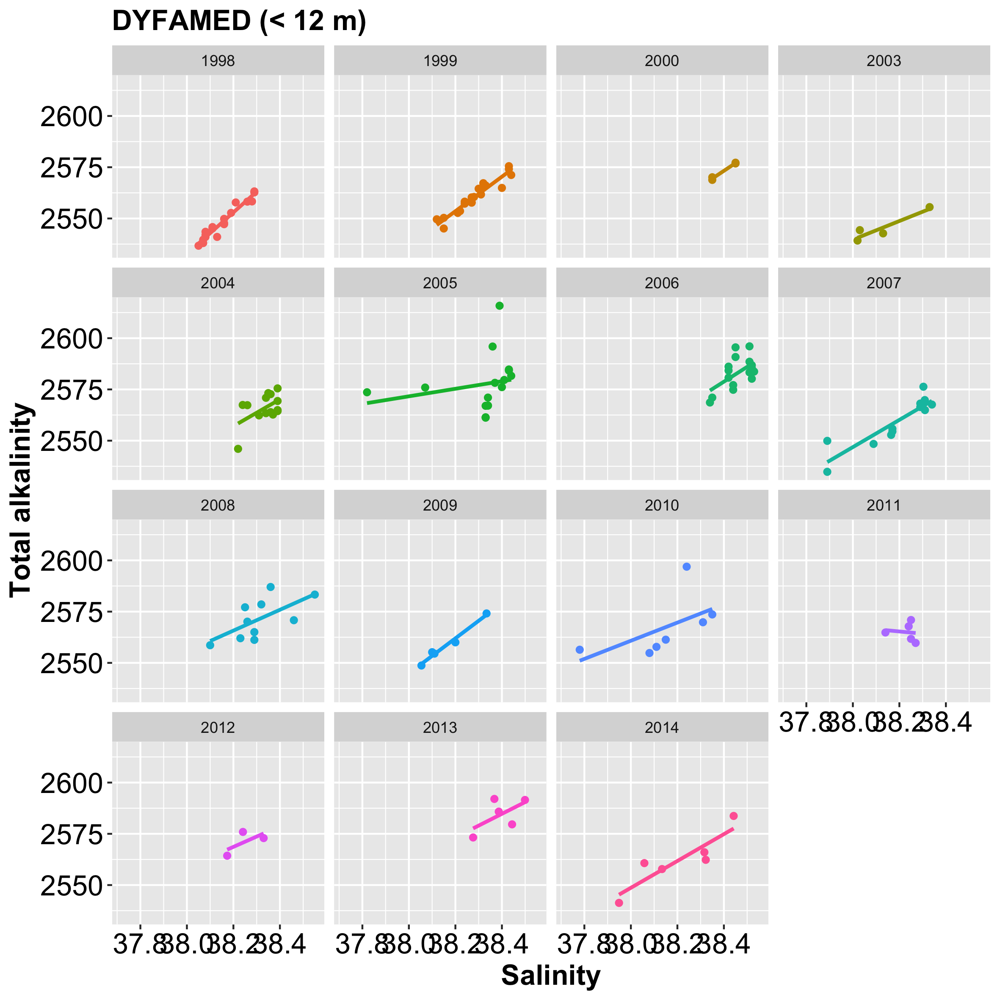

The relationship with salinity is highly significant: 
<!-- cat(sprintf("%.3f + salinity x %.3f (P = %.3f)", int_dyf, slo_dyf, tab_dyf_surf_salinity_AT[8,3])) -->
`r int_dyf` + salinity x `r slo_dyf`$ (P = `r tab_dyf_surf_salinity_AT[8,3]`)

```{r DYFAMED AT vs salinity, include=TRUE}
kable(tab_fig_dyf_surf_date_AT)
print(dyf_surf_salinity_AT)
kable(tab_dyf_surf_salinity_AT, caption="")
print(dyf_surf_salinity_AT_year)
kable(tab_dyf_surf_salinity_AT_year, caption="")
```

## Point B

```{r Initialization Point B, include=FALSE}
# read data and create a tibble
typ <- c("cccdddddfddfdffdfdffdfdfdfdfdf") # column type
z <-  read_delim(
  #paste0(path,"data/", "Data_DIC.csv"), col_types = cols(sampling_date = "D", pH_ta = "d", ta_dup = "d", 
  #                                                        dic_dup = "d",
  #                                                        temp_lab_eol="d", 
  #                                                        pH_s_eol_temp_lab ="d", qflag_pH_s_eol="d",
  #                                                        temp_lab_ptb ="d", pH_s_ptb_temp_lab ="d",
  #                                                        qflag_pH_s_ptb="d"),
paste0(path,"data/", "Data_DIC.csv"), col_types = typ, 
  delim = ",",
  na = c("NA", "999999")
)
# assign("last.warning", NULL, envir = baseenv()) #to clear warnings if they occur

H <- NULL
z$sampling_date <- as.POSIXct(z$sampling_date, format = "%d/%m/%Y")
z$measure_date <- as.POSIXct(z$measure_date, format = "%d/%m/%Y")
z$year <- year(z$sampling_date)
z$monthd <- month(z$sampling_date)
z$quarter <- quarter(z$sampling_date)
z$month <- month(z$sampling_date, label = TRUE, abbr = FALSE)
#render all variables as.numeric instead of character
z$salinity_field <- as.numeric(z$salinity_field)
# convert from umol/l to umol/kg
z$PO4 <- as.numeric(z$PO4 / (rho(S= z$salinity_field,T = z$temp_field , P= 0) / 1000))
z$SIOH4 <- as.numeric(z$SIOH4 / (1000 * rho(S= z$salinity_field,T = z$temp_field , P= 0) / 1000))
z$temp_lab_eol <- as.numeric(z$temp_lab_eol)
z$pH_s_eol_temp_lab <- as.numeric(z$pH_s_eol_temp_lab)
z$temp_lab_ptb <- as.numeric(z$temp_lab_ptb)
z$pH_s_ptb_temp_lab <- as.numeric(z$pH_s_ptb_temp_lab)


# Mercuric chloride correction for AT and CT (Dickson et al. 2007, SOP3a)
# 100 ul of saturated HgCl2 were added before 2019-07-30 whereas
# 200 ul of 50% saturated HgCl2 were added after that date
z <- z %>%
  mutate(ta_dup = if_else(sampling_date < "2019-07-30",
                    ta_dup * 1.0002,
                    ta_dup * 1.0004),
         dic_dup = if_else(sampling_date < "2019-07-30",
                    dic_dup * 1.0002,
                    dic_dup * 1.0004),
  )

# all flags changed into factors
z$qflag_taking <- as.factor(z$qflag_taking)     
z$qflag_sample <- as.factor(z$qflag_sample)     
z$qflag_ta <- as.factor(z$qflag_ta)
z$qflag_dic <- as.factor(z$qflag_dic)
z$qflag_final <- as.factor(z$qflag_final)
z$qflag_pH_s_eol <- as.factor(z$qflag_pH_s_eol)
z$qflag_pH_s_ptb <- as.factor(z$qflag_pH_s_ptb)

# Average TA/DIC data that are in duplicate (raw data)
z <- z %>%
  dplyr::group_by(sampling_date, depth) %>%
  dplyr::mutate(ta = mean(ta_dup, na.rm = T),
                dic =mean(dic_dup, na.rm =T)) 

# Exclude data for 2020 and later
z <- filter(z, sampling_date < "2020-01-01")

# read POC and PON data
pom <- read_csv(file = paste0(path,"/data/POC-PON/POC-2007-2015_PtB_1m.csv"), comment="#")
pom$date <- as.POSIXct(pom$date)
```

```{r Check outliers, include=FALSE}
# "C" means "check"
# Check for outliers at 1 m
CAT1 <- ggplot(dplyr::filter(z, depth == 0), aes(x = sampling_date, y = ta, color = qflag_ta)) +
  scale_x_datetime(breaks = date_breaks("2 year"), labels = date_format("%Y")) +
  geom_point(na.rm=TRUE) +
  theme_bw() + 
  labs(y = expression(paste(italic(A)[T]," ","(",mu, mol.kg^-1,")")),x="",title="Total alkalinity at 1 m")
#remove outliers and replot
z$ta[which(z$ta > 2900 & z$depth == 0)] <- NA #this is an identifed outlier
CAT1 <- ggplot(dplyr::filter(z, depth == 0), aes(x = sampling_date, y = ta, color = qflag_ta)) +
  geom_point(na.rm=TRUE) +
  theme_bw() + 
  labs(y = expression(paste(italic(A)[T]," ","(",mu, mol.kg^-1,")")),x="",title="Total alkalinity at 1 m, 1 outlier > 2900 removed")

CCT1 <- ggplot(dplyr::filter(z, depth == 0), aes(x = sampling_date, y = dic, color = qflag_dic)) +
  scale_x_datetime(breaks = date_breaks("2 year"), labels = date_format("%Y")) +
  geom_point(na.rm=TRUE) +
  theme_bw() + 
  labs(y = expression(paste(italic(C)[T]," ","(",mu, mol.kg^-1,")")),x="",title="Dissolved inorganic carbon at 1 m")
#remove outliers and replot
z$dic[which(z$dic > 2300 & z$depth ==0)] <- NA #this is an indentifed outlier
CCT1 <- ggplot(dplyr::filter(z, depth == 0), aes(x = sampling_date, y = dic, color = qflag_dic)) +
  scale_x_datetime(breaks = date_breaks("2 year"), labels = date_format("%Y")) +
  geom_point(na.rm=TRUE) +
  theme_bw() + 
  labs(y = expression(paste(italic(C)[T]," ","(",mu, mol.kg^-1,")")),x="",title="Dissolved inorganic carbon at 1 m, 3 data > 2300 removed")

# Check for outliers at 50 m
CAT50 <- ggplot(dplyr::filter(z, depth == 50), aes(x = sampling_date, y = ta, color = qflag_ta)) +
  scale_x_datetime(breaks = date_breaks("2 year"), labels = date_format("%Y")) +
  geom_point(na.rm=TRUE) +
  theme_bw() + 
  labs(y = expression(paste(italic(A)[T]," ","(",mu, mol.kg^-1,")")),x="",title="Total alkalinity at 50 m")
#remove outliers and replot
z$ta[which(z$ta < 2500 & z$depth == 50)] <- NA #this is an indentifed outlier
CAT50 <- ggplot(dplyr::filter(z, depth == 50), aes(x = sampling_date, y = ta, color = qflag_ta)) +
  scale_x_datetime(breaks = date_breaks("2 year"), labels = date_format("%Y")) +
  geom_point(na.rm=TRUE) +
  theme_bw() + 
  labs(y = expression(paste(italic(A)[T]," ","(",mu, mol.kg^-1,")")),x="",title="Total alkalinity at 50 m, 1 data < 2500 removed")

#remove outliers and replot
# no outlier identified
CCT50 <- ggplot(dplyr::filter(z, depth == 50), aes(x = sampling_date, y = dic, color = qflag_dic)) +
  scale_x_datetime(breaks = date_breaks("2 year"), labels = date_format("%Y")) +
  geom_point(na.rm=TRUE) +
  theme_bw() + 
  labs(y = expression(paste(italic(C)[T]," ","(",mu, mol.kg^-1,")")),x="",title="Dissolved inorganic carbon at 50 m, no outlier removed")

#combine graphs on one page
png(file = paste0(path,"/figures/fig_outliers.png"),
    width = 17, height = 25, units = "cm", res = 300)
grid.arrange(CAT1, CCT1, CAT50, CCT50, ncol=1)
dev.off()
```

```{r calculate derived parameters and save data, include=FALSE}
# calculate in situ spec pH at eol
tmp <- dplyr::filter(z, !is.na(ta), !is.na(dic),
                     !is.na(salinity_field), !is.na(temp_field), 
                     !is.na(pH_s_eol_temp_lab), !is.na(temp_lab_eol))
pH_s_eol_temp_insi <- pHinsi(pH=tmp$pH_s_eol_temp_lab, ALK=tmp$ta,
                             Tinsi=tmp$temp_field, 
                             Tlab=tmp$temp_lab_eol,
                             Pinsi=0, S=tmp$salinity_field, 
                             Pt=1e-6*tmp$PO4, Sit=1e-6*tmp$SIOH4, 
                             k1k2 = "l", kf = "pf", ks="d", 
                             pHscale = "T", b="l10")

#select tmp variables
tmp <- tmp %>%
  ungroup() %>%                                       # added to solve 2 problems: " Adding missing grouping variables: `depth`" and 
  mutate(pH_s_eol_temp_insi = pH_s_eol_temp_insi) %>%  #"Error in mutate_impl(.data, dots) : "Column `pH_s_ptb_temp_insi` must be length 30 (the group size) or one, not 2557"
  select(sampling_date, pH_s_eol_temp_insi, depth, pH_s_eol_temp_lab) #add depth , pH_s_ lab to discriminate pH and avoid duplicates in the result of left_join

z <- left_join(z, tmp, by=c("pH_s_eol_temp_lab", "sampling_date", "depth"))

# calculate in situ spec pH at Point B
tmp <- dplyr::filter(z, !is.na(ta), !is.na(dic),
                     !is.na(salinity_field), !is.na(temp_field), 
                     !is.na(pH_s_ptb_temp_lab), !is.na(temp_lab_ptb))
pH_s_ptb_temp_insi <- pHinsi(pH=tmp$pH_s_ptb_temp_lab, ALK=tmp$ta,
                             Tinsi=tmp$temp_field, 
                             Tlab=tmp$temp_lab_ptb,
                             Pinsi=0, S=tmp$salinity_field, 
                             Pt=1e-6*tmp$PO4, Sit=1e-6*tmp$SIOH4, 
                             k1k2 = "l", kf = "pf", ks="d", 
                             pHscale = "T", b="l10")
tmp <- tmp %>%
  ungroup() %>% # added to solve the problem " Adding missing grouping variables: `depth`"
  mutate(pH_s_ptb_temp_insi = pH_s_ptb_temp_insi) %>%
  select(sampling_date, pH_s_ptb_temp_insi, depth, pH_s_ptb_temp_lab)  #add depth , pH_s_ lab to discriminate pH and avoid duplicates in the result of left_join
z <- left_join(z, tmp, by = c("sampling_date","depth", "pH_s_ptb_temp_lab"))
# to avoid duplicate in rows
z <- unique(z)

#select all rows containing NA for one of the 4 key variables
NArows <-  z%>%
  ungroup() %>% 
  filter(is.na(salinity_field & dic & ta & temp_field)) # rows with NAs

#select all rows containing data because the carb function does not work with NAs

# add calculated pH and Omega calcite (to dat)
dat <- dplyr::filter(z, ta != "NA" & dic != "NA" & salinity_field != "NA" & temp_field != "NA")
carb <- carb(flag=15, var1=dat$ta*1e-6, var2=dat$dic*1e-6,
             S=dat$salinity_field, T=dat$temp_field, P=dat$depth/10,
             Pt=1e-6*dat$PO4, Sit=1e-6*dat$SIOH4, 
             k1k2 = "l", kf = "pf", pHscale = "T", b="l10")
dat$pH <- carb$pH
dat$CO2 <- carb$CO2
dat <- dat%>%
      ungroup() %>% 
      dplyr::mutate(
              CSC_flag = carb$flag,
              HCO3 = carb$HCO3,
              CO3 = carb$CO3,
              OmegaCalcite = as.numeric(carb$OmegaCalcite),
              OmegaAragonite = as.numeric(carb$OmegaAragonite),
              pH25 = pHinsi(pH=dat$pH,ALK=dat$ta*1e-6,Tinsi=25,
                            Tlab=dat$temp_field,S=dat$salinity_field,
                            Pt=1e-6*dat$PO4, Sit=1e-6*dat$SIOH4, 
                            k1k2 = "l", 
                            kf = "pf", pHscale = "T"),
              pCO2 = carb$pCO2,
              fCO2 = carb$fCO2,
              Nta = 1e6 * carb$ALK * 38 / dat$salinity_field,
              Ndic = 1e6 * carb$DIC * 38 / dat$salinity_field
              )

#merge back all NArows (they were temporarily eliminated for the data processing above)
#first add missing columns
f <- as.data.frame(matrix(as.numeric(NA), nrow = nrow(NArows), ncol = 12))

#name the columns (same column names as dat)
colnames(f)=c("pH", "CO2", "CSC_flag", "HCO3", "CO3", "OmegaCalcite", "OmegaAragonite", 
              "pH25", "pCO2" ,"fCO2",	"Nta",	"Ndic")

#bind to dat
NArows <- cbind(NArows,f)

#bind dates
dat <- rbind(dat, NArows)

#arrange by dates
dat <- arrange(dat, sampling_date)

#Prepare data to upload to Pangaea
pangaea <- select(dat, sampling_date, depth, CSC_flag, salinity_field,
                  temp_field, HCO3, CO3,
                  pH, ta, dic, OmegaCalcite,
                  OmegaAragonite, pCO2, fCO2) %>%
  dplyr::mutate(depth = replace(depth, depth == 0, 1),
                HCO3 = round(HCO3*1e6, digits = 1),
                CO3 = round(CO3*1e6, digits = 1),
                pH = round(pH, digits = 3),
                ta = round(ta, digits = 1),
                dic = round(dic, digits = 1),
                OmegaCalcite = round(OmegaCalcite, digits = 1),
                OmegaAragonite = round(OmegaAragonite, digits = 1),
                pCO2 = round(pCO2, digits = 1),
                fCO2 = round(fCO2, digits = 1)
) %>%
  dplyr::filter(sampling_date < "2018-12-31")
  
#save data
# write.table(dat, paste0("output/", Sys.Date(), "_output.csv"), sep= ",", dec=".", row.names = FALSE)
# write.table(pangaea, paste0("output/", Sys.Date(), "_pangaea.csv"), sep= ",", dec=".", row.names = FALSE)
# write_rds(dat, paste0("output/", Sys.Date(), "_output.rds"))
write_csv(dat, path= paste0(path,"/output/output.csv"))
write_csv(pangaea, path=paste0(path,"/output/output_pangaea.csv"))
write_rds(dat, paste0(path,"/output/output.rds"))
```

```{r Calculate mean values, include=FALSE}
means_depth <- dat %>%
  group_by(depth, sampling_date) %>%
  dplyr::summarise(
            mean_salinity=mean(salinity_field, na.rm=TRUE),
            mean_temperature=mean(temp_field, na.rm=TRUE),
            mean_Chla=mean(Chla, na.rm=TRUE),
            mean_dic=mean(dic, na.rm=TRUE),
            mean_ta=mean(ta, na.rm=TRUE),
            mean_ta_nocarb=mean(ta - HCO3*1e6 - 2*CO3*1e6, na.rm=TRUE),
            mean_Nta=mean(Nta,na.rm=TRUE),
            mean_Ndic=mean(Ndic,na.rm=TRUE),
            mean_pH_s_eol_temp_insi=mean(pH_s_eol_temp_insi,na.rm=TRUE), 
            mean_pH_s_ptb_temp_insi=mean(pH_s_ptb_temp_insi,na.rm=TRUE),
            mean_pH=mean(pH, na.rm=TRUE),
            mean_pH25=mean(pH25, na.rm=TRUE),
            mean_pCO2=mean(pCO2, na.rm=TRUE),
            mean_OmegaCalcite=mean(OmegaCalcite, na.rm=TRUE),
            mean_OmegaAragonite=mean(OmegaAragonite, na.rm=TRUE),
            mean_Chla=mean(Chla, na.rm=TRUE),
            mean_P=mean(depth/10, na.rm=TRUE),
            mean_Pt=mean(1e-6*PO4, na.rm=TRUE),
            mean_Sit=mean(1e-6*SIOH4, na.rm=TRUE)
            ) %>%
  dplyr::mutate(
    year = year(sampling_date),
    quarter = quarter(sampling_date),
    monthd = month(sampling_date),
    month = month(sampling_date, label = TRUE, abbr = FALSE),
    week = week(sampling_date)
    ) %>%
    dplyr::arrange(depth)

# The above generates NaNs which are replaced by NAs
is.na(means_depth) <- is.na(means_depth)
write.table(means_depth, paste0(path,"/output/output_somlit.csv"), sep= ",", dec=".", row.names = FALSE)

#separate each means_depth and handle last incomplete year
mean0m <- dplyr::filter(means_depth, depth==0)
mean50m <- dplyr::filter(means_depth, depth==50)
mean0m_full <- dplyr::filter(means_depth, depth==0, year(sampling_date) < 2016)
mean50m_full <- dplyr::filter(means_depth, depth==50, year(sampling_date) < 2016)
```

```{r Uncertainties, include=FALSE, echo=FALSE}
means_depth_no_NA <- filter(means_depth, !is.na(mean_ta) & !is.na(mean_dic) & !is.na(mean_salinity)  & !is.na(mean_temperature))
  evar1 <-
  mean(c(3.6, 3.5, 1.2, 1.99, 2.4, 3.0, 3.9, 2.6, 0.5, 2.6, 3.2))*1e-6 #AT, extracted from SNAPO-CO2 reports
evar2 <-
  mean(c(3.2, 3.7, 3.4, 2.25, 2, 2.8, 4.9, 4, 1.5, 2.7, 2))      *1e-6 #CT, extracted from SNAPO-CO2 reports

epKstd  <- c(0.002, 0.01,  0.02, 0.01,  0.01, 0.01, 0.01)

tmp <- errors(flag = 15, var1 = means_depth_no_NA$mean_ta*1e-6, var2 = means_depth_no_NA$mean_dic*1e-6, 
  S = means_depth_no_NA$mean_salinity, T = means_depth_no_NA$mean_temperature, P = means_depth_no_NA$depth/10, Pt = 1e-6*means_depth_no_NA$mean_Pt, Sit = 1e-6*means_depth_no_NA$mean_Sit,
  evar1 = evar1, evar2 = evar1, eS = 0.01, eT = 0.1, ePt = 0, eSit = 0,
  epK = epKstd, 
  #method = "ga", r = 0.0, runs = 10000, 
  k1k2 = "l", kf = "pf", pHscale = "T", b = "l10", warn = "y"
  )
mean_err <- tmp %>% summarise_all(mean)

# Calculate the average percent errors for key parameters
mean_err_percent <- data.frame(
  H = mean(100 * tmp$H / 10^-(means_depth_no_NA$mean_pH)),
  pH =mean(100 * tmp$pH / means_depth_no_NA$mean_pH),
  pCO2 = mean(100 * tmp$pCO2 / means_depth_no_NA$mean_pCO2),
  pCO2 = mean(100 * tmp$pCO2 / means_depth_no_NA$mean_pCO2),
  OmegaAragonite = mean(100 * tmp$OmegaAragonite / means_depth_no_NA$mean_OmegaAragonite),
  OmegaCalcite   = mean(100 * tmp$OmegaCalcite   / means_depth_no_NA$mean_OmegaCalcite)
)
```

The average uncertainties of the derived carbonate parameters were calculated according to the Gaussian method (Dickson & Riley, 1978) implemented in the "errors" function of the R package seacarb 3.1 (Gattuso et al., 2016). More detail is available in Orr et al. (sbm). The uncertainties are `r format(mean_err$H, digits =1, scientific = TRUE)` mol H+, `r format(mean_err$pH, digits=3)` pH units), `r format(mean_err$pCO2, digits=0)` umol pCO2, and `r format(mean_err$OmegaAragonite, digits=1)` unit of the aragonite saturation state.

```{r Monthly means, include=TRUE, message= FALSE, }
# prepare data 0m
tmp <- ungroup(mean0m) %>%
  mutate(month = month(sampling_date, label = TRUE, abb = TRUE)) %>%
  select(
  month,
  mean_temperature,
  mean_salinity,
  mean_Chla,
  mean_ta,
  mean_dic,
  mean_pCO2,
  mean_pH_s_eol_temp_insi,
  mean_pH_s_ptb_temp_insi,
  mean_pH,
  mean_OmegaAragonite
  )
tmp$month <- factor(tmp$month)

means_month0m <- ungroup(mean0m) %>%
  group_by(monthd) %>%
  summarise(
  Salinity = mean(mean_salinity, na.rm = TRUE),
  Salinity_sd = sd(mean_salinity, na.rm = TRUE),
  Salinity_n = sum(!is.na(mean_salinity)),
  Temperature = mean(mean_temperature, na.rm = TRUE),
  Temperature_sd = sd(mean_temperature, na.rm = TRUE),
  Temperature_n = sum(!is.na(mean_temperature)),
  Chla = mean(mean_Chla, na.rm = TRUE),
  Chla_sd = sd(mean_Chla, na.rm=TRUE),
  Chla_n = sum(!is.na(mean_Chla)),
  dic = mean(mean_dic, na.rm = TRUE),
  dic_sd = sd(mean_dic, na.rm = TRUE),
  dic_n = sum(!is.na(mean_dic)),
  ta = mean(mean_ta, na.rm = TRUE),
  ta_sd = sd(mean_ta, na.rm = TRUE),
  ta_n = sum(!is.na(mean_ta)),
  pH_s_eol_temp_insi = mean(mean_pH_s_eol_temp_insi, na.rm = TRUE),
  pH_s_eol_temp_insi_sd = sd(mean_pH_s_eol_temp_insi, na.rm = TRUE),
  pH_s_eol_temp_insi_n = sum(!is.na(mean_pH_s_eol_temp_insi)),
  pH_s_ptb_temp_insi = mean(mean_pH_s_ptb_temp_insi, na.rm = TRUE),
  pH_s_ptb_temp_insi_sd = sd(mean_pH_s_ptb_temp_insi, na.rm = TRUE),
  pH_s_ptb_temp_insi_n = sum(!is.na(mean_pH_s_ptb_temp_insi)),
  pH = mean(mean_pH, na.rm = TRUE),
  pH_sd = sd(mean_pH, na.rm = TRUE),
  pH_n = sum(!is.na(mean_pH)),
  pH25 = mean(mean_pH25, na.rm = TRUE),
  pH25_sd = sd(mean_pH25, na.rm = TRUE),
  pH25_n = sum(!is.na(mean_pH25)),
  pCO2 = mean(mean_pCO2, na.rm = TRUE),
  pCO2_sd = sd(mean_pCO2, na.rm = TRUE),
  pCO2_n = sum(!is.na(mean_pCO2)),
  OmegaCalcite = mean(mean_OmegaCalcite, na.rm = TRUE),
  OmegaCalcite_sd = sd(mean_OmegaCalcite, na.rm = TRUE),
  OmegaCalcite_n = sum(!is.na(mean_OmegaCalcite)),
  OmegaAragonite = mean(mean_OmegaAragonite, na.rm = TRUE),
  OmegaAragonite_sd = sd(mean_OmegaAragonite, na.rm = TRUE),
  OmegaAragonite_n = sum(!is.na(mean_OmegaAragonite))
  )
colnames_means_month0m <- colnames(means_month0m) #to restore them in the plot for paper section
means_month0m$monthd <-
  month(means_month0m$monthd, label = TRUE, abbr = FALSE) # month name for table

colnames(means_month0m) <-
  c(
  "Month",
  "Salinity",
  "Salinity_sd",
  "Salinity_n",
  "Temperature",
  "Temperature_sd",
  "Temperature_n",
  "Chla",
  "Chla_sd",
  "Chla_n",
  "CT",
  "CT_sd",
  "CT_n",
  "AT",
  "AT_sd",
  "AT_n",
  "pH_s_eol_temp_insi",
  "pH_s_eol_temp_insi_sd",
  "pH_s_eol_temp_insi_n",
  "pH_s_ptb_temp_insi",
  "pH_s_ptb_temp_insi_sd",
  "pH_s_ptb_temp_insi_n",
  "pHT",
  "pHT_sd",
  "pH_n",
  "pHT18",
  "pHT18_sd",
  "pH25_n",
  "pCO2",
  "pCO2_sd",
  "pCO2_n",
  "Oc",
  "Oc_sd",
  "Oc_n",
  "Oa",
  "Oa_sd",
  "Oa_n"
  )

# tmp_long <-
# tbl_df(
# melt(
#   tmp,
#   id.vars = c("month"),
#   measure.vars = c(
#   "mean_temperature",
#   "mean_salinity",
#   "mean_Chla",
#   "mean_ta",
#   "mean_dic",
#   "mean_pCO2",
#   "mean_pH",
#   "mean_OmegaAragonite"
#   ),
#   na.rm = TRUE
#   )
# )

tmp_long <- tmp %>%
  gather(key = variable, value=value, -month, na.rm = TRUE)
  
size_point <- 0.1 # size of data points
T1vp <- ggplot(filter(tmp_long, variable=="mean_temperature"), aes(x = month, y = value, group=month)) +
  #geom_violin(fill='lightblue', alpha=0.5, size=0.2, trim = TRUE) +
  geom_violin(fill='lightblue', alpha=0.5, size=0.2, trim = TRUE, draw_quantiles = c(0.25, 0.5, 0.75)) +
  #geom_boxplot(notch=TRUE, size=0.2, fill="grey50", outlier.color = "blue", outlier.size = 0.3) +
  geom_boxplot(notch=FALSE, size=0.2, fill="transparent", color="transparent", outlier.color = "blue", outlier.size = 0.3) +

  scale_x_discrete(breaks=c("Jan", "", "Mar", "", "May", "", "Jul", "", "Sep", "", "Nov", "")) +
  scale_y_continuous(limits=c(10,32)) +
  labs(title=NULL, x=NULL, y ="T (°C)") +
#  coord_fixed() +
  Mytheme(size_labs = 9) +
  theme(aspect.ratio = 1/2,
        plot.margin = margin(t = -0.5, r = 0.2, b = -0.5, l = 0, unit = "cm"),
        axis.text.x=element_blank()) +
  annotation_custom(grob_A)
S1vp <- ggplot(filter(tmp_long, variable=="mean_salinity"), aes(x = month, y = value, group=month)) +
  geom_violin(fill='lightblue', alpha=0.5, size=0.2, trim = TRUE) +
  geom_boxplot(notch=TRUE, size=0.2, fill="grey50", outlier.color = "blue", outlier.size = 0.3) +
  scale_x_discrete(breaks=c("Jan", "", "Mar", "", "May", "", "Jul", "", "Sep", "", "Nov", "")) +
  scale_y_continuous(limits=c(35.5, 39)) +
  labs(title=NULL,x=NULL,y="Salinity") +
#  coord_fixed() +
  Mytheme(size_labs = 9) +
  theme(aspect.ratio = 1/2,
        plot.margin = margin(t = -0.5, r = 0.2, b = -0.2, l = 0, unit = "cm"),
        axis.text.x=element_blank()) +
  annotation_custom(grob_B)
AT1vp <- ggplot(filter(tmp_long, variable=="mean_ta"), aes(x = month, y = value, group=month)) +
  geom_violin(fill='lightblue', alpha=0.5, size=0.2, trim = TRUE) +
  geom_boxplot(notch=TRUE, size=0.2, fill="grey50", outlier.color = "blue", outlier.size = 0.3) +
  scale_x_discrete(breaks=c("Jan", "", "Mar", "", "May", "", "Jul", "", "Sep", "", "Nov", "")) +
  labs(title=NULL,x=NULL,y=expression(paste(italic(A)[T], " (",mu, "mol ", kg^-1,")"))) +
#  coord_fixed() +
  Mytheme(size_labs = 9) +
  theme(aspect.ratio = 1/2,
        plot.margin = margin(t = -0.5, r = 0.2, b = -0.2, l = 0, unit = "cm"),
        axis.text.x=element_blank()) +
  annotation_custom(grob_C)
CT1vp <- ggplot(filter(tmp_long, variable=="mean_dic"), aes(x = month, y = value, group=month)) +
  geom_violin(fill='lightblue', alpha=0.5, size=0.2, trim = TRUE) +
  geom_boxplot(notch=TRUE, size=0.2, fill="grey50", outlier.color = "blue", outlier.size = 0.3) +
  scale_x_discrete(breaks=c("Jan", "", "Mar", "", "May", "", "Jul", "", "Sep", "", "Nov", "")) +
  labs(title=NULL,x=NULL,y=expression(paste(italic(C)[T], " (",mu, "mol ", kg^-1,")"))) +
#  coord_fixed() +
  Mytheme(size_labs = 9) +
  theme(aspect.ratio = 1/2,
        plot.margin = margin(t = -0.5, r = 0.2, b = -0.2, l = 0, unit = "cm"),
        axis.text.x=element_blank()) +
  annotation_custom(grob_D_bl)
pH1vp <- ggplot(filter(tmp_long, variable=="mean_pH"), aes(x = month, y = value, group=month)) +
  geom_violin(fill='lightblue', alpha=0.5, size=0.2, trim = TRUE) +
  geom_boxplot(notch=TRUE, size=0.2, fill="grey50", outlier.color = "blue", outlier.size = 0.3) +
  scale_x_discrete(breaks=c("Jan", "", "Mar", "", "May", "", "Jul", "", "Sep", "", "Nov", "")) +
  labs(title=NULL,x=NULL,y=expression(paste(pH[T]))) +
#  coord_fixed() +
  Mytheme(size_labs = 9) +
  theme(aspect.ratio = 1/2,
        plot.margin = margin(t = -0.5, r = 0.2, b = -0.2, l = 0, unit = "cm"),
        axis.text.x=element_blank()) +
  annotation_custom(grob_E_bl)
pCO21vp <- ggplot(filter(tmp_long, variable=="mean_pCO2"), aes(x = month, y = value, group=month)) +
  geom_violin(fill='lightblue', alpha=0.5, size=0.2, trim = TRUE) +
  geom_boxplot(notch=TRUE, size=0.2, fill="grey50", outlier.color = "blue", outlier.size = 0.3) +
  scale_x_discrete(breaks=c("Jan", "", "Mar", "", "May", "", "Jul", "", "Sep", "", "Nov", "")) +
  labs(title=NULL,x=NULL,y=expression(paste(pCO[2], " (",mu, "atm)"))) +
#  coord_fixed() +
  Mytheme(size_labs = 9) +
  theme(aspect.ratio = 1/2,
        plot.margin = margin(t = -0.5, r = 0.2, b = -0.5, l = 0, unit = "cm"),
        axis.text.x=element_blank()) +
  annotation_custom(grob_F)
Oa1vp <- ggplot(filter(tmp_long, variable=="mean_OmegaAragonite"), aes(x = month, y = value, group=month)) +
  geom_violin(fill='lightblue', alpha=0.5, size=0.2, trim = TRUE) +
  geom_boxplot(notch=TRUE, size=0.2, fill="grey50", outlier.color = "blue", outlier.size = 0.3) +
  scale_x_discrete(breaks=c("Jan", "", "Mar", "", "May", "", "Jul", "", "Sep", "", "Nov", "")) +
  labs(title=NULL,x=NULL,y=expression(paste(Omega[a]))) +
#  coord_fixed() +
  Mytheme(size_labs = 9) +
  theme(aspect.ratio = 1/2,
        plot.margin = margin(t = 0, r = 0.2, b = 0.3, l = 0, unit = "cm")) +
  annotation_custom(grob_G)

g <- cowplot::plot_grid(T1vp, S1vp, AT1vp, CT1vp, pH1vp, pCO21vp, Oa1vp, ncol=1,
               align="v")
#g <- arrangeGrob(T1vp, S1vp, AT1vp, CT1vp, pH1vp, pCO21vp, Oa1vp, ncol=1)
#cowplot::
ggsave(file="figures/fig4.pdf", g,  width = 8, height = 28, units = "cm")
g <- cowplot::plot_grid(T1vp, S1vp, AT1vp, CT1vp, pH1vp, pCO21vp, Oa1vp, ncol=2)
ggsave(file="figures/fig_paper_monthly_means_1m.png", g, width = 18, height = 14, units = "cm")

# prepare data 50m
tmp <- ungroup(mean50m) %>%
  mutate(month = month(sampling_date, label = TRUE, abb = TRUE)) %>%
  select(
  month,
  mean_temperature,
  mean_salinity,
  mean_Chla,
  mean_ta,
  mean_dic,
  mean_pCO2,
  mean_pH_s_eol_temp_insi,
  mean_pH_s_ptb_temp_insi,
  mean_pH,
  mean_OmegaAragonite
  )
tmp$month <- factor(tmp$month)

means_month50m <- ungroup(mean50m) %>%
  group_by(monthd) %>%
  summarise(
  Salinity = mean(mean_salinity, na.rm = TRUE),
  Salinity_sd = sd(mean_salinity, na.rm = TRUE),
  Salinity_n = sum(!is.na(mean_salinity)),
  Temperature = mean(mean_temperature, na.rm = TRUE),
  Temperature_sd = sd(mean_temperature, na.rm = TRUE),
  Temperature_n = sum(!is.na(mean_temperature)),
  Chla = mean(mean_Chla, na.rm = TRUE),
  Chla_sd = sd(mean_Chla, na.rm=TRUE),
  Chla_n = sum(!is.na(mean_Chla)),
  dic = mean(mean_dic, na.rm = TRUE),
  dic_sd = sd(mean_dic, na.rm = TRUE),
  dic_n = sum(!is.na(mean_dic)),
  ta = mean(mean_ta, na.rm = TRUE),
  ta_sd = sd(mean_ta, na.rm = TRUE),
  ta_n = sum(!is.na(mean_ta)),
  pH_s_eol_temp_insi = mean(mean_pH_s_eol_temp_insi, na.rm = TRUE),
  pH_s_eol_temp_insi_sd = sd(mean_pH_s_eol_temp_insi, na.rm = TRUE),
  pH_s_eol_temp_insi_n = sum(!is.na(mean_pH_s_eol_temp_insi)),
  pH_s_ptb_temp_insi = mean(mean_pH_s_ptb_temp_insi, na.rm = TRUE),
  pH_s_ptb_temp_insi_sd = sd(mean_pH_s_ptb_temp_insi, na.rm = TRUE),
  pH_s_ptb_temp_insi_n = sum(!is.na(mean_pH_s_ptb_temp_insi)),
  pH = mean(mean_pH, na.rm = TRUE),
  pH_sd = sd(mean_pH, na.rm = TRUE),
  pH_n = sum(!is.na(mean_pH)),
  pH25 = mean(mean_pH25, na.rm = TRUE),
  pH25_sd = sd(mean_pH25, na.rm = TRUE),
  pH25_n = sum(!is.na(mean_pH25)),
  pCO2 = mean(mean_pCO2, na.rm = TRUE),
  pCO2_sd = sd(mean_pCO2, na.rm = TRUE),
  pCO2_n = sum(!is.na(mean_pCO2)),
  OmegaCalcite = mean(mean_OmegaCalcite, na.rm = TRUE),
  OmegaCalcite_sd = sd(mean_OmegaCalcite, na.rm = TRUE),
  OmegaCalcite_n = sum(!is.na(mean_OmegaCalcite)),
  OmegaAragonite = mean(mean_OmegaAragonite, na.rm = TRUE),
  OmegaAragonite_sd = sd(mean_OmegaAragonite, na.rm = TRUE),
  OmegaAragonite_n = sum(!is.na(mean_OmegaAragonite))
  )
colnames_means_month50m <- colnames(means_month50m) #to restore them in the plot for paper section
means_month50m$monthd <-
  month(means_month50m$monthd, label = TRUE, abbr = FALSE) # month name for table

colnames(means_month50m) <-
  c(
  "Month",
  "Salinity",
  "Salinity_sd",
  "Salinity_n",
  "Temperature",
  "Temperature_sd",
  "Temperature_n",
  "Chla",
  "Chla_sd",
  "Chla_n",
  "CT",
  "CT_sd",
  "CT_n",
  "AT",
  "AT_sd",
  "AT_n",
  "pH_s_eol_temp_insi",
  "pH_s_eol_temp_insi_sd",
  "pH_s_eol_temp_insi_n",
  "pH_s_ptb_temp_insi",
  "pH_s_ptb_temp_insi_sd",
  "pH_s_ptb_temp_insi_n",
  "pHT",
  "pHT_sd",
  "pH_n",
  "pHT18",
  "pHT18_sd",
  "pH25_n",
  "pCO2",
  "pCO2_sd",
  "pCO2_n",
  "Oc",
  "Oc_sd",
  "Oc_n",
  "Oa",
  "Oa_sd",
  "Oa_n"
  )

```

## Monthly means at the surface
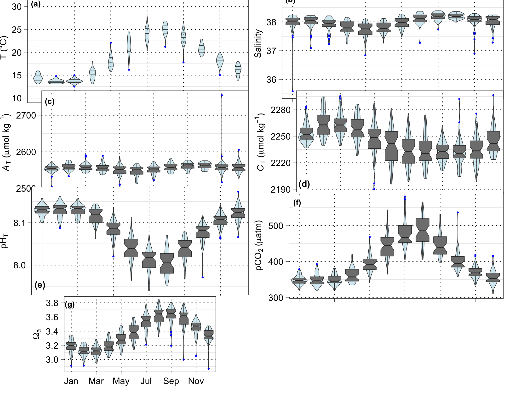

```{r table monthly means}
kable(means_month0m, digits = 3, caption="Monthly means at the surface")
kable(means_month50m, digits = 3, caption="Monthly means at 50 m")
```


```{r Figure Interannual changes and anomalies at 1 m, include=FALSE}
size_point <- 0.4 # size of data points

# Plot interannual changes
T1p <- ggplot(mean0m, aes(x = sampling_date, y = mean_temperature), na.rm=TRUE) +
  scale_x_datetime(breaks = date_breaks("2 year"), labels = date_format("%Y")) +
  geom_point(colour="black", na.rm=TRUE, size=size_point) + 
  #geom_smooth(method=lm, colour="black", fill="grey", size=0.6, na.rm=TRUE) +
  labs(title=NULL,x="", y="Temp. (°C)") +
  coord_fixed() +
  Mytheme(size_labs = 8) +
  theme(axis.text.x=element_blank()) +
  annotation_custom(grob_A_bl)
S1p <- ggplot(mean0m, aes(x = sampling_date, y = mean_salinity), na.rm=TRUE) +
  scale_x_datetime(breaks = date_breaks("2 year"), labels = date_format("%Y")) +
    scale_y_continuous(limits=c(35.5, 39), breaks=c(36,37,38)) +
  geom_point(colour="black", na.rm=TRUE, size=size_point) + 
  #geom_smooth(method=lm, colour="black", fill="grey", size=0.6, na.rm=TRUE) +
  labs(title=NULL,x="",y="Salinity") +
  coord_fixed() +
  Mytheme(size_labs = 8) +
  theme(axis.text.x=element_blank()) +
  annotation_custom(grob_B_bl)
CT1p <- ggplot(mean0m, aes(x = sampling_date, y = mean_dic), na.rm=TRUE) +
  scale_x_datetime(breaks = date_breaks("2 year"), labels = date_format("%Y")) +
  geom_point(colour="black", na.rm=TRUE, size=size_point) + 
  #geom_smooth(method=lm, colour="black", fill="grey", size=0.6, na.rm=TRUE) +
  labs(title=NULL,x="",y=expression(paste(italic(C)[T], " (",mu, "mol ", kg^-1,")"))) +
  #annotate("text", x =as.POSIXct("2016-01-01"), y= min(mean0m$mean_dic, na.rm=TRUE), 
  #         label="*", colour="blue", size=10, fontface="plain") +
  coord_fixed() +
  Mytheme(size_labs = 8) +
  theme(axis.text.x=element_blank()) +
  annotation_custom(grob_D_bl)
AT1p <- ggplot(mean0m, aes(x = sampling_date, y = mean_ta), na.rm=TRUE) +
  scale_x_datetime(breaks = date_breaks("2 year"), labels = date_format("%Y")) +
  geom_point(colour="black", na.rm=TRUE, size=size_point) + 
  #geom_smooth(method=lm, colour="black", fill="grey", size=0.6, na.rm=TRUE) +
  labs(title=NULL,x="",y=expression(paste(italic(A)[T], " (",mu, "mol ", kg^-1,")"))) +
  #annotate("text", x =as.POSIXct("2016-01-01"), y= min(mean0m$mean_ta, na.rm=TRUE), 
  #         label="*", colour="blue", size=9, fontface="plain") +
  coord_fixed() +
  Mytheme(size_labs = 8) +
  theme(axis.text.x=element_blank()) +
  annotation_custom(grob_C_bl)
pH1p <- ggplot(mean0m, aes(x = sampling_date, y = mean_pH), na.rm=TRUE) +
  scale_x_datetime(breaks = date_breaks("2 year"), labels = date_format("%Y")) +
  geom_point(colour="black", na.rm=TRUE, size=size_point) + 
  geom_point(data=mean0m, aes(x = sampling_date, y = mean_pH_s_eol_temp_insi),color= "blue", size=1) +
  geom_point(data=mean0m, aes(x = sampling_date, y = mean_pH_s_ptb_temp_insi), color ="red", size=1) +
  #geom_smooth(method=lm, colour="black", fill="grey", size=0.6, na.rm=TRUE) +
 labs(title=NULL,x="", y=expression(paste(pH[T]))) +
  coord_fixed() +
  Mytheme(size_labs = 8) +
  #annotate("text", x =as.POSIXct("2016-01-01"), y= min(mean0m$mean_pH, na.rm=TRUE), 
  #         label="*", colour="blue", size=9, fontface="plain") +
  theme(axis.text.x=element_blank()) +
  annotation_custom(grob_E_bl)
pCO21p <- ggplot(mean0m, aes(x = sampling_date, y = mean_pCO2), na.rm=TRUE) +
  scale_x_datetime(breaks = date_breaks("2 year"), labels = date_format("%Y")) +
  geom_point(colour="black", na.rm=TRUE, size=size_point) + 
  #geom_smooth(method=lm, colour="black", fill="grey", size=0.6, na.rm=TRUE) +
  labs(title=NULL,x="",y=expression(paste(pCO[2], " (",mu, "atm)"))) +
  #annotate("text", x =as.POSIXct("2016-01-01"), y= min(mean0m$mean_pCO2, na.rm=TRUE), 
  #         label="*", colour="blue", size=9, fontface="plain") +
  coord_fixed() +
  Mytheme(size_labs = 8) +
  theme(axis.text.x=element_blank()) +
  annotation_custom(grob_F_bl)
Oa1p <- ggplot(mean0m, aes(x = sampling_date, y = mean_OmegaAragonite), na.rm=TRUE) +
  scale_x_datetime(breaks = date_breaks("2 year"), labels = date_format("%Y")) +
  geom_point(colour="black", na.rm=TRUE, size=size_point) + 
  geom_smooth(method=lm, colour="black", fill="grey", size=0.6, na.rm=TRUE) +
  labs(title=NULL,x="",y=expression(paste(Omega[a]))) +
  coord_fixed() +
  Mytheme(size_labs = 8) +
  annotation_custom(grob_G_bl)
ATvsCT1p <- ggplot(mean0m, aes(x = sampling_date, y = mean_ta/mean_dic), na.rm=TRUE) +
  scale_x_datetime(breaks = date_breaks("2 year"), labels = date_format("%Y")) +
  geom_point(colour="#482173FF", na.rm=TRUE, size=size_point) +
  geom_smooth(method=lm, colour="black", fill="grey", size=0.6, na.rm=TRUE) +
  labs(title=NULL,x="",y=expression(paste(A[T]:C[T]))) +
  annotate("text", x = as.POSIXct("2008-01-01"), 
           y = max(mean0m$mean_ta/mean0m$mean_dic, na.rm=TRUE), 
           label = lm_eqn(lm(mean_ta/mean_dic ~sampling_date, data=mean0m)), parse = TRUE) +
  coord_fixed() +
  Mytheme(size_labs = 8)
ggsave(filename = "figures/ATvsCT1p.png", plot = ATvsCT1p)

# Calculate anomalies
# At 1 m
# Calculate monthly means
tmp <- ungroup(mean0m) %>%
  group_by(monthd) %>%
  summarise(
  Salinity_month = mean(mean_salinity, na.rm = TRUE),
  Temperature_month = mean(mean_temperature, na.rm = TRUE),
  dic_month = mean(mean_dic, na.rm = TRUE),
  ta_month = mean(mean_ta, na.rm = TRUE),
  pH_s_eol_temp_insi_month = mean(mean_pH_s_eol_temp_insi, na.rm = TRUE),
  pH_s_ptb_temp_insi_month = mean(mean_pH_s_ptb_temp_insi, na.rm = TRUE),
  pH_month = mean(mean_pH, na.rm = TRUE),
  pH25_month = mean(mean_pH25, na.rm = TRUE),
  pCO2_month = mean(mean_pCO2, na.rm = TRUE),
  OmegaCalcite_month = mean(mean_OmegaCalcite, na.rm = TRUE),
  OmegaAragonite_month = mean(mean_OmegaAragonite, na.rm = TRUE),
  Nta_month = mean(mean_Nta, na.rm = TRUE),
  Ndic_month = mean(mean_Ndic, na.rm = TRUE)
  )
# Calculate anomalies
ano_month0m <- left_join(ungroup(mean0m), tmp, by = "monthd") %>%
  mutate(
  Salinity_ano = mean_salinity - Salinity_month,
  Temperature_ano = mean_temperature - Temperature_month,
  dic_ano = mean_dic - dic_month,
  ta_ano = mean_ta - ta_month,
  pH_s_eol_temp_insi_ano = mean_pH_s_eol_temp_insi - pH_s_eol_temp_insi_month,
  pH_s_ptb_temp_insi_ano = mean_pH_s_ptb_temp_insi - pH_s_ptb_temp_insi_month,
  pH_ano = mean_pH - pH_month,
  pH25_ano = mean_pH25 - pH25_month,
  pCO2_ano = mean_pCO2 - pCO2_month,
  OmegaCalcite_ano = mean_OmegaCalcite - OmegaCalcite_month,
  OmegaAragonite_ano = mean_OmegaAragonite - OmegaAragonite_month,
  Nta_ano = mean_Nta - Nta_month,
  Ndic_ano = mean_Ndic - Ndic_month
  )

# Regressions and tables of key parameters
var_list <-
  c(
  "mean_salinity",
  "mean_temperature",
  "mean_dic",
  "mean_ta",
  "mean_pH_s_eol_temp_insi",
  "mean_pH_s_ptb_temp_insi",
  "mean_pH",
  "mean_pH25",
  "mean_pCO2",
  "mean_OmegaCalcite",
  "mean_OmegaAragonite",
  "mean_Nta",
  "mean_Ndic"
  )
lms <- lapply(var_list, function(x) {
  summary(lm(substitute(i ~ decimal_date(sampling_date), list(i = as.name(x))), data = ano_month0m))
  })
reg <- NULL
for (i in 1:length(var_list)) {
  #one loops through all anomalies
  # calculate probability of fstatistic because it cannot be extracted from lms above
  # see http://stats.stackexchange.com/questions/92824/extracting-the-model-p-value-for-a-multiple-regression-in-r
  # slope returned by lm is per second
  prob <- pf(lms[[i]]$fstatistic[1],
  lms[[i]]$fstatistic[2],
  lms[[i]]$fstatistic[3],
  lower.tail = FALSE)
  reg <- rbind(reg, as.numeric(c(
    lms[[i]]$coefficients[2, 1],
    lms[[i]]$coefficients[2, 2],
    lms[[i]]$coefficients[2, 4],
  lms[[i]]$coefficients[1, 1],
  lms[[i]]$coefficients[1, 2],
  lms[[i]]$coefficients[1, 4],
  lms[[i]]$fstatistic[1],
  lms[[i]]$fstatistic[3],
  lms[[i]]$r.squared,
  prob
  )
  ))
}
colnames(reg) <-
  c("Slope",
  "SE Slope",
  "P Slope",
  "Intercept",
  "SE int.",
  "P int.",
  "F",
  "df",
  "R2",
  "P value")
row.names(reg) <- var_list
reg_var_1m <- reg
slope_ta <- reg_var_1m[4,1]
intercept_ta <- reg_var_1m[4,4]

# Regression and table anomalies
var_list <-
  c(
  "Salinity_ano",
  "Temperature_ano",
  "dic_ano",
  "ta_ano",
  "pH_s_eol_temp_insi_ano",
  "pH_s_ptb_temp_insi_ano",
  "pH_ano",
  "pH25_ano",
  "pCO2_ano",
  "OmegaCalcite_ano",
  "OmegaAragonite_ano",
  "Nta_ano",
  "Ndic_ano"
  )
lms <- lapply(var_list, function(x) {
  summary(lm(substitute(i ~ decimal_date(sampling_date), list(i = as.name(x))), data = ano_month0m))
  })
reg <- NULL
for (i in 1:length(var_list)) {
  #one loops through all anomalies
  # calculate probability of fstatistic because it cannot be extracted from lms above
  # see http://stats.stackexchange.com/questions/92824/extracting-the-model-p-value-for-a-multiple-regression-in-r
  # slope returned by lm is per second
prob <-
  pf(lms[[i]]$fstatistic[1],
  lms[[i]]$fstatistic[2],
  lms[[i]]$fstatistic[3],
  lower.tail = FALSE)
reg <-
  rbind(reg, as.numeric(
  c(
  lms[[i]]$coefficients[2, 1],
  lms[[i]]$coefficients[2, 2],
  lms[[i]]$coefficients[2, 4],
  lms[[i]]$coefficients[1, 1],
  lms[[i]]$coefficients[1, 2],
  lms[[i]]$coefficients[1, 4],
  lms[[i]]$fstatistic[1],
  lms[[i]]$fstatistic[3],
  lms[[i]]$r.squared,
  prob
  )
  ))
}
colnames(reg) <-
  c("Slope",
  "SE Slope",
  "P Slope",
  "Intercept",
  "SE int.",
  "P int.",
  "F",
  "df",
  "R2",
  "P value")
row.names(reg) <- var_list
reg_ano_1m <- reg
reg_ano_1m["Salinity_ano", "P value"]

# Plot anomalies
#Anomalies 1 m
anT1p <- ggplot(data = ano_month0m, aes(x = sampling_date, y = Temperature_ano), na.rm=TRUE) +
  scale_x_datetime(breaks = date_breaks("2 year"), labels = date_format("%Y")) +
  geom_point(colour="blue", na.rm=TRUE, size=size_point) + 
  geom_smooth(method=lm, colour="black", fill="grey", size=0.6, na.rm=TRUE) +
  labs(title=NULL,x="", y="Temp. (°C)") +
  annotate("text", x =as.POSIXct("2016-01-01"), y= min(ano_month0m$Temperature_ano, na.rm=TRUE), 
           label="*", colour="black", size=9, fontface="plain") +
  coord_fixed() +
  Mytheme(size_labs = 8) +
  theme(axis.text.x=element_blank()) +
  annotation_custom(grob_H_bl)
anS1p <- ggplot(data = ano_month0m, aes(x = sampling_date, y = Salinity_ano), na.rm=TRUE) +
  scale_x_datetime(breaks = date_breaks("2 year"), labels = date_format("%Y")) +
  scale_y_continuous(breaks=c(-2,-1,0,0.5)) +
  geom_point(colour="blue", na.rm=TRUE, size=size_point) + 
  geom_smooth(method=lm, colour="black", fill="grey", size=0.6, na.rm=TRUE) +
  labs(title=NULL,x="", y="Salinity") +
  coord_fixed() +
  Mytheme(size_labs = 8) +
  theme(axis.text.x=element_blank()) +
  annotation_custom(grob_I_bl)
anCT1p <- ggplot(data = ano_month0m, aes(x = sampling_date, y = dic_ano), na.rm=TRUE) +
  scale_x_datetime(breaks = date_breaks("2 year"), labels = date_format("%Y")) +
  geom_point(colour="blue", na.rm=TRUE, size=size_point) + 
  geom_smooth(method=lm, colour="black", fill="grey", size=0.6, na.rm=TRUE) +
  labs(title=NULL,x="", y=expression(paste(italic(C)[T], " (",mu, "mol ", kg^-1,")"))) +
  annotate("text", x =as.POSIXct("2016-01-01"), y= min(ano_month0m$dic_ano, na.rm=TRUE), 
           label="*", colour="black", size=9, fontface="plain") +
  coord_fixed() +
  Mytheme(size_labs = 8) +
  theme(axis.text.x=element_blank()) +
  annotation_custom(grob_K_bl)
anAT1p <- ggplot(data = ano_month0m, aes(x = sampling_date, y = ta_ano), na.rm=TRUE) +
  scale_x_datetime(breaks = date_breaks("2 year"), labels = date_format("%Y")) +
  geom_point(colour="blue", na.rm=TRUE, size=size_point) + 
  geom_smooth(method=lm, colour="black", fill="grey", size=0.6, na.rm=TRUE) +
  labs(title=NULL,x="", y=expression(paste(italic(A)[T], " (",mu, "mol ", kg^-1,")"))) +
  theme(axis.text.x=element_blank()) +
  annotate("text", x =as.POSIXct("2016-01-01"), y= min(ano_month0m$ta_ano, na.rm=TRUE), 
           label="*", colour="black", size=9, fontface="plain") +
  coord_fixed() +
  Mytheme(size_labs = 8) +
  theme(axis.text.x=element_blank()) +
  annotation_custom(grob_J_bl)
anpHeol1p <- ggplot(data = ano_month0m, aes(x = sampling_date, y = pH_s_eol_temp_insi_ano), na.rm=TRUE) +
  scale_x_datetime(breaks = date_breaks("2 year"), labels = date_format("%Y")) +
  geom_point(colour="blue", na.rm=TRUE, size=size_point) + 
  geom_smooth(method=lm, colour="black", fill="grey", size=0.6, na.rm=TRUE) +
  labs(title=NULL,x="",y=expression(paste(pH[T], " EOL"))) +
  annotate("text", x =as.POSIXct("2016-01-01"), y= min(ano_month0m$pH_ano, na.rm=TRUE), 
           label="*", colour="black", size=9, fontface="plain") +
  coord_fixed() +
  Mytheme(size_labs = 8) +
  theme(axis.text.x=element_blank()) +
  annotation_custom(grob_L_bl)

anpHptb1p <- ggplot(data = ano_month0m, aes(x = sampling_date, y = pH_s_ptb_temp_insi_ano), na.rm=TRUE) +
  scale_x_datetime(breaks = date_breaks("2 year"), labels = date_format("%Y")) +
  geom_point(colour="red", na.rm=TRUE, size=size_point) + 
  geom_smooth(method=lm, colour="black", fill="grey", size=0.6, na.rm=TRUE) +
  labs(title=NULL,x="",y=expression(paste(pH[T], " Point B"))) +
  annotate("text", x =as.POSIXct("2016-01-01"), y= min(ano_month0m$pH_ano, na.rm=TRUE), 
           label="*", colour="black", size=9, fontface="plain") +
  coord_fixed() +
  Mytheme(size_labs = 8) +
  theme(axis.text.x=element_blank()) +
  annotation_custom(grob_L_bl)
anpH1p <- ggplot(data = ano_month0m, aes(x = sampling_date, y = pH_ano), na.rm=TRUE) +
  scale_x_datetime(breaks = date_breaks("2 year"), labels = date_format("%Y")) +
  geom_point(colour="blue", na.rm=TRUE, size=size_point) + 
  geom_smooth(method=lm, colour="black", fill="grey", size=0.6, na.rm=TRUE) +
  labs(title=NULL,x="",y=expression(paste(pH[T]))) +
  annotate("text", x =as.POSIXct("2016-01-01"), y= min(ano_month0m$pH_ano, na.rm=TRUE), 
           label="*", colour="black", size=9, fontface="plain") +
  coord_fixed() +
  Mytheme(size_labs = 8) +
  theme(axis.text.x=element_blank()) +
  annotation_custom(grob_L_bl)
anpCO21p <- ggplot(data = ano_month0m, aes(x = sampling_date, y = pCO2_ano), na.rm=TRUE) +
  scale_x_datetime(breaks = date_breaks("2 year"), labels = date_format("%Y")) +
   geom_point(colour="blue", na.rm=TRUE, size=size_point) + 
  geom_smooth(method=lm, colour="black", fill="grey", size=0.6, na.rm=TRUE) +
 labs(title=NULL,x="",y=expression(paste(pCO[2], " (",mu, "atm)"))) +
  annotate("text", x =as.POSIXct("2016-01-01"), y= min(ano_month0m$pCO2_ano, na.rm=TRUE), 
           label="*", colour="black", size=9, fontface="plain") +
  coord_fixed() +
  Mytheme(size_labs = 8) +
  theme(axis.text.x=element_blank()) +
  annotation_custom(grob_M_bl)
anOa1p <- ggplot(data = ano_month0m, aes(x = sampling_date, y = OmegaAragonite_ano), na.rm=TRUE) +
  scale_x_datetime(breaks = date_breaks("2 year"), labels = date_format("%Y")) +
  scale_y_continuous(breaks=c(-0.2,0,0.2)) +
  geom_point(colour="blue", na.rm=TRUE, size=size_point) + 
  geom_smooth(method=lm, colour="black", fill="grey", size=0.6, na.rm=TRUE) +
  labs(title=NULL,x="",y=expression(paste(Omega[a]))) +
  annotate("text", x =as.POSIXct("2016-01-01"), y= min(ano_month0m$OmegaAragonite_ano, na.rm=TRUE), 
           label="*", colour="black", size=9, fontface="plain") +
  coord_fixed() +
  Mytheme(size_labs = 8) +
  annotation_custom(grob_N_bl)

g <- cowplot::plot_grid(T1p, anT1p, S1p, anS1p, AT1p, anAT1p, CT1p, anCT1p, pH1p, anpH1p, anpHeol1p, anpHptb1p, pCO21p, anpCO21p, Oa1p, anOa1p, align='vh', ncol=2)
ggsave(file="figures/fig_paper_interannual_1m.png", g, width=15, height = 17, units = "cm")
ggsave(file="figures/fig2.pdf", g, width = 18, height = 21, units = "cm")

# AT as a function of salinity for every year
j <- 0
reg <- data.frame()
for (i in 1:(length(unique(mean0m$year)))) { #one loops through all years, -1 to remove the current year
  #print(i)
  j <- j + 1
  yr <- unique(mean0m$year)[i]
  d_reg <- filter(mean0m, year==yr)
#  fm <- as.formula(paste0(i, " ~ sampling_date"))
  #fit[[i]] <- lm(fm, data = mean0m)
  lms <- summary(lm(data=d_reg, mean_ta ~ mean_salinity))
  # calculate probability of fstatistic because it cannot be extracted from lms above
  # see http://stats.stackexchange.com/questions/92824/extracting-the-model-p-value-for-a-multiple-regression-in-r
  # slope returned by lm is per second
  prob <- pf(lms$fstatistic[1],lms$fstatistic[2],lms$fstatistic[3],lower.tail=FALSE)
  reg <- rbind(reg, as.numeric(c(lms$coefficients[2,1], lms$coefficients[2,2], 
                                 lms$coefficients[2,4], lms$coefficients[1,1], lms$coefficients[1,2],
                                 lms$coefficients[1,4], lms$fstatistic[1],   lms$fstatistic[3],
                                 lms$r.squared, prob)))
}
names(reg) <- c("Slope", "SE Slope", "P Slope","Intercept","SE int.","P int.", "F", "df",
                "R2","P value")
row.names(reg) <- as.character(unique(mean0m$year))
#transform in latex table and save
tab_surf_salinity_AT_year <- reg

# POC and PON
pom_l <-pom %>% 
  filter(depth==1 | depth==50) %>%
  select(-q_poc, -q_pon) %>%
  gather(key=pom, value=value, poc, pon)
fig_poc_pon <- ggplot(data = filter(pom_l, depth==1), aes(x = date, y = value), na.rm=TRUE) + 
  geom_point(aes(colour=pom), na.rm=TRUE, size=size_point) +
  scale_x_datetime(breaks = date_breaks("2 year"), labels = date_format("%Y")) +
  labs(title="Point B at 1 m",x="",y="Particulate organic matter") +
  Mytheme()
ggsave(file= "figures/fig_poc_pon.png", fig_poc_pon, width = 18, height = 20, units = "cm")
```

```{r Removing the effect of changes in AT at 1m, include=FALSE}
#intercept_ta <- 0
first_at <- intercept_ta + decimal_date(dat$sampling_date[1]) * slope_ta # 1st AT value of the time series
dat$ta_no_change <- dat$ta - ((intercept_ta + decimal_date(dat$sampling_date) * slope_ta) - first_at)
p_ta_no_change <- ggplot(data=dat, na.rm=TRUE) +
  geom_point(aes(x=sampling_date, y= ta), col="red") +
  geom_point(aes(x=sampling_date, y= ta_no_change), col="blue")
zzz <- drop_na(dat,ta_no_change, dic,salinity_field,temp_field)
carb_ta_no_change <- carb(flag=15, var1=zzz$ta_no_change*1e-6, var2=zzz$dic*1e-6, S=zzz$salinity_field,
             T=zzz$temp_field, P=zzz$depth/10, Pt=1e-6*zzz$PO4, Sit=1e-6*zzz$SIOH4, 
             k1k2 = "l", kf = "pf", pHscale = "T", b="l10")
zzz$pH <- carb_ta_no_change$pH
# calculate rate of pH change
# les deux lignes qui suivent ne marchent pas. J'ai dû recourir à ce qui suit.
# JE NE COMPRENDS pas pourquoi.
#zzz_reg <- summary(lm(data=zzz, decimal_date(sampling_date) ~ pH))
#slope_ta_no_change <- zzz_reg$coefficients[2, 1]

var_list <- c("pH")
lms <- lapply(var_list, function(x) {
  summary(lm(substitute(i ~ decimal_date(sampling_date), list(i = as.name(x))), data = zzz))
  })
reg_ta_no_change <- NULL
for (i in 1:length(var_list)) {
  #one loops through all anomalies
  # calculate probability of fstatistic because it cannot be extracted from lms above
  # see http://stats.stackexchange.com/questions/92824/extracting-the-model-p-value-for-a-multiple-regression-in-r
  # slope returned by lm is per second
  prob <- pf(lms[[i]]$fstatistic[1],
  lms[[i]]$fstatistic[2],
  lms[[i]]$fstatistic[3],
  lower.tail = FALSE)
  reg_ta_no_change <- rbind(reg_ta_no_change, as.numeric(c(
    lms[[i]]$coefficients[2, 1],
    lms[[i]]$coefficients[2, 2],
    lms[[i]]$coefficients[2, 4],
  lms[[i]]$coefficients[1, 1],
  lms[[i]]$coefficients[1, 2],
  lms[[i]]$coefficients[1, 4],
  lms[[i]]$fstatistic[1],
  lms[[i]]$fstatistic[3],
  lms[[i]]$r.squared,
  prob
  )
  ))
}
colnames(reg_ta_no_change) <-
  c("Slope",
  "SE Slope",
  "P Slope",
  "Intercept",
  "SE int.",
  "P int.",
  "F",
  "df",
  "R2",
  "P value")
row.names(reg_ta_no_change) <- var_list
```


## Interannual changes at 1 m
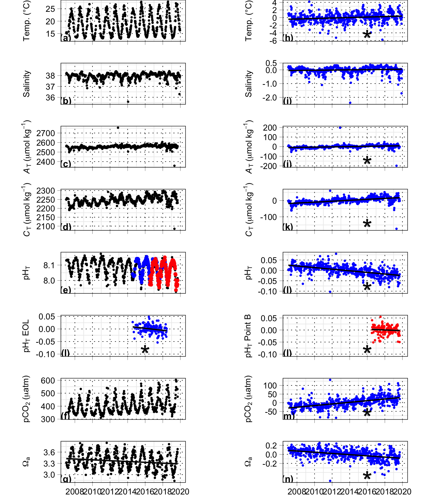
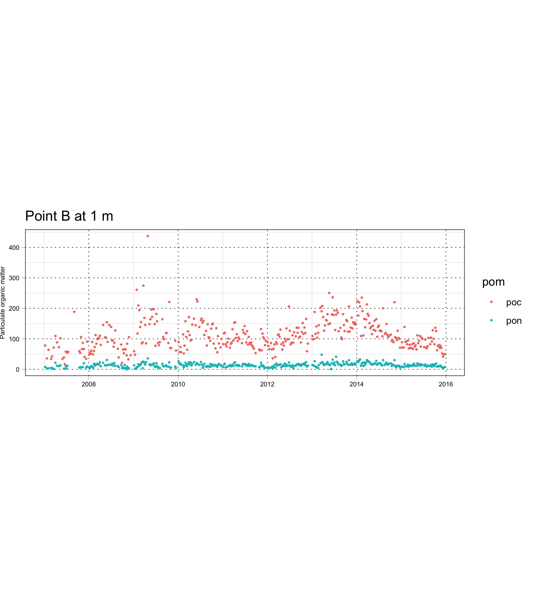
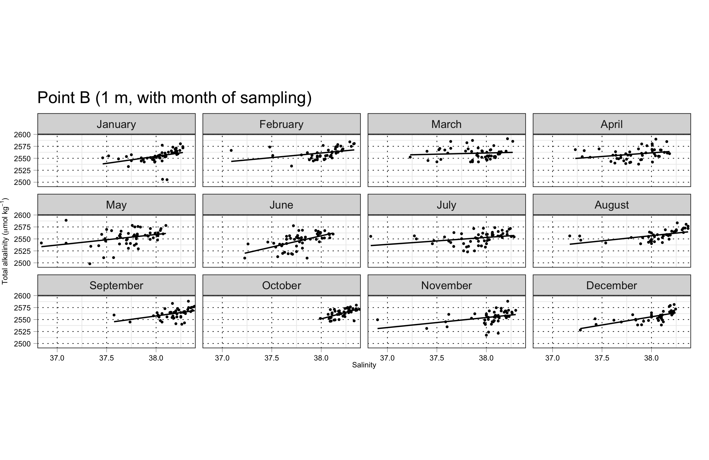

The slope of the rate of pH change is `r round(reg_var_1m[5,1], digits=4)` ± `r format(reg_var_1m[5,2], digits=4, scientific=FALSE)` units per year. If the observed total alkalinity data are corrected from their rate of change (i.e. assuming that they have not increased during the period of measurement, but kept their subannual variability), the rate of change is `r round(reg_ta_no_change[1,1], digits=4)` ± `r format(reg_ta_no_change[1,2], digits=4, scientific=FALSE)` units per year.

```{r kable regressions 1 m}
kable(reg_var_1m, digits = c(4,4,3,3,3,2,3), caption="Regressions on values at 1 m depth.")
kable(reg_ano_1m, digits = c(4,4,3,3,3,2,3), caption="Regressions on anomalies at 1 m depth.")  
kable(tab_surf_salinity_AT_year, digits = c(2,2), caption="Regressions on values at 1 m depth for every year.")
```

```{r Figure Interannual changes and anomalies at 50 m, include=FALSE}
size_point <- 0.4 # size of data points

# Plot interannual changes
T50p <- ggplot(mean50m, aes(x = sampling_date, y = mean_temperature), na.rm=TRUE) +
  scale_x_datetime(breaks = date_breaks("2 year"), labels = date_format("%Y")) +
  scale_y_continuous(limits = c(12.5, 22.6)) +
  geom_point(colour="black", na.rm=TRUE, size=size_point) + 
  #geom_smooth(method=lm, colour="black", fill="grey", size=0.6, na.rm=TRUE) +
  labs(title=NULL,x="", y="Temp. (°C)") +
  # annotate("text", x =as.POSIXct("2016-01-01"), y= min(mean50m$mean_temperature, na.rm=TRUE), 
  #          label="*", colour="blue", size=10, fontface="plain") +
  coord_fixed() +
  Mytheme(size_labs = 8) +
  theme(axis.text.x=element_blank()) +
  annotation_custom(grob_A)
S50p <- ggplot(mean50m, aes(x = sampling_date, y = mean_salinity), na.rm=TRUE) +
  scale_x_datetime(breaks = date_breaks("2 year"), labels = date_format("%Y")) +
#    scale_y_continuous(limits=c(37, 39), breaks=c(37,38,39)) +
  geom_point(colour="black", na.rm=TRUE, size=size_point) + 
  #geom_smooth(method=lm, colour="black", fill="grey", size=0.6, na.rm=TRUE) +
  labs(title=NULL,x="",y="Salinity") +
  # annotate("text", x =as.POSIXct("2016-01-01"), y= min(mean50m$mean_salinity, na.rm=TRUE), 
  #          label="*", colour="blue", size=10, fontface="plain") +
  coord_fixed() +
  Mytheme(size_labs = 8) +
  theme(axis.text.x=element_blank()) +
  annotation_custom(grob_B)
CT50p <- ggplot(mean50m, aes(x = sampling_date, y = mean_dic), na.rm=TRUE) +
  scale_x_datetime(breaks = date_breaks("2 year"), labels = date_format("%Y")) +
  geom_point(colour="black", na.rm=TRUE, size=size_point) + 
  #geom_smooth(method=lm, colour="black", fill="grey", size=0.6, na.rm=TRUE) +
  labs(title=NULL,x="",y=expression(paste(italic(C)[T], " (",mu, "mol ", kg^-1,")"))) +
  coord_fixed() +
  Mytheme(size_labs = 8) +
  theme(axis.text.x=element_blank()) +
  annotation_custom(grob_D)
AT50p <- ggplot(mean50m, aes(x = sampling_date, y = mean_ta), na.rm=TRUE) +
  scale_x_datetime(breaks = date_breaks("2 year"), labels = date_format("%Y")) +
  scale_y_continuous(breaks=c(2530, 2550, 2570)) +
  geom_point(colour="black", na.rm=TRUE, size=size_point) + 
  #geom_smooth(method="loess", span=0.4, se=FALSE, colour="orange") +
  #geom_smooth(method=lm, colour="black", fill="grey", size=0.6, na.rm=TRUE) +
  labs(title=NULL,x="",y=expression(paste(italic(A)[T], " (",mu, "mol ", kg^-1,")"))) +
  coord_fixed() +
  Mytheme(size_labs = 8) +
  theme(axis.text.x=element_blank()) +
  annotation_custom(grob_C)
pH50p <- ggplot(mean50m, aes(x = sampling_date, y = mean_pH), na.rm=TRUE) +
  scale_x_datetime(breaks = date_breaks("2 year"), labels = date_format("%Y")) +
  geom_point(colour="black", na.rm=TRUE, size=size_point) + 
  geom_point(data=mean50m, aes(x = sampling_date, y = mean_pH_s_ptb_temp_insi), color ="red", size=1) +
  #geom_smooth(method=lm, colour="black", fill="grey", size=0.6, na.rm=TRUE) +
 labs(title=NULL,x="", y=expression(paste(pH[T]))) +
  # annotate("text", x =as.POSIXct("2016-01-01"), y= min(mean50m$mean_pH, na.rm=TRUE), 
  #          label="*", colour="blue", size=10, fontface="plain") +
  coord_fixed() +
  Mytheme(size_labs = 8) +
  theme(axis.text.x=element_blank()) +
  annotation_custom(grob_E)
pCO250p <- ggplot(mean50m, aes(x = sampling_date, y = mean_pCO2), na.rm=TRUE) +
  scale_x_datetime(breaks = date_breaks("2 year"), labels = date_format("%Y")) +
  geom_point(colour="black", na.rm=TRUE, size=size_point) + 
  #geom_smooth(method=lm, colour="black", fill="grey", size=0.6, na.rm=TRUE) +
  labs(title=NULL,x="",y=expression(paste(pCO[2], " (",mu, "atm)"))) +
  coord_fixed() +
  Mytheme(size_labs = 8) +
  theme(axis.text.x=element_blank()) +
  annotation_custom(grob_F)
Oa50p <- ggplot(mean50m, aes(x = sampling_date, y = mean_OmegaAragonite), na.rm=TRUE) +
  scale_x_datetime(breaks = date_breaks("2 year"), labels = date_format("%Y")) +
  geom_point(colour="black", na.rm=TRUE, size=size_point) + 
  #geom_smooth(method=lm, colour="black", fill="grey", size=0.6, na.rm=TRUE) +
  labs(title=NULL,x="",y=expression(paste(Omega[a]))) +
  # annotate("text", x =as.POSIXct("2016-01-01"), y= min(mean50m$mean_OmegaAragonite, na.rm=TRUE), 
  #          label="*", colour="blue", size=10, fontface="plain") +  
  coord_fixed() +
  Mytheme(size_labs = 8) +
  annotation_custom(grob_G)
ATvsCT50p <- ggplot(mean50m, aes(x = sampling_date, y = mean_ta/mean_dic), na.rm=TRUE) +
  scale_x_datetime(breaks = date_breaks("2 year"), labels = date_format("%Y")) +
  geom_point(colour="black", na.rm=TRUE, size=size_point) +
  geom_smooth(method=lm, colour="black", fill="grey", size=0.6, na.rm=TRUE) +
  labs(title=NULL,x="",y=expression(paste(A[T]:C[T]))) +
  coord_fixed() +
  Mytheme(size_labs = 8)
ggsave(filename = "figures/ATvsCT50p.png", plot = ATvsCT50p)

# Calculate monthly means
tmp <- ungroup(mean50m) %>%
  group_by(monthd) %>%
  summarise(
  Salinity_month = mean(mean_salinity, na.rm = TRUE),
  Temperature_month = mean(mean_temperature, na.rm = TRUE),
  dic_month = mean(mean_dic, na.rm = TRUE),
  ta_month = mean(mean_ta, na.rm = TRUE),
  pH_s_ptb_temp_insi_month = mean(mean_pH_s_ptb_temp_insi, na.rm = TRUE),
  pH_month = mean(mean_pH, na.rm = TRUE),
  pH25_month = mean(mean_pH25, na.rm = TRUE),
  pCO2_month = mean(mean_pCO2, na.rm = TRUE),
  OmegaCalcite_month = mean(mean_OmegaCalcite, na.rm = TRUE),
  OmegaAragonite_month = mean(mean_OmegaAragonite, na.rm = TRUE),
  Nta_month = mean(mean_Nta, na.rm = TRUE),
  Ndic_month = mean(mean_Ndic, na.rm = TRUE)
  )

# Calculate anomalies
ano_month50m <- left_join(ungroup(mean50m), tmp, by = "monthd") %>%
  mutate(
  Salinity_ano = mean_salinity - Salinity_month,
  Temperature_ano = mean_temperature - Temperature_month,
  dic_ano = mean_dic - dic_month,
  ta_ano = mean_ta - ta_month,
  pH_s_ptb_temp_insi_ano = mean_pH_s_ptb_temp_insi - pH_s_ptb_temp_insi_month,
  pH_ano = mean_pH - pH_month,
  pH25_ano = mean_pH25 - pH25_month,
  pCO2_ano = mean_pCO2 - pCO2_month,
  OmegaCalcite_ano = mean_OmegaCalcite - OmegaCalcite_month,
  OmegaAragonite_ano = mean_OmegaAragonite - OmegaAragonite_month,
  Nta_ano = mean_Nta - Nta_month,
  Ndic_ano = mean_Ndic - Ndic_month
  )

# Regressions and tables of key parameters
var_list <-
  c(
  "mean_salinity",
  "mean_temperature",
  "mean_dic",
  "mean_ta",
  "mean_pH_s_ptb_temp_insi",
  "mean_pH",
  "mean_pH25",
  "mean_pCO2",
  "mean_OmegaCalcite",
  "mean_OmegaAragonite",
  "mean_Nta",
  "mean_Ndic"
  )
lms <- lapply(var_list, function(x) {
  summary(lm(substitute(i ~ decimal_date(sampling_date), list(i = as.name(x))), data = ano_month50m))
  })
reg <- NULL
for (i in 1:length(var_list)) {
  #one loops through all anomalies
  # calculate probability of fstatistic because it cannot be extracted from lms above
  # see http://stats.stackexchange.com/questions/92824/extracting-the-model-p-value-for-a-multiple-regression-in-r
  # slope returned by lm is per second
  prob <-
  pf(lms[[i]]$fstatistic[1],
  lms[[i]]$fstatistic[2],
  lms[[i]]$fstatistic[3],
  lower.tail = FALSE)
  reg <-
  rbind(reg, as.numeric(
  c(
    lms[[i]]$coefficients[2, 1],
    lms[[i]]$coefficients[2, 2],
  lms[[i]]$coefficients[2, 4],
  lms[[i]]$coefficients[1, 1],
  lms[[i]]$coefficients[1, 2],
  lms[[i]]$coefficients[1, 4],
  lms[[i]]$fstatistic[1],
  lms[[i]]$fstatistic[3],
  lms[[i]]$r.squared,
  prob
  )
  ))
}
colnames(reg) <-
  c("Slope",
  "SE Slope",
  "P Slope",
  "Intercept",
  "SE int.",
  "P int.",
  "F",
  "df",
  "R2",
  "P value")
row.names(reg) <- var_list
reg_var_50m <- reg


# Regression and table anomalies
var_list <-
  c(
  "Salinity_ano",
  "Temperature_ano",
  "dic_ano",
  "ta_ano",
  "pH_s_ptb_temp_insi_ano",
  "pH_ano",
  "pH25_ano",
  "pCO2_ano",
  "OmegaCalcite_ano",
  "OmegaAragonite_ano",
  "Nta_ano",
  "Ndic_ano"
  )
lms <- lapply(var_list, function(x) {
  summary(lm(substitute(i ~ decimal_date(sampling_date), list(i = as.name(x))), data = ano_month50m))
  })
reg <- NULL
for (i in 1:length(var_list)) {
  #one loops through all anomalies
  # calculate probability of fstatistic because it cannot be extracted from lms above
  # see http://stats.stackexchange.com/questions/92824/extracting-the-model-p-value-for-a-multiple-regression-in-r
  # slope returned by lm is per second
prob <-
  pf(lms[[i]]$fstatistic[1],
  lms[[i]]$fstatistic[2],
  lms[[i]]$fstatistic[3],
  lower.tail = FALSE)
reg <-
  rbind(reg, as.numeric(
  c(
  lms[[i]]$coefficients[2, 1],
  lms[[i]]$coefficients[2, 2],
  lms[[i]]$coefficients[2, 4],
  lms[[i]]$coefficients[1, 1],
  lms[[i]]$coefficients[1, 2],
  lms[[i]]$coefficients[1, 4],
  lms[[i]]$fstatistic[1],
  lms[[i]]$fstatistic[3],
  lms[[i]]$r.squared,
  prob
  )
  ))
}
colnames(reg) <-
  c("Slope",
  "SE Slope",
  "P Slope",
  "Intercept",
  "SE int.",
  "P int.",
  "F",
  "df",
  "R2",
  "P value")
row.names(reg) <- var_list
reg_ano_50m <- reg
reg_ano_50m["Salinity_ano", "P value"]

# Plot anomalies at 50 m
anT50p <- ggplot(data = ano_month50m, aes(x = sampling_date, y = Temperature_ano), na.rm=TRUE) +
  scale_x_datetime(breaks = date_breaks("2 year"), labels = date_format("%Y")) +
  geom_point(colour="blue", na.rm=TRUE, size=size_point) + 
  geom_smooth(method=lm, colour="black", fill="grey", size=0.6, na.rm=TRUE) +
  labs(title=NULL,x="", y="Temp. (°C)") +
  annotate("text", x =as.POSIXct("2016-01-01"), y= min(ano_month50m$Temperature_ano, na.rm=TRUE), 
           label="*", colour="black", size=10, fontface="plain") +
  coord_fixed() +
  Mytheme(size_labs = 8) +
  theme(axis.text.x=element_blank()) +
  annotation_custom(grob_H)
anS50p <- ggplot(data = ano_month50m, aes(x = sampling_date, y = Salinity_ano), na.rm=TRUE) +
  scale_x_datetime(breaks = date_breaks("2 year"), labels = date_format("%Y")) +
  #scale_y_continuous(breaks=c(-2,-1,0,0.5)) +
  geom_point(colour="blue", na.rm=TRUE, size=size_point) + 
  geom_smooth(method=lm, colour="black", fill="grey", size=0.6, na.rm=TRUE) +
  labs(title=NULL,x="", y="Salinity") +
  annotate("text", x =as.POSIXct("2016-01-01"), y= min(ano_month50m$Salinity_ano, na.rm=TRUE), label="*", colour="black", size=10, fontface="plain") +
  coord_fixed() +
  Mytheme(size_labs = 8) +
  theme(axis.text.x=element_blank()) +
  annotation_custom(grob_I)
anCT50p <- ggplot(data = ano_month50m, aes(x = sampling_date, y = dic_ano), na.rm=TRUE) +
  scale_x_datetime(breaks = date_breaks("2 year"), labels = date_format("%Y")) +
  geom_point(colour="blue", na.rm=TRUE, size=size_point) + 
  geom_smooth(method=lm, colour="black", fill="grey", size=0.6, na.rm=TRUE) +
  labs(title=NULL,x="", y=expression(paste(italic(C)[T], " (",mu, "mol ", kg^-1,")"))) +
  annotate("text", x =as.POSIXct("2016-01-01"), y= min(ano_month50m$dic_ano, na.rm=TRUE), 
           label="*", colour="black", size=10, fontface="plain") +
  coord_fixed() +
  Mytheme(size_labs = 8) +
  theme(axis.text.x=element_blank()) +
  annotation_custom(grob_K)
anAT50p <- ggplot(data = ano_month50m, aes(x = sampling_date, y = ta_ano), na.rm=TRUE) +
  scale_x_datetime(breaks = date_breaks("2 year"), labels = date_format("%Y")) +
  scale_y_continuous(breaks=c(-20, 0, 20)) +
  geom_point(colour="blue", na.rm=TRUE, size=size_point) + 
  geom_smooth(method=lm, colour="black", fill="grey", size=0.6, na.rm=TRUE) +
  labs(title=NULL,x="", y=expression(paste(italic(A)[T], " (",mu, "mol ", kg^-1,")"))) +
  annotate("text", x =as.POSIXct("2016-01-01"), y= min(ano_month50m$ta_ano, na.rm=TRUE), 
           label="*", colour="black", size=10, fontface="plain") +
  theme(axis.text.x=element_blank()) +
  coord_fixed() +
  Mytheme(size_labs = 8) +
  theme(axis.text.x=element_blank()) +
  annotation_custom(grob_J)
anpHptb50p <- ggplot(data = ano_month50m, aes(x = sampling_date, y = pH_s_ptb_temp_insi_ano), na.rm=TRUE) +
  scale_x_datetime(breaks = date_breaks("2 year"), labels = date_format("%Y")) +
  geom_point(colour="red", na.rm=TRUE, size=size_point) + 
  geom_smooth(method=lm, colour="black", fill="grey", size=0.6, na.rm=TRUE) +
  labs(title=NULL,x="",y=expression(paste(pH[T], " Point B"))) +
  annotate("text", x =as.POSIXct("2016-01-01"), y= min(ano_month50m$pH_ano, na.rm=TRUE), 
           label="*", colour="black", size=10, fontface="plain") +
  coord_fixed() +
  Mytheme(size_labs = 8) +
  theme(axis.text.x=element_blank()) +
  annotation_custom(grob_L)
anpH50p <- ggplot(data = ano_month50m, aes(x = sampling_date, y = pH_ano), na.rm=TRUE) +
  scale_x_datetime(breaks = date_breaks("2 year"), labels = date_format("%Y")) +
  geom_point(colour="blue", na.rm=TRUE, size=size_point) + 
  geom_smooth(method=lm, colour="black", fill="grey", size=0.6, na.rm=TRUE) +
  labs(title=NULL,x="",y=expression(paste(pH[T]))) +
  annotate("text", x =as.POSIXct("2016-01-01"), y= min(ano_month50m$pH_ano, na.rm=TRUE), 
           label="*", colour="black", size=10, fontface="plain") +
  coord_fixed() +
  Mytheme(size_labs = 8) +
  theme(axis.text.x=element_blank()) +
  annotation_custom(grob_L)
anpCO250p <- ggplot(data = ano_month50m, aes(x = sampling_date, y = pCO2_ano), na.rm=TRUE) +
  scale_x_datetime(breaks = date_breaks("2 year"), labels = date_format("%Y")) +
  geom_point(colour="blue", na.rm=TRUE, size=size_point) + 
  geom_smooth(method=lm, colour="black", fill="grey", size=0.6, na.rm=TRUE) +
  labs(title=NULL,x="",y=expression(paste(pCO[2], " (",mu, "atm)"))) +
  annotate("text", x =as.POSIXct("2016-01-01"), y= min(ano_month50m$pCO2_ano, na.rm=TRUE), 
           label="*", colour="black", size=10, fontface="plain") +
  coord_fixed() +
  Mytheme(size_labs = 8) +
  theme(axis.text.x=element_blank()) +
  annotation_custom(grob_M)
anOa50p <- ggplot(data = ano_month50m, aes(x = sampling_date, y = OmegaAragonite_ano), na.rm=TRUE) +
  scale_x_datetime(breaks = date_breaks("2 year"), labels = date_format("%Y")) +
  scale_y_continuous(breaks=c(-0.2,0,0.2)) +
  geom_point(colour="blue", na.rm=TRUE, size=size_point) + 
  geom_smooth(method=lm, colour="black", fill="grey", size=0.6, na.rm=TRUE) +
  labs(title=NULL,x="",y=expression(paste(Omega[a]))) +
  annotate("text", x =as.POSIXct("2016-01-01"), y= min(ano_month50m$OmegaAragonite_ano, na.rm=TRUE), 
           label="*", colour="black", size=10, fontface="plain") +
  coord_fixed() +
  Mytheme(size_labs = 8) +
  annotation_custom(grob_N)

g <- cowplot::plot_grid(T50p, anT50p, S50p, anS50p, AT50p, anAT50p, CT50p, anCT50p, pH50p, anpH50p, anpHptb50p, pCO250p, anpCO250p, Oa50p, anOa50p, align='vh', ncol=2)
ggsave(file="figures/fig_paper_interannual_50m.png", g, width=15, height = 17, units = "cm")
ggsave(file="figures/fig3.pdf", g, width = 18, height = 21, units = "cm")
```
## Interannual changes at 50 m
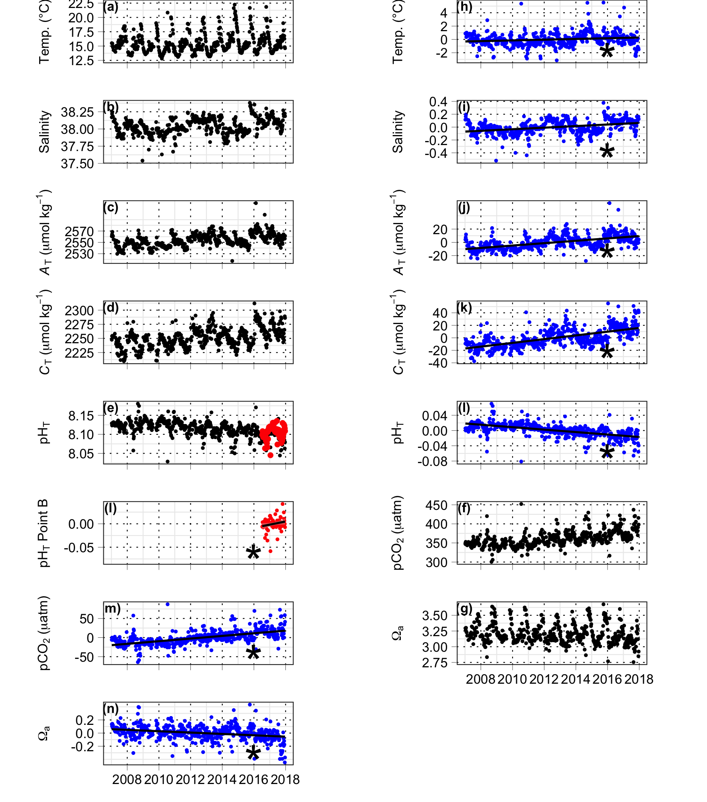

```{r kable regressions 50 m}
kable(reg_var_50m, digits = c(4,4,3,3,3,2,3), caption="Regressions on values at 50 m depth.")
kable(reg_ano_50m, digits = c(4,4,3,3,3,2,3), caption="Regressions on anomalies at 50 m depth.")
```

```{r Changes in AT_nocarb, include=FALSE}
ATnoC1p <- ggplot(mean0m, aes(x = sampling_date, y = mean_ta_nocarb), na.rm=TRUE) +
  scale_x_datetime(breaks = date_breaks("2 year"), labels = date_format("%Y")) +
  geom_point(colour="black", na.rm=TRUE, size=size_point) + 
  #geom_smooth(method=lm, colour="black", fill="grey", size=0.6, na.rm=TRUE) +
  labs(title="1 m",x="",y=expression(paste(italic(A)[T], " non carbonate (",mu, "mol ", kg^-1,")"))) +
  #annotate("text", x =as.POSIXct("2016-01-01"), y= min(mean0m$mean_ta, na.rm=TRUE), 
  #         label="*", colour="blue", size=9, fontface="plain") +
  coord_fixed() +
  Mytheme(size_labs = 8) +
  theme(axis.text.x=element_blank()) +
  annotation_custom(grob_A_bl)
ATnoC50p <- ggplot(mean50m, aes(x = sampling_date, y = mean_ta_nocarb), na.rm=TRUE) +
  scale_x_datetime(breaks = date_breaks("2 year"), labels = date_format("%Y")) +
  geom_point(colour="black", na.rm=TRUE, size=size_point) + 
  #geom_smooth(method=lm, colour="black", fill="grey", size=0.6, na.rm=TRUE) +
  labs(title="50 m",x="",y=expression(paste(italic(A)[T], " non carbonate (",mu, "mol ", kg^-1,")"))) +
  #annotate("text", x =as.POSIXct("2016-01-01"), y= min(mean0m$mean_ta, na.rm=TRUE), 
  #         label="*", colour="blue", size=9, fontface="plain") +
  coord_fixed() +
  Mytheme(size_labs = 8) +
  theme(axis.text.x=element_blank()) +
  annotation_custom(grob_B_bl)
g <- cowplot::plot_grid(ATnoC1p, ATnoC50p, align='vh', ncol=1)
ggsave(file="figures/fig_paper_at_nocarb.png", g, width=15, height = 17, units = "cm")
#cowplot::ggsave(file="../figures/at_nocarb.pdf", g, width = 18, height = 21, units = "cm")
```

## Annual, monthly and quarterly ranges of T, AT and pCO2 at 1m

```{r monthly and quarterly temperature and AT at 1 m, include=FALSE}
mean0m_month <- mean0m %>%
  group_by(year, monthd) %>%
  summarise(Temperature = mean(mean_temperature, na.rm=TRUE),
            at = mean(mean_ta, na.rm=TRUE),
            pCO2 = mean(mean_pCO2, na.rm=TRUE),
            ct = mean(mean_dic, na.rm=TRUE)) %>%
  mutate(date = ymd(paste(year,monthd,"01")))

fig_temp_month <- ggplot(data=mean0m_month, aes(x=year, y=Temperature)) + 
  geom_line(aes(color=as.factor(monthd)), size=1) +
  xlab("Time") + ylab("Temperature") +
  Mytheme() +
  scale_color_viridis(name="Month", discrete=TRUE, option="plasma") + 
  theme(legend.position="top") +
  guides(col = guide_legend(ncol = 12, byrow = TRUE))
ggsave(file="figures/fig_temp_month.png", fig_temp_month, width = 15, height = 10, units = "cm")
fig_at_month <- ggplot(data=mean0m_month, aes(x=year, y=at)) + 
  geom_line(aes(color=as.factor(monthd)), size=1) +
  guides(guide_legend(title = "Month")) +
  xlab("Time") + ylab("Total alkalinity") +
  Mytheme() +
  scale_color_viridis(name="Month", discrete=TRUE, option="plasma") + 
  theme(legend.position="top") +
  guides(col = guide_legend(ncol = 12, byrow = TRUE))
ggsave(file="figures/fig_at_month.png", fig_at_month, width = 15, height = 10, units = "cm")
fig_pCO2_month <- ggplot(data=mean0m_month, aes(x=year, y=pCO2)) + 
  geom_line(aes(color=as.factor(monthd)), size=1) +
  xlab("Time") + ylab("pCO2") +
  Mytheme() +
  scale_color_viridis(name="Month", discrete=TRUE, option="plasma") + 
  theme(legend.position="top") +
  guides(col = guide_legend(ncol = 12, byrow = TRUE))
ggsave(file="figures/fig_pCO2_month.png", fig_pCO2_month, width = 15, height = 10, units = "cm")
fig_ct_month <- ggplot(data=mean0m_month, aes(x=year, y=ct)) + 
  geom_line(aes(color=as.factor(monthd)), size=1) +
  xlab("Time") + ylab("Dissolved inorganic carbon") +
  Mytheme() +
  scale_color_viridis(name="Month", discrete=TRUE, option="plasma") + 
  theme(legend.position="top") +
  guides(col = guide_legend(ncol = 12, byrow = TRUE))
ggsave(file="figures/fig_ct_month.png", fig_ct_month, width = 15, height = 10, units = "cm")

# Regressions annual monthly temperature
j <- 0
reg <- data.frame()
for (i in 1:length(unique(mean0m_month$monthd))) { #one loops through all months
  j <- j + 1
  lms <- summary(lm(data=dplyr::filter(mean0m_month, monthd==i), Temperature ~ year))
  # calculate probability of fstatistic because it cannot be extracted from lms above
  # see http://stats.stackexchange.com/questions/92824/extracting-the-model-p-value-for-a-multiple-regression-in-r
  # slope returned by lm is per second
  prob <- pf(lms$fstatistic[1],lms$fstatistic[2],lms$fstatistic[3],lower.tail=FALSE)
  reg <- rbind(reg, as.numeric(c(lms$coefficients[2,1], lms$coefficients[2,2], 
                                 lms$coefficients[2,4], lms$coefficients[1,1], lms$coefficients[1,2],
                                 lms$fstatistic[1], lms$fstatistic[3], lms$coefficients[1,4], lms$r.squared, prob)))
}
names(reg) <- c("Slope", "SE Slope", "P Slope","Intercept","SE int.","P int.", "F", "df",
                "R2","P value")
row.names(reg) <- month(ymd(080101) + months(0:11), label = TRUE, abbr = FALSE)
#transform in latex table and save
tab_temp_month <- reg

# Regressions annual monthly AT
j <- 0
reg <- data.frame()
for (i in 1:length(unique(mean0m_month$monthd))) { #one loops through all months
  j <- j + 1
  lms <- summary(lm(data=dplyr::filter(mean0m_month, monthd==i), at ~ year))
  # calculate probability of fstatistic because it cannot be extracted from lms above
  # see http://stats.stackexchange.com/questions/92824/extracting-the-model-p-value-for-a-multiple-regression-in-r
  # slope returned by lm is per second
  prob <- pf(lms$fstatistic[1],lms$fstatistic[2],lms$fstatistic[3],lower.tail=FALSE)
  reg <- rbind(reg, as.numeric(c(lms$coefficients[2,1], lms$coefficients[2,2], 
                                 lms$coefficients[2,4], lms$coefficients[1,1], lms$coefficients[1,2],
                                 lms$fstatistic[1], lms$fstatistic[3], lms$coefficients[1,4], lms$r.squared, prob)))
}
names(reg) <- c("Slope", "SE Slope", "P Slope","Intercept","SE int.","P int.", "F", "df",
                "R2","P value")
row.names(reg) <- month(ymd(080101) + months(0:11), label = TRUE, abbr = FALSE)
#transform in latex table and save
tab_at_month <- reg
# Regressions annual monthly pCO2
j <- 0
reg <- data.frame()
for (i in 1:length(unique(mean0m_month$monthd))) { #one loops through all months
  j <- j + 1
  lms <- summary(lm(data=dplyr::filter(mean0m_month, monthd==i), pCO2 ~ year))
  # calculate probability of fstatistic because it cannot be extracted from lms above
  # see http://stats.stackexchange.com/questions/92824/extracting-the-model-p-value-for-a-multiple-regression-in-r
  # slope returned by lm is per second
  prob <- pf(lms$fstatistic[1],lms$fstatistic[2],lms$fstatistic[3],lower.tail=FALSE)
  reg <- rbind(reg, as.numeric(c(lms$coefficients[2,1], lms$coefficients[2,2], 
                                 lms$coefficients[2,4], lms$coefficients[1,1], lms$coefficients[1,2],
                                 lms$fstatistic[1], lms$fstatistic[3], lms$coefficients[1,4], lms$r.squared, prob)))
}
names(reg) <- c("Slope", "SE Slope", "P Slope","Intercept","SE int.","P int.", "F", "df",
                "R2","P value")
row.names(reg) <- month(ymd(080101) + months(0:11), label = TRUE, abbr = FALSE)
#transform in latex table and save
tab_pCO2_month <- reg
# Regressions annual monthly CT
j <- 0
reg <- data.frame()
for (i in 1:length(unique(mean0m_month$monthd))) { #one loops through all months
  j <- j + 1
  lms <- summary(lm(data=dplyr::filter(mean0m_month, monthd==i), ct ~ year))
  # calculate probability of fstatistic because it cannot be extracted from lms above
  # see http://stats.stackexchange.com/questions/92824/extracting-the-model-p-value-for-a-multiple-regression-in-r
  # slope returned by lm is per second
  prob <- pf(lms$fstatistic[1],lms$fstatistic[2],lms$fstatistic[3],lower.tail=FALSE)
  reg <- rbind(reg, as.numeric(c(lms$coefficients[2,1], lms$coefficients[2,2], 
                                 lms$coefficients[2,4], lms$coefficients[1,1], lms$coefficients[1,2],
                                 lms$fstatistic[1], lms$fstatistic[3], lms$coefficients[1,4], lms$r.squared, prob)))
}
names(reg) <- c("Slope", "SE Slope", "P Slope","Intercept","SE int.","P int.", "F", "df",
                "R2","P value")
row.names(reg) <- month(ymd(080101) + months(0:11), label = TRUE, abbr = FALSE)
#transform in latex table and save
tab_ct_month <- reg

#Plot monthly increases in AT and CT at 1 m
#Prepare dataframe
monthly_rate_AT_CT <- 
  cbind(rename(select(tab_at_month, Slope), AT=Slope),
        rename(select(tab_ct_month, Slope), CT=Slope)
) %>%
  mutate(month=factor(month.abb, as.character(month.abb))) %>%
  gather(key, value, -month) %>%
  mutate(se=c(tab_at_month[,2], tab_ct_month[,2])) %>%
  mutate(p=c(tab_at_month[,3], tab_ct_month[,3])) %>%
  mutate(significance=ifelse(p<=0.05, "*", ""))

# Scatter plot
fig_paper_monthly_rate_AT_CT <- 
  ggplot(data=monthly_rate_AT_CT, group=key) +
  geom_point(aes(x=month, y=value, color=key), size=2, position=position_dodge(0.2)) +
  geom_errorbar(aes(x=month, ymin=value-se, ymax=value+se, color=key), 
                position=position_dodge(0.2), width=0.1) +
  labs(title=NULL, x= NULL, y=expression(paste("Monthly change (",mu, "mol ", kg^-1, " ", yr^-1, ")")),
       colour="") +
  scale_y_continuous(limits = c(-2.5, 7.5), expand=c(0,0)) +
  scale_color_manual(values = c("blue", "#51C56AFF"),
                     labels=c(expression(paste(italic(A)[T])), expression(paste(italic(C)[T])))) +
  geom_text(aes(x=month, y=value, label=significance), nudge_x=0.25, nudge_y=-0.2, size=8) +
  geom_hline(yintercept = 0, size=0.1) +
  Mytheme(size_labs = 9) +
  theme(aspect.ratio=1/2, 
        legend.position = c(1,1),
        legend.justification = c(1,1),
        panel.grid.major.x = element_blank(),
        legend.title = element_blank(),
        legend.key = element_rect(colour = 'white', fill = 'white', size = 0),
        legend.background = element_rect(fill=alpha('white', alpha=0))
        )
ggsave(file="figures/fig_paper_monthly_rate_AT_CT.png", fig_paper_monthly_rate_AT_CT, width = 8, height = 8*2/3, units = "cm")
ggsave(file="figures/fig5.pdf", fig_paper_monthly_rate_AT_CT, width = 16, height= 10, units = "cm")

# Quarterly
mean0m_quart <- mean0m %>%
  group_by(year, quarter) %>%
  summarise(Temperature = mean(mean_temperature, na.rm=TRUE),
            at = mean(mean_ta, na.rm=TRUE))
fig_temp_quarter <- ggplot(data=mean0m_quart, aes(x=year, y=Temperature)) + 
  geom_line(aes(color=as.factor(quarter)), size=1) +
  xlab("Time") + ylab("Temperature") +
  Mytheme() +
  scale_color_viridis(name="Quarter", discrete=TRUE, option="plasma") + 
  theme(legend.position="top") +
  guides(col = guide_legend(ncol = 12, byrow = TRUE))
ggsave(file="figures/fig_temp_quarter.png", fig_temp_quarter, width = 15, height = 10, units = "cm")

fig_at_quarter <- ggplot(data=mean0m_quart, aes(x=year, y=at)) + 
  geom_line(aes(color=as.factor(quarter)), size=1) +
  xlab("Time") + ylab("Total alkalinity") +
  Mytheme() +
  scale_color_viridis(name="Quarter", discrete=TRUE, option="plasma") + 
  theme(legend.position="top") +
  guides(col = guide_legend(ncol = 12, byrow = TRUE))
ggsave(file="figures/fig_at_quarter.png", fig_at_quarter, width = 15, height = 10, units = "cm")
```

```{r}
kable(tab_temp_month, raw.names=TRUE, digits = c(4,4,3,3,3,2,3), caption="Regressions on annual monthly values of temperature at 1 m depth.")
kable(tab_at_month, digits = c(4,4,3,3,3,2,3), caption="Regressions on annual monthly values of total alkalinity at 1 m depth.")
kable(tab_pCO2_month, digits = c(4,4,3,3,3,2,3), caption="Regressions on annual monthly values of pCO2 at 1 m depth.")
kable(tab_ct_month, digits = c(4,4,3,3,3,2,3), caption="Regressions on annual monthly values of CT at 1 m depth.")
```

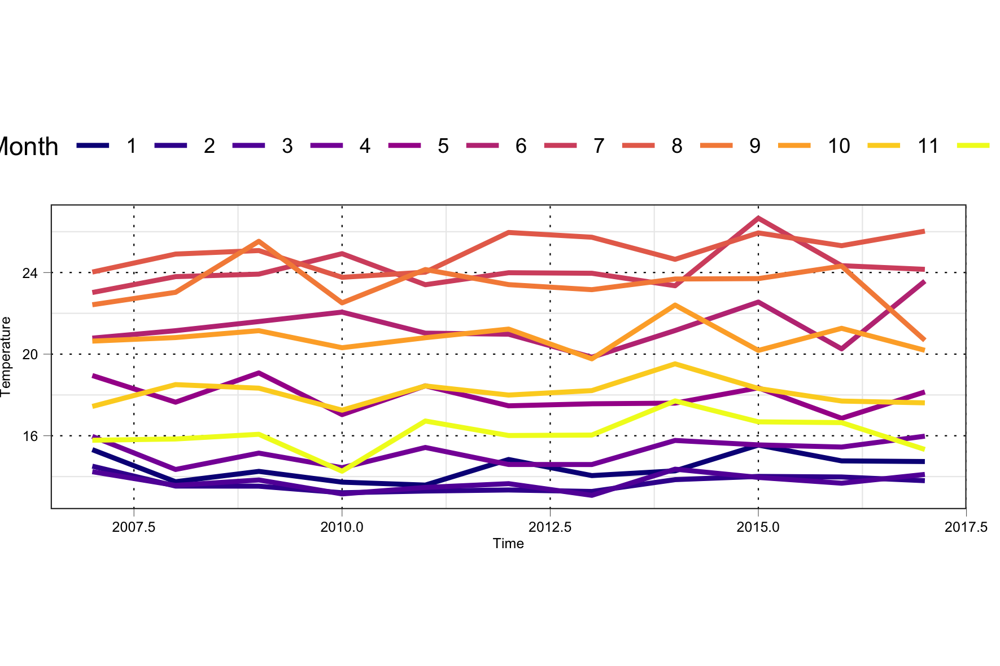
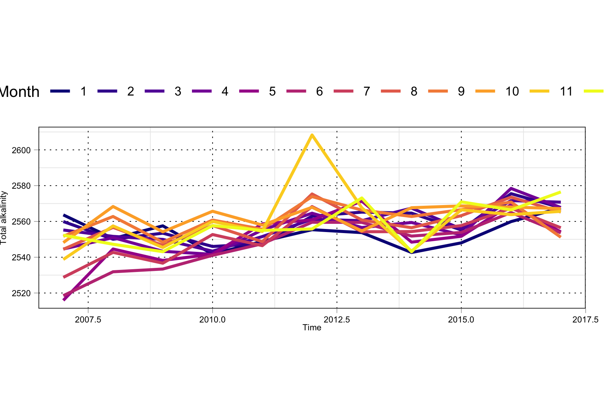
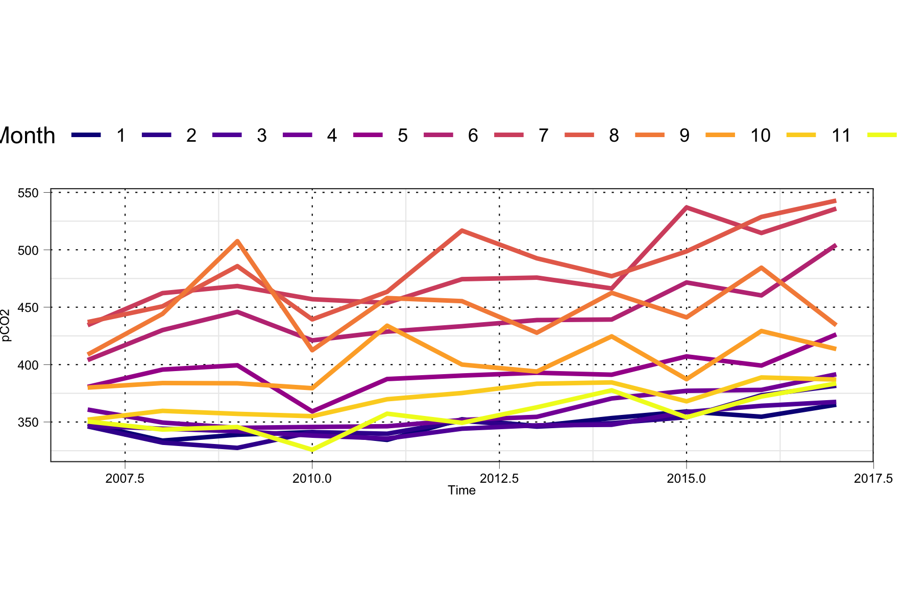
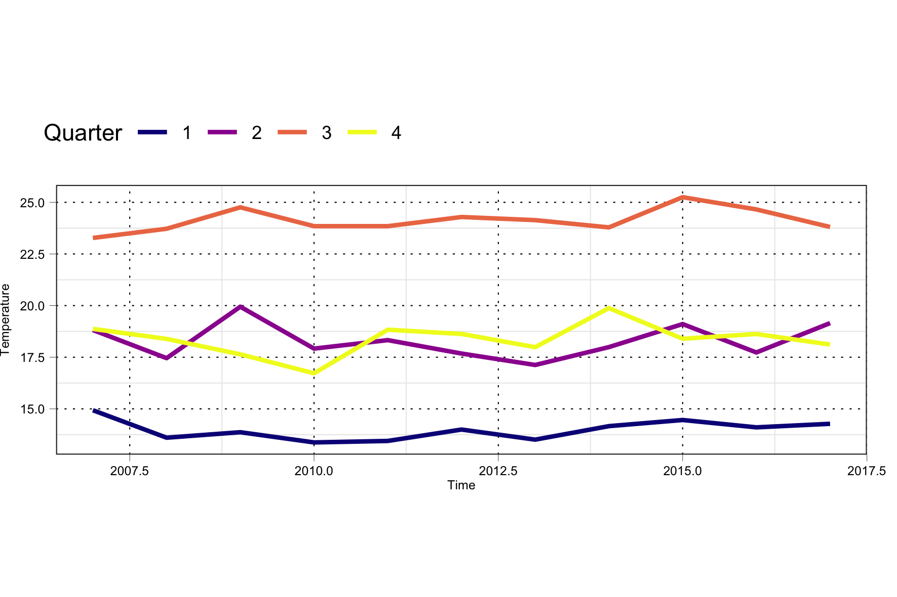
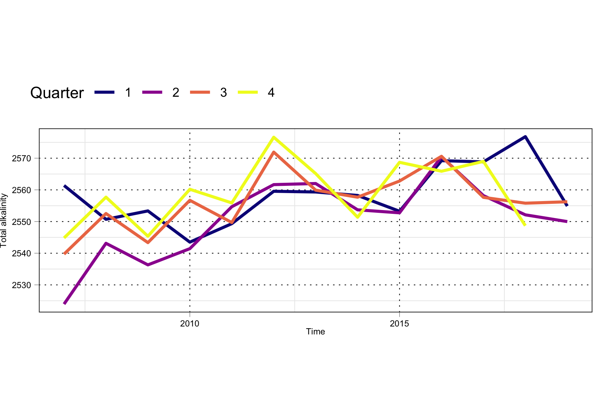
## Annual, monthly and quarterly ranges of T, AT and pCO2 at 50 m

```{r monthly and quarterly temperature and AT at 50 m, include=FALSE}
mean50m_month <- mean50m %>%
  group_by(year, monthd) %>%
  summarise(Temperature = mean(mean_temperature, na.rm=TRUE),
            at = mean(mean_ta, na.rm=TRUE),
            pCO2 = mean(mean_pCO2, na.rm=TRUE),
            ct = mean(mean_dic, na.rm=TRUE)) %>%
  mutate(date = ymd(paste(year,monthd,"01")))

# fig_temp_month <- ggplot(data=mean0m_month, aes(x=year, y=Temperature)) + 
#   geom_line(aes(color=as.factor(monthd)), size=1) +
#   xlab("Time") + ylab("Temperature") +
#   Mytheme() +
#   scale_color_viridis(name="Month", discrete=TRUE, option="plasma") + 
#   theme(legend.position="top") +
#   guides(col = guide_legend(ncol = 12, byrow = TRUE))
# ggsave(file="../figures/fig_temp_month.png", fig_temp_month, width = 15, height = 10, units = "cm")
# fig_at_month <- ggplot(data=mean0m_month, aes(x=year, y=at)) + 
#   geom_line(aes(color=as.factor(monthd)), size=1) +
#   guides(guide_legend(title = "Month")) +
#   xlab("Time") + ylab("Total alkalinity") +
#   Mytheme() +
#   scale_color_viridis(name="Month", discrete=TRUE, option="plasma") + 
#   theme(legend.position="top") +
#   guides(col = guide_legend(ncol = 12, byrow = TRUE))
# ggsave(file="../figures/fig_at_month.png", fig_at_month, width = 15, height = 10, units = "cm")
# fig_pCO2_month <- ggplot(data=mean0m_month, aes(x=year, y=pCO2)) + 
#   geom_line(aes(color=as.factor(monthd)), size=1) +
#   xlab("Time") + ylab("pCO2") +
#   Mytheme() +
#   scale_color_viridis(name="Month", discrete=TRUE, option="plasma") + 
#   theme(legend.position="top") +
#   guides(col = guide_legend(ncol = 12, byrow = TRUE))
# ggsave(file="../figures/fig_pCO2_month.png", fig_pCO2_month, width = 15, height = 10, units = "cm")
# fig_ct_month <- ggplot(data=mean0m_month, aes(x=year, y=ct)) + 
#   geom_line(aes(color=as.factor(monthd)), size=1) +
#   xlab("Time") + ylab("Dissolved inorganic carbon") +
#   Mytheme() +
#   scale_color_viridis(name="Month", discrete=TRUE, option="plasma") + 
#   theme(legend.position="top") +
#   guides(col = guide_legend(ncol = 12, byrow = TRUE))
# ggsave(file="../figures/fig_ct_month.png", fig_ct_month, width = 15, height = 10, units = "cm")


# Regressions annual monthly temperature
j <- 0
reg <- data.frame()
for (i in 1:length(unique(mean50m_month$monthd))) { #one loops through all months
  j <- j + 1
  lms <- summary(lm(data=dplyr::filter(mean50m_month, monthd==i), Temperature ~ year))
  # calculate probability of fstatistic because it cannot be extracted from lms above
  # see http://stats.stackexchange.com/questions/92824/extracting-the-model-p-value-for-a-multiple-regression-in-r
  # slope returned by lm is per second
  prob <- pf(lms$fstatistic[1],lms$fstatistic[2],lms$fstatistic[3],lower.tail=FALSE)
  reg <- rbind(reg, as.numeric(c(lms$coefficients[2,1], lms$coefficients[2,2], 
                                 lms$coefficients[2,4], lms$coefficients[1,1], lms$coefficients[1,2],
                                 lms$fstatistic[1], lms$fstatistic[3], lms$coefficients[1,4], lms$r.squared, prob)))
}
names(reg) <- c("Slope", "SE Slope", "P Slope","Intercept","SE int.","P int.", "F", "df",
                "R2","P value")
row.names(reg) <- month(ymd(080101) + months(0:11), label = TRUE, abbr = FALSE)
#transform in latex table and save
tab_temp_month_50m <- reg

# Regressions annual monthly AT
j <- 0
reg <- data.frame()
for (i in 1:length(unique(mean50m_month$monthd))) { #one loops through all months
  j <- j + 1
  lms <- summary(lm(data=dplyr::filter(mean50m_month, monthd==i), at ~ year))
  # calculate probability of fstatistic because it cannot be extracted from lms above
  # see http://stats.stackexchange.com/questions/92824/extracting-the-model-p-value-for-a-multiple-regression-in-r
  # slope returned by lm is per second
  prob <- pf(lms$fstatistic[1],lms$fstatistic[2],lms$fstatistic[3],lower.tail=FALSE)
  reg <- rbind(reg, as.numeric(c(lms$coefficients[2,1], lms$coefficients[2,2], 
                                 lms$coefficients[2,4], lms$coefficients[1,1], lms$coefficients[1,2],
                                 lms$fstatistic[1], lms$fstatistic[3], lms$coefficients[1,4], lms$r.squared, prob)))
}
names(reg) <- c("Slope", "SE Slope", "P Slope","Intercept","SE int.","P int.", "F", "df",
                "R2","P value")
row.names(reg) <- month(ymd(080101) + months(0:11), label = TRUE, abbr = FALSE)
#transform in latex table and save
tab_at_month_50m <- reg
# Regressions annual monthly pCO2
j <- 0
reg <- data.frame()
for (i in 1:length(unique(mean50m_month$monthd))) { #one loops through all months
  j <- j + 1
  lms <- summary(lm(data=dplyr::filter(mean50m_month, monthd==i), pCO2 ~ year))
  # calculate probability of fstatistic because it cannot be extracted from lms above
  # see http://stats.stackexchange.com/questions/92824/extracting-the-model-p-value-for-a-multiple-regression-in-r
  # slope returned by lm is per second
  prob <- pf(lms$fstatistic[1],lms$fstatistic[2],lms$fstatistic[3],lower.tail=FALSE)
  reg <- rbind(reg, as.numeric(c(lms$coefficients[2,1], lms$coefficients[2,2], 
                                 lms$coefficients[2,4], lms$coefficients[1,1], lms$coefficients[1,2],
                                 lms$fstatistic[1], lms$fstatistic[3], lms$coefficients[1,4], lms$r.squared, prob)))
}
names(reg) <- c("Slope", "SE Slope", "P Slope","Intercept","SE int.","P int.", "F", "df",
                "R2","P value")
row.names(reg) <- month(ymd(080101) + months(0:11), label = TRUE, abbr = FALSE)
#transform in latex table and save
tab_pCO2_month_50m <- reg
# Regressions annual monthly CT
j <- 0
reg <- data.frame()
for (i in 1:length(unique(mean50m_month$monthd))) { #one loops through all months
  j <- j + 1
  lms <- summary(lm(data=dplyr::filter(mean50m_month, monthd==i), ct ~ year))
  # calculate probability of fstatistic because it cannot be extracted from lms above
  # see http://stats.stackexchange.com/questions/92824/extracting-the-model-p-value-for-a-multiple-regression-in-r
  # slope returned by lm is per second
  prob <- pf(lms$fstatistic[1],lms$fstatistic[2],lms$fstatistic[3],lower.tail=FALSE)
  reg <- rbind(reg, as.numeric(c(lms$coefficients[2,1], lms$coefficients[2,2], 
                                 lms$coefficients[2,4], lms$coefficients[1,1], lms$coefficients[1,2],
                                 lms$fstatistic[1], lms$fstatistic[3], lms$coefficients[1,4], lms$r.squared, prob)))
}
names(reg) <- c("Slope", "SE Slope", "P Slope","Intercept","SE int.","P int.", "F", "df",
                "R2","P value")
row.names(reg) <- month(ymd(080101) + months(0:11), label = TRUE, abbr = FALSE)
#transform in latex table and save
tab_ct_month_50m <- reg

#Plot monthly increases in AT and CT at 50 m
#Prepare dataframe
monthly_rate_AT_CT_50m <- 
  cbind(rename(select(tab_at_month_50m, Slope), AT=Slope),
        rename(select(tab_ct_month_50m, Slope), CT=Slope)
) %>%
  mutate(month=factor(month.abb, as.character(month.abb))) %>%
  gather(key, value, -month) %>%
  mutate(se=c(tab_at_month[,2], tab_ct_month[,2])) %>%
  mutate(p=c(tab_at_month[,3], tab_ct_month[,3])) %>%
  mutate(significance=ifelse(p<=0.05, "*", ""))

# Scatter plot
fig_paper_monthly_rate_AT_CT_50m <- 
  ggplot(data=monthly_rate_AT_CT_50m, group=key) +
  geom_point(aes(x=month, y=value, color=key), size=2, position=position_dodge(0.2)) +
  geom_errorbar(aes(x=month, ymin=value-se, ymax=value+se, color=key), 
                position=position_dodge(0.2), width=0.1) +
  labs(title=NULL, x= NULL, y=expression(paste("Monthly change (",mu, "mol ", kg^-1, " ", yr^-1, ")")),
       colour="") +
  scale_y_continuous(limits = c(-2.5, 7.5)) +
  scale_color_manual(values = c("blue", "#51C56AFF"),
                     labels=c(expression(paste(italic(A)[T])), expression(paste(italic(C)[T])))) +
  geom_text(aes(x=month, y=value, label=significance), nudge_x=0.25, nudge_y=-0.2, size=8) +
  geom_hline(yintercept = 0, size=0.1) +
  Mytheme(size_labs = 9) +
  theme(aspect.ratio=1/2, 
        legend.position = c(1,1),
        legend.justification = c(1,1),
        panel.grid.major.x = element_blank(),
        legend.title = element_blank(),
        legend.key = element_rect(colour = 'white', fill = 'white', size = 0),
        legend.background = element_rect(fill="white", size=0.15, colour="black"))
ggsave(file="figures/fig_paper_monthly_rate_AT_CT_50m.png", fig_paper_monthly_rate_AT_CT_50m, width = 8, height = 8*2/3, units = "cm")
ggsave(file="figures/fig4b.pdf", fig_paper_monthly_rate_AT_CT_50m, width = 16, height= 10, units = "cm")
```

## Issue of total alkalinity
```{r Total alkalinity Point B, include=FALSE}

# AT versus salinity at the surface per month with facet
p1 <- ggplot(data=dplyr::filter(means_depth, depth== 0)) +
  aes(mean_salinity, mean_ta) +
  geom_point(na.rm=TRUE, size=size_point) +
  stat_smooth(method=lm, na.rm=TRUE, show.legend=FALSE, se=FALSE, colour="black", size=0.5) +
  facet_wrap(~ month) +
  scale_x_continuous(limits = c(36.8, 38.4), breaks=c(37, 37.5, 38), expand = c(0,0)) +
  scale_y_continuous(limits = c(2490, 2600), expand = c(0,0)) +
  labs(title = "Point B (1 m, with month of sampling)", x = "Salinity", y = expression(paste("Total alkalinity (",mu, "mol ", kg^-1,")"))) +
  Mytheme()
png(file = "figures/fig_ta_vs_salinity_month_pointB_0m.png", 
    width = 20, height = 13, units = "cm", res = 300)
print(p1)
dev.off()

# AT versus salinity at the surface per year with facet
p1 <- ggplot(data=dplyr::filter(means_depth, depth== 0)) +
  aes(mean_salinity, mean_ta) +
  geom_point(na.rm=TRUE, size=size_point) +
  stat_smooth(method=lm, na.rm=TRUE, show.legend=FALSE, se=FALSE, colour="black", size=0.5) +
  facet_wrap(~ year) +
  scale_x_continuous(limits = c(36.8, 38.4), breaks=c(37, 37.5, 38), expand = c(0,0)) +
  scale_y_continuous(limits = c(2490, 2600), expand = c(0,0)) +
  labs(title = NULL, x = "Salinity", y = expression(paste("Total alkalinity (",mu, "mol ", kg^-1,")"))) +
Mytheme_facet()
ggsave(p1, file = "figures/fig_ta_vs_salinity_year_pointB_0m.png", 
    width = 6, height = 6)

# AT versus salinity at the surface per year with loop
panel <- c("(a)","(b)","(c)","(d)","(e)","(f)","(g)","(h)","(i)", "(j)", "(k)", "(l)", "(m)")
tmp <- filter(means_depth, depth== 0)
p <- NULL; j <- 0
#for (i in 1:11) {
for (i in unique(tmp$year)) {
  #i <- 13
  j <- j+1
  print(j)
  p[[j]] <- ggplot(data=filter(tmp, tmp$year==i), aes(x=mean_salinity, y=mean_ta, colour=month)) +
    geom_point(na.rm=TRUE, size=2) +
    stat_smooth(method=lm, na.rm=TRUE, show.legend=FALSE, se=FALSE, colour="black", size=0.5) +
    scale_x_continuous(limits = c(36.8, 38.5), breaks=c(37, 37.5, 38, 38.5), expand = c(0,0)) +
    scale_y_continuous(limits = c(2490, 2600), expand = c(0,0)) +
    labs(title = NULL, x = NULL, y = NULL) +
    annotate(geom = "text", x=36.9, y=2495, label= as.character(i), hjust=0, vjust=0, size=3) +
    annotate(geom = "text", x=36.9, y=2590, label= panel[[j]], hjust=0, vjust=0, size=3) +
    Mytheme(size_labs = 9) +
    scale_color_viridis(name="Month", discrete=TRUE, option="plasma") + 
    theme(aspect.ratio = 1,
          plot.margin = margin(t = 0, r = 0, b = 0, l = 0, unit = "cm"),
          panel.grid.major = element_blank(),
          panel.grid.minor = element_blank(),
          legend.title = element_blank(),
          legend.key = element_rect(colour = 'white', fill = 'white', size = 0),
          legend.background = element_rect(fill="white", size=0.15),
          legend.key.width = unit(1, "cm"),
          legend.position='none')
if (j %in% c(1,5,9,13)) {p[[j]] <- p[[j]] + labs(y=expression(paste(italic(A)[T], " (",mu, "mol ", kg^-1,")")))}
  else {
    p[[j]] <- p[[j]] + theme(axis.text.y = element_blank())
    p[[j]] <- p[[j]] + theme(plot.margin = margin(t = 0, r = 0.3, b = 0, l = 0, unit = "cm"))
  }
 if (j %in% c(10,11,12,13)) {p[[j]] <- p[[j]] + labs(x = "Salinity")
 p[[j]] <- p[[j]] + theme(axis.title.x = element_text(margin=margin(t = 0.2, r = 0, b = 0.2, l = 0, unit="cm")))
 }
 else {
    p[[j]] <- p[[j]] + theme(axis.text.x = element_blank())
 }
  #   #p[[j]] <- p[[j]] + theme(axis.title.x = element_text(margin=margin(t = 0.2, r = 0, b = 0.2, l = 0, unit="cm")))
  #   #p[[j]] <- p[[j]] + theme(plot.margin = margin(t = 0, r = 0, b = 0, l = 0, unit = "cm"))
}
g1 <- cowplot::plot_grid(p[[1]], p[[2]], p[[3]], p[[4]], p[[5]], p[[6]], p[[7]], p[[8]], p[[9]], p[[10]], p[[11]], p[[12]], p[[13]], ncol=4, align="vh")
grobs <- ggplotGrob(p[[1]] + theme(legend.position="top"))$grobs
legend_top <- grobs[[which(sapply(grobs, function(x) x$name) == "guide-box")]]
g <- cowplot::plot_grid(legend_top, g1, ncol = 1, rel_heights = c(0.15, 1))
ggsave(file="figures/fig6.pdf", g, width = 16, height = 15, units = "cm")


# AT=f(S) with all data
lms <- summary(lm(data = mean0m, mean_ta ~ mean_salinity))
prob <- pf(lms$fstatistic[1],lms$fstatistic[2],lms$fstatistic[3],lower.tail=FALSE)
reg_AT_S_all <- cbind(as.numeric(c(lms$coefficients[2,1], lms$coefficients[2,2], 
                                       lms$coefficients[2,4], lms$coefficients[1,1],
                                       lms$coefficients[1,2], lms$fstatistic[1], lms$fstatistic[3], 
                                       lms$coefficients[1,4], lms$r.squared, prob)))
colnames(reg_AT_S_all) <- c("AT")
row.names(reg_AT_S_all) <- c("Slope", "SE Slope", "P Slope","Intercept","SE int.","P int.", "F", "df",
                    "R2","P value")

p1 <- ggplot(data=mean0m) +
  aes(x= mean_salinity, y=mean_ta) +
  geom_point(na.rm=TRUE, size=size_point) +
  stat_smooth(method=lm, na.rm=TRUE, show.legend=FALSE, se=FALSE, colour="black", size=0.5) +
  labs(title = "With monthly means", x = "Salinity", y = expression(paste("Total alkalinity (",mu, "mol ", kg^-1,")"))) +
  Mytheme()
ggsave(p1, filename = "figures/fig_ta_vs_salinity_all_pointB_0m.png", width = 20, height = 13, units = "cm")

# AT=f(S) with monthly means
lms <- summary(lm(data = means_month0m, AT ~ Salinity))
prob <- pf(lms$fstatistic[1],lms$fstatistic[2],lms$fstatistic[3],lower.tail=FALSE)
reg_AT_S_monthly <- cbind(as.numeric(c(lms$coefficients[2,1], lms$coefficients[2,2], 
                                       lms$coefficients[2,4], lms$coefficients[1,1],
                                       lms$coefficients[1,2], lms$fstatistic[1], lms$fstatistic[3], 
                                       lms$coefficients[1,4], lms$r.squared, prob)))
colnames(reg_AT_S_monthly) <- c("AT")
row.names(reg_AT_S_monthly) <- c("Slope", "SE Slope", "P Slope","Intercept","SE int.","P int.", "F", "df",
                    "R2","P value")

p1 <- ggplot(data=means_month0m) +
  aes(x= Salinity, y=AT) +
  geom_point(na.rm=TRUE, size=size_point) +
  stat_smooth(method=lm, na.rm=TRUE, show.legend=FALSE, se=FALSE, colour="black", size=0.5) +
  labs(title = "With all data", x = "Salinity", 
       y = expression(paste("Total alkalinity (",mu, "mol ", kg^-1,")"))) +
  Mytheme()
png(file = "figures/fig_ta_vs_salinity_monthly_means_pointB_0m.png", 
    width = 20, height = 13, units = "cm", res = 300)
print(p1)
dev.off()


# Alkalinity as a function of precipitation
w <- tbl_df(read.table(paste0(path,"/data/meteo_nice_airport/Meteo_2007_2015.csv"), header=T, sep=",", dec=".", as.is=T, na.strings = c("NA", "-999", "999999")))
w$sampling_date <- ymd(w$sampling_date)
w$days <- wday(w$sampling_date, label = TRUE, abbr = FALSE)
w$group <- format(w$sampling_date - 1, "%Y%W") # Group the weeks tuesday to monday
w <- w %>%
   group_by(group) %>%
   mutate(rr_cumsum =  cumsum(rr)  ) #cumsum of precipitation tuesday to monday
# take the monday precipitation value (cumsum) and match it with TA of the day after (tuesday).
 w_monday <- w %>%
   filter(days == "Monday" | days== "Lundi")
 w_monday$group <- as.numeric(w_monday$group)
 w_monday$group <-w_monday$group + 1 # Add + 1 to w$group to match with AT
 
#mean0m$days <- wday(mean0m$sampling_date)
mean0m$group <- format(mean0m$sampling_date, "%Y%W") # Create "group" column in mean0m for AT
mean0m$group <- as.numeric(mean0m$group)

# merge the 2 df
w_AT_precip <- left_join(mean0m,w_monday[,c(2,43:45)], by="group") %>%
  rename(sampling_date=sampling_date.x)
 
# PLOTS
precip_cumsum <-
  ggplot(w_AT_precip, aes(x = sampling_date, y = rr_cumsum)) +
  scale_x_datetime(breaks = date_breaks("2 year"), labels = date_format("%Y")) +
  geom_point(colour = "blue", na.rm=TRUE) +
  labs(title = NULL, x = "Time", y = "Weekly precipitation (mm)") +
  Mytheme(size_labs = 9) +
  theme(aspect.ratio = 1/2,
        plot.margin = margin(t=0.25, r=0.5, b=0, l=0, unit = "cm"),
        axis.title.x = element_text(margin=margin(t=0.15, r=0, b=0.25, l=0, unit = "cm"))) +
  annotation_custom(grob_A)
  
precip_ta <- ggplot(w_AT_precip, aes(x = rr_cumsum, y = mean_ta)) +
  geom_point(colour = "blue", na.rm=TRUE) +
  labs(title = NULL,
       x = "Weekly precipitation (mm)", 
       y = expression(paste(italic(A)[T]," ","(",mu, "mol ", kg^-1,")"))) +
  Mytheme(size_labs = 9) +
  theme(aspect.ratio = 1/2,
        plot.margin = margin(t=0.25, r=0.5, b=0, l=0, unit = "cm"),
        axis.title.x = element_text(margin=margin(t=0.15, r=0, b=0.25, l=0, unit = "cm"))) +
  annotation_custom(grob_B_bl)

precip_S <- ggplot(w_AT_precip, aes(x = rr_cumsum, y = mean_salinity)) +
  geom_point(colour = "blue", na.rm=TRUE) +
  labs(title = NULL,
       x = "Weekly precipitation (mm)", 
       y = "Salinity") +
  Mytheme(size_labs = 9) +
    theme(aspect.ratio = 1/2,
        plot.margin = margin(t=0.25, r=0.5, b=0, l=0, unit = "cm"),
        axis.title.x = element_text(margin=margin(t=0.15, r=0, b=0.25, l=0, unit = "cm"))) +
annotation_custom(grob_C_bl)

g <- cowplot::plot_grid(precip_cumsum, precip_ta, precip_S, ncol=1, align="h")
ggsave("figures/precip.png",g, width = 18, height = 14, units = "cm")
ggsave("figures/figS2.pdf",g, width = 8, height = 14, units = "cm")
```

The relationship between AT and salinity using all data is shown below.
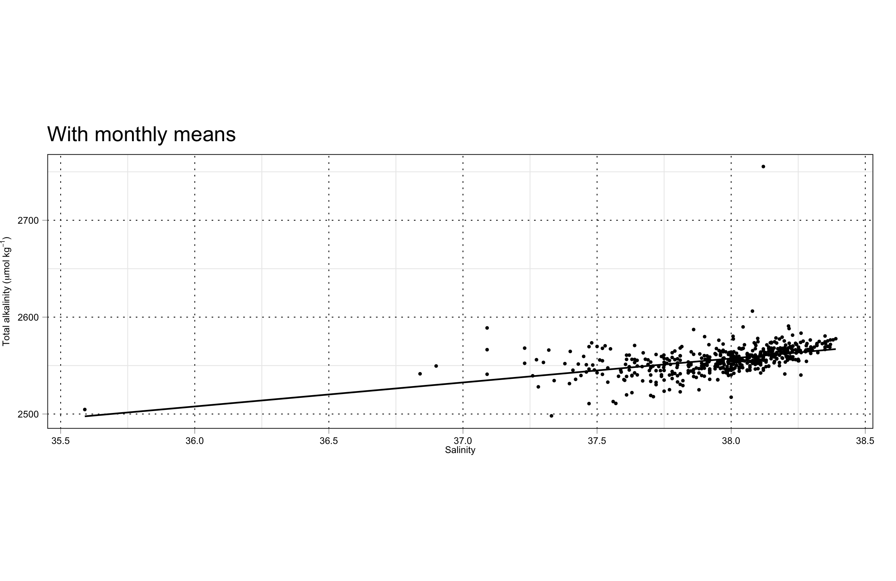

The relationship between AT and salinity using monthly means is shown below.
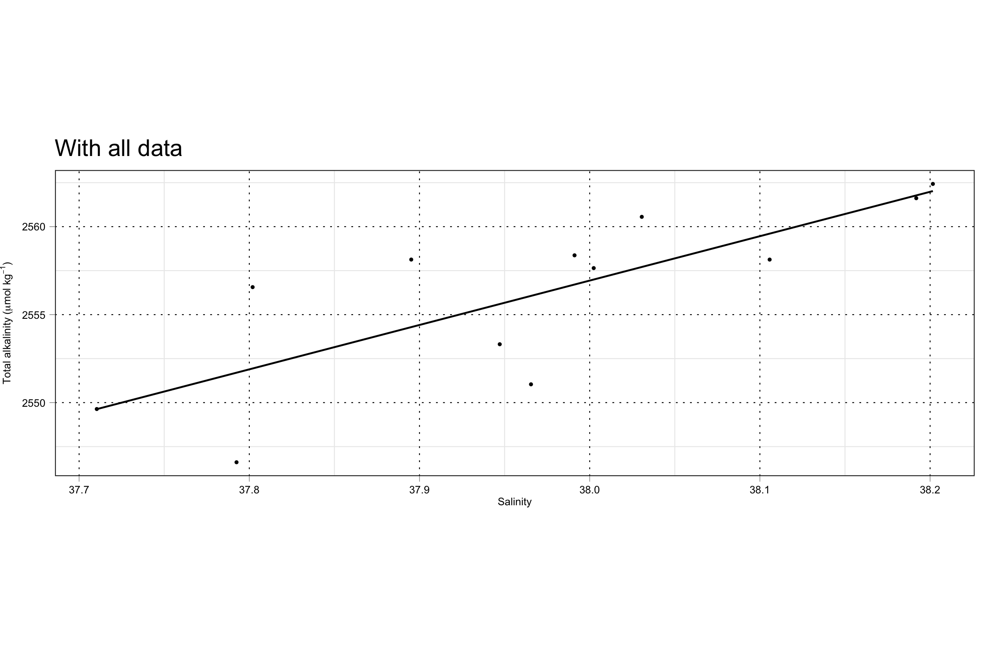

```{r reg_AT_S_monthly}
  kable(reg_AT_S_monthly, digits = c(3), padding = 0, caption="Regression parameters of the AT=f(S) relationship derived using monthly means.")
  kable(reg_AT_S_all, digits = c(3), padding = 0, caption="Regression parameters of the AT=f(S) relationship derived using all data.")
```


Salinity and total alkalinity data were compared with the weekly, from Tuesday to Monday, sum of precipitation data (Nice airport). Note that the analysis is incomplete as the 2015 data are currenly missing.
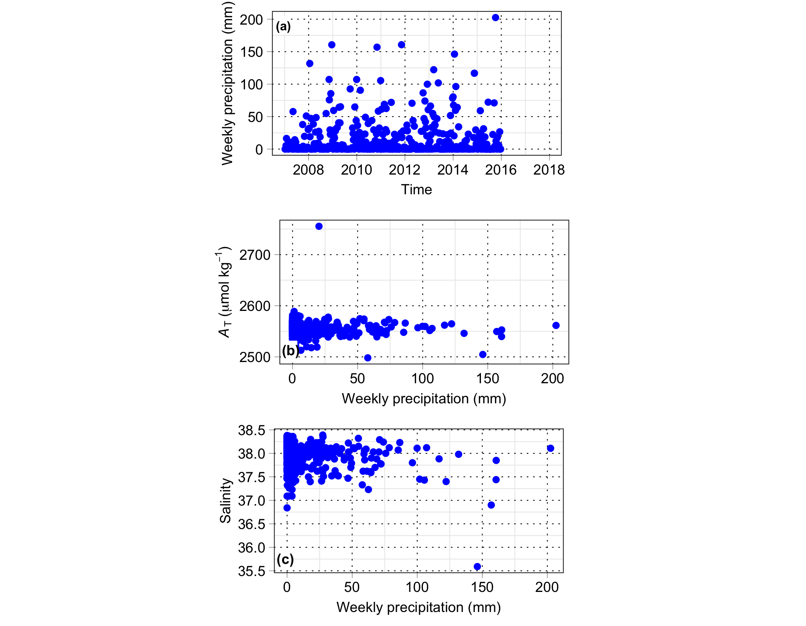


## Daily and monthly changes in pH and T
```{r Daily and seasonal changes, include=FALSE}
# Long series
continuous_discrete <- read_csv(file = paste0(path,"/data/continuous_discrete.csv"), col_types = cols(pHcalc_ptB = "d", pHspec_Tptb="d"), col_names = TRUE)
continuous_discrete$pHspec_Tptb <- as.numeric(continuous_discrete$pHspec_Tptb)
continuous_discrete <- filter(continuous_discrete, date > "2014-06-27 00:00:00")
deploy <- as.numeric(as.POSIXct(
   c("2014-01-07 09:00:08",
  "2014-02-11 09:00:08",
  "2014-04-28 13:00:08",
  "2014-06-27 10:00:08",
  "2014-09-16 08:00:08",
  "2014-11-20 09:30:08",
  "2014-02-11 09:00:08",
  "2014-12-19 09:30:08",
  "2015-03-31 07:10:08",
  "2015-06-01 08:00:08",
  "2015-07-06 08:00:08",
  "2015-09-29 09:00:08",
  "2015-12-08 09:00:08",
  "2016-01-07 09:00:08",
  "2016-03-08 09:00:08",
  "2016-04-08 08:00:08"
  ), tz = "UTC"))
plot_continuous_discrete_pH  <- ggplot(data = filter(continuous_discrete,!is.na(pHT_sfint))) +
  geom_vline(xintercept = deploy, colour="grey") + 
  geom_point(aes(x = date, y = pHT_sfint), size = 0.1) +
  geom_point(data = filter(continuous_discrete, !is.na(pHspec_Tptb)),
    aes(x = date, y = pHspec_Tptb), size = size_point, colour = "#51C56AFF") +
  labs(x = NULL, y=expression(paste(pH[T])), title = NULL) +
  scale_x_datetime(date_breaks="4 months", 
               date_minor_breaks="1 month", labels=date_format("%b %Y")) +
  Mytheme() +
  theme(panel.grid.major.x = element_blank()) +
  annotation_custom(grob_A)

  # Plot Seafet temperature
plot_continuous_discrete_T  <- ggplot(data = filter(continuous_discrete,!is.na(T_seaF))) +
  geom_vline(xintercept = deploy, colour="grey") + 
  geom_point(aes(x = date, y = T_seaF), size = 0.1) +
  labs(x = NULL, y="Temperature (°C)", title = NULL) +
  scale_x_datetime(date_breaks="4 months", 
               date_minor_breaks="1 month", labels=date_format("%b %Y")) +
  Mytheme() +
  theme(panel.grid.major.x = element_blank()) +
  annotation_custom(grob_B)

# Zoom on a few days
date_min <- as.numeric(as.POSIXct("2015-05-01"))
date_max <- as.numeric(as.POSIXct("2015-05-05"))
dat <- filter(continuous_discrete, !is.na(pHT_sfint) & date > date_min & date < date_max)
plot_zoom <- ggplot(data =dat) +
  geom_point(aes(x = date, y = pHT_sfint), size = size_point) +
  labs(x = NULL, y=expression(paste(pH[T])), title = NULL) +
  scale_x_datetime(breaks = date_breaks("1 days"), labels = date_format("%d %b")) +
  Mytheme() +
  theme(panel.grid.major.x = element_blank()) +
  annotation_custom(grob_E)

# Offset between seafet pH and spec pH (Fig. 2 Kapsenberg et al.)
dat <- mutate(continuous_discrete, diff_pH = pHspec_Tptb - pHT_sfint)
average_offset <- mean(abs(dat$diff_pH), na.rm=TRUE)

plot_offset <- ggplot(data = filter(dat, !is.na(diff_pH))) +
  geom_hline(yintercept=mean(dat$diff_pH, na.rm = TRUE), size=0.3) +
  geom_point(aes(x = date, y = diff_pH), size = 1, colour = "#51C56AFF") +
  labs(x = NULL, y=expression(paste(pH[T], " difference")), title = NULL) +
  scale_x_datetime(date_breaks="4 months", 
               date_minor_breaks="1 month", labels=date_format("%b %Y")) +
  Mytheme() +
  theme(panel.grid.major.x = element_blank()) +
  annotation_custom(grob_C)

# Range of daily pH changes
range <- tbl_df(
  dat %>%
  group_by(date=as.Date(date), month=month(date, label=TRUE), year=year(date)) %>%
  summarize(pH_range = max(pHT_sfint) - min(pHT_sfint))
)
quant <- quantile(range$pH_range, probs =c(2.5/100, 97.5/100))

# Per month
range_month <-
  range %>%
  group_by(Month = month(date, label=TRUE, abbr=FALSE)) %>%
  summarize(pH_range_month = mean(pH_range, na.rm=TRUE))
# add chla in range_month
range_month <- inner_join(range_month, select(means_month0m, Month, Temperature, Chla), by="Month")
range_month$monthd <- c(1:12)

#regressions
reg_Temperature <- lm(pH_range_month ~ Temperature, data=range_month)
reg_Chla <- lm(pH_range_month ~ Chla, data=range_month)

# plot
plot_range_pH_Chla_month <-  ggplot(data = range_month) +
  geom_text(aes(x = Chla, y = pH_range_month, label = Month)) +
  labs(x = "Chl-a concentration", y = "pH range", title = NULL) +
  theme_bw()
ggsave("figures/plot_range_pH_Chla_month.png", plot_range_pH_Chla_month)

plot_range_pH_Temperature <-  ggplot(data = range_month) +
  geom_text(aes(x = Temperature, y = pH_range_month, label = Month), na.rm=TRUE) +
  scale_x_continuous(limits=c(12, 25)) +
  scale_y_continuous(limits=c(0.02, 0.041)) +
  labs(title = NULL,
       x = "Temperature (°C)",
       y = expression(paste(pH[T], " range"))) +
  Mytheme(size_labs = 9) +
  theme(aspect.ratio=1/2,
        axis.title.x = element_text(margin=margin(t=0.25, r=0, b=0.25, l=0, unit = "cm"))) +
  annotation_custom(grob_A)
ggsave("figures/plot_range_pH_Temperature.png", plot_range_pH_Temperature)

size_point <- 0.4 # size of data points
plot_range <-  
  ggplot(data=range, aes(x = as.factor(month), y = pH_range)) +
  geom_violin(fill='lightblue', alpha=0.5, size=0.2, trim = TRUE) +
  geom_boxplot(notch=TRUE, size=0.2, fill="grey50", outlier.color = "blue", outlier.size = 0.3) +
  labs(y =expression(paste(pH[T], " range")), x=NULL, title=NULL) +
  Mytheme() +
  theme(panel.grid.major.x = element_blank()) +
  annotation_custom(grob_D)

g <- cowplot::plot_grid(plot_continuous_discrete_pH, plot_continuous_discrete_T, plot_offset, plot_range, plot_zoom, align='vh', ncol=1)
ggsave("figures/fig_paper_time_series.png", g, width = 18, height = 14, units = "cm")
ggsave(file="figures/fig7.pdf", g, width = 8, height = 16, units = "cm")

# Per year and week
range$year_week <- paste0(range$year,"-", week(range$date))
range_year_week <-
  ungroup(range) %>%
  group_by(year_week) %>%
  summarize(pH_range_year_week = mean(pH_range, na.rm=TRUE))
# add year_month to weekly data
tmp <- ungroup(mean0m) %>%
  mutate(year_week=paste0(year,"-", week(sampling_date))) %>%
  select(sampling_date, mean_Chla, year_week)
# add chla in range_month
range_year_week <- inner_join(range_year_week, tmp, by="year_week")
plot_range_pH_Chla_week <-  ggplot(data =  range_year_week) +
  geom_point(aes(x = mean_Chla, y = pH_range_year_week), na.rm=TRUE) +
  labs(title = NULL,
       x = expression(paste("Chl-a concentration (mg ", m^-3,")")),
       y = "pH range") +
  Mytheme(size_labs = 9) +
  theme(aspect.ratio=1/2,
        axis.title.x = element_text(margin=margin(t=0.25, r=0, b=0.25, l=0, unit = "cm"))) +
  annotation_custom(grob_B)
ggsave("figures/plot_range_pH_Chla_week.png", plot_range_pH_Chla_week)

plot_range_pH_Chla_temp <- cowplot::plot_grid(plot_range_pH_Temperature,
                                     plot_range_pH_Chla_week, ncol = 1, align = "h")
ggsave("figures/plot_range_pH_Chla_temp.png", plot_range_pH_Chla_temp, width = 8)
ggsave("figures/figS1.pdf", plot_range_pH_Chla_temp, width = 8, height = 8)

```

The average error in pH due to spatiotemporal mismatch between sensor and discrete sample is `r average_offset`.
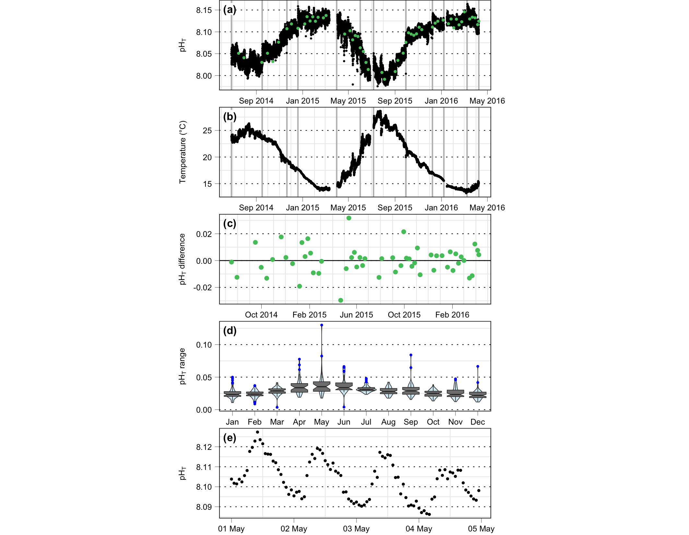

The quantiles of interest for the daily pH range of the total scale are `r quant ` (respectively 2.5% and 97.5%).

The changes in the daily pH range do not seem to be driven by the concentration of Chl-a nor by temperature as the relationships between pH range with temperature and Chla are not significant. For temperature r-square is `r summary(reg_Temperature)$r.squared` with a p-value of `r summary(reg_Temperature)$fstatistic[1]`. For Chla r-square is `r summary(reg_Chla)$r.squared` with a p-value of `r summary(reg_Chla)$fstatistic[1]`. 


```{r kable pH range vs temperature and Chla}
kable(broom::tidy(summary(reg_Temperature)), digits = c(5,5,5,3,3), caption="Regressions on values monthly means of pH range as a function of temperature")
kable(broom::tidy(summary(reg_Chla)), digits = c(5,5,5,3,3), caption="Regressions on values monthly means of pH range as a function of Chla")
```


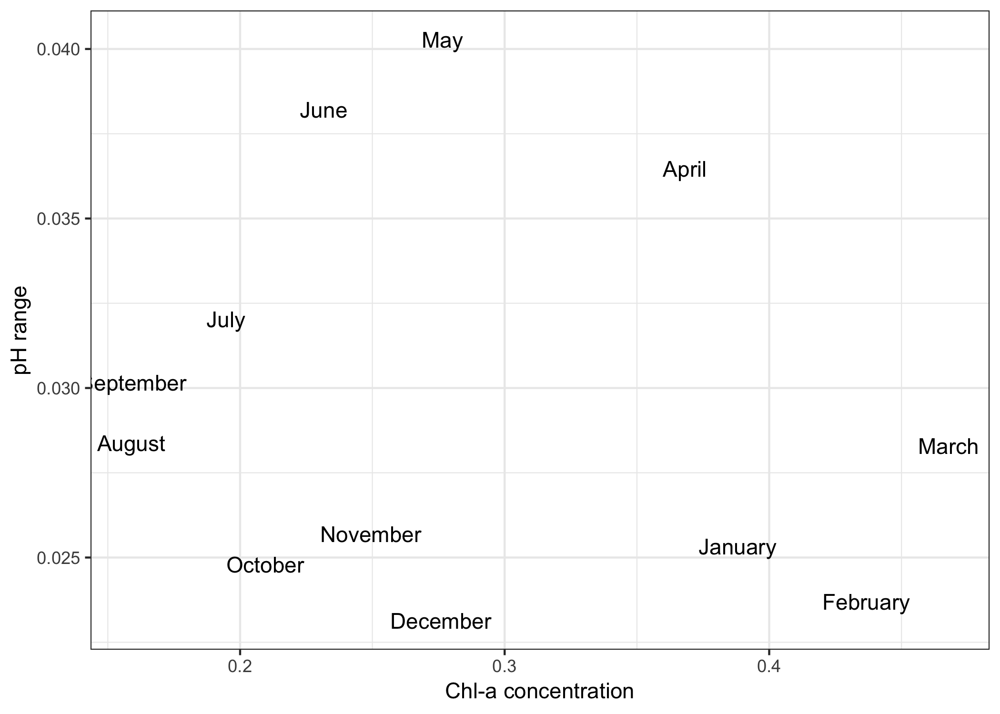
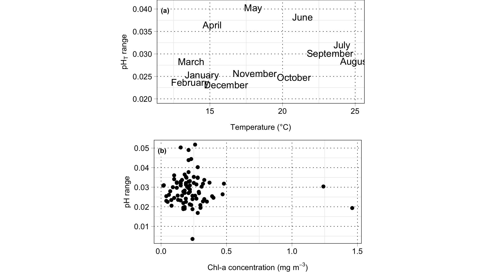


## CO2
```{r CO2, include=FALSE}
CO2_pr <- tbl_df(
  read_csv(file=paste0(path,"/data/CO2_data_PlateauRosa_daily_1993-2015_R.csv"), col_names=TRUE, skip=7)
) %>%
  rename(dt=date) %>%
  mutate(year=year(dt)) %>%
  filter(dt >= "2007-01-01")
NAs_by_year <- summarise(group_by(CO2_pr, year), NAs=sum(is.na(atm_CO2))) # N NAs per year
duration <- CO2_pr$dt[length(CO2_pr$dt)] - CO2_pr$dt[1]
CO2_pr_zoo <- zooreg(CO2_pr$atm_CO2, order.by=CO2_pr$dt) # create zoo time series
CO2_pr_zoo_i <- na.approx(CO2_pr_zoo) # interpolate NAs
CO2_pr_i <- tbl_df(fortify.zoo(CO2_pr_zoo_i)) %>% # change to df
  rename(dt=Index, atm_CO2=CO2_pr_zoo_i) %>%
  mutate(year=year(dt), monthd = month(dt), month = month(dt, label = TRUE, abbr = FALSE))
# add seawater pCO2
tmp <- ungroup(mean0m) %>%
  select(sampling_date, mean_pCO2)
tmp$dt <- as.Date(tmp$sampling_date)
CO2_pr_i <- left_join(CO2_pr_i, tmp)
# Calculate monthly means
tmp <- CO2_pr_i %>%
  group_by(monthd) %>%
  summarise(atm_CO2__month = mean(atm_CO2, na.rm = TRUE))

# Calculate anomalies
ano_atm_CO2 <- left_join(ungroup(CO2_pr_i), tmp, by = "monthd") %>%
  mutate(atm_CO2_ano = atm_CO2 - atm_CO2__month)

#regression atmospheric CO2
lms <- summary(lm(data = CO2_pr_i, atm_CO2 ~ decimal_date(dt)))
prob <- pf(lms$fstatistic[1],lms$fstatistic[2],lms$fstatistic[3],lower.tail=FALSE)
reg_atm_CO2 <- cbind(as.numeric(c(lms$coefficients[2,1], lms$coefficients[2,2], 
                               lms$coefficients[2,4], lms$coefficients[1,1],
                          lms$coefficients[1,2],
                          lms$coefficients[1,4], lms$fstatistic[1], lms$fstatistic[3], lms$r.squared, prob)))
colnames(reg_atm_CO2) <- c("atm_CO2 interpolated")
row.names(reg_atm_CO2) <- c("Slope", "SE Slope", "P Slope","Intercept","SE int.","P int.", "F", "df",
                    "R2","P value")

#regression atmospheric CO2 anomalies
lms <- summary(lm(data = ano_atm_CO2, atm_CO2_ano ~ decimal_date(dt)))
prob <- pf(lms$fstatistic[1],lms$fstatistic[2],lms$fstatistic[3],lower.tail=FALSE)
reg_atm_CO2_ano <- cbind(as.numeric(c(lms$coefficients[2,1], lms$coefficients[2,2], 
                               lms$coefficients[2,4], lms$coefficients[1,1],
                          lms$coefficients[1,2],
                          lms$coefficients[1,4], lms$fstatistic[1], lms$fstatistic[3], lms$r.squared, prob)))
colnames(reg_atm_CO2_ano) <- c("ano_atm_CO2")
row.names(reg_atm_CO2_ano) <- c("Slope", "SE Slope", "P Slope","Intercept","SE int.","P int.", "F", "df",
                    "R2","P value")
# bind the two regression tables
reg_atm_CO2 <- cbind(reg_atm_CO2, reg_atm_CO2_ano)

# plots CO2
# CO2_pr_i_melt <- CO2_pr_i %>%
#   select(dt, atm_CO2, mean_pCO2) %>%
#   melt(id.var = "dt")
CO2_pr_i_melt <- CO2_pr_i %>%
  select(dt, atm_CO2, mean_pCO2) %>%
  gather(key = variable, value=value, -dt, na.rm = TRUE)

fig_CO2_time_series <- ggplot(data=CO2_pr_i_melt) +
  geom_point(aes(x=dt, y=value, colour=variable)) +
  geom_smooth(aes(x=dt, y=value,color=variable), method = "lm") +
  labs(title=NULL, x="Time", y="CO2") +
  Mytheme() +
  theme(legend.position="top") +
  guides(col = guide_legend(ncol = 2, byrow = TRUE))
  annotation_custom(grob_A)

fig_CO2_ano <- ggplot(data = ano_atm_CO2, aes(x = as.POSIXct(dt), y = atm_CO2_ano)) +
  scale_x_datetime(breaks = date_breaks("2 year"), labels = date_format("%Y")) +
  geom_point(colour="orange", na.rm=TRUE, size=size_point) + 
  geom_smooth(method=lm, colour="black", fill="grey", size=0.6) +
  labs(title=NULL, x="Time", y=expression(paste("Atmospheric ", CO[2]))) +
  Mytheme() +
  annotation_custom(grob_B)

fig_delta_CO2 <- ggplot(data = CO2_pr_i, aes(x = as.POSIXct(dt), y = mean_pCO2 - atm_CO2), na.rm=TRUE) +
  scale_x_datetime(breaks = date_breaks("2 year"), labels = date_format("%Y")) +
  geom_point(colour="orange", na.rm=TRUE, size=size_point) + 
  #geom_smooth(method=lm, colour="black", fill="grey", size=0.6) +
  labs(title="Positive values indicate a source for the atmosphere", x="Time", y=expression(paste("Seawater ", pCO[2], " - atmospheric ", CO[2]))) +
  Mytheme() +
  geom_hline(yintercept = 0)
  
g <- arrangeGrob(fig_CO2_time_series, fig_CO2_ano, ncol=1)
ggsave("figures/fig_atm_CO2.png", g)
```

Atmospheric concentration of CO2 measured at Plateau Rosa from 1993 to 2015 were downloaded from <http://ds.data.jma.go.jp/gmd/wdcgg/cgi-bin/wdcgg/download.cgi?index=PRS645N00-RSE&param=200612120114&select=inventory>. Note that contributors should be contacted for proper acknowledgement for use of the data or offer of co-authorship
<http://ds.data.jma.go.jp/gmd/wdcgg/cgi-bin/wdcgg/accessdata.cgi?lang=&contributor_index=200612120057>

There are missing data:

```{r kable NAs atm CO2}
  kable(NAs_by_year, digits = c(0,0), padding = 0, caption="Number of days without atmospheric CO2 data.")
```

Missing values were filled by linear interpolation between nearest values in order to obtain the same sampling number per year. The rate of increase was calculated by regressing the CO$_2$ concentration (`r round(reg_atm_CO2[1,1], digit=2)` ppm per year) and the anomaly (`r round(reg_atm_CO2[1,2], digit=2)` ppm per year) following subtraction of monthly means against time.

The rate of increase of seawater pCO2 (`r round(reg_var_1m[7,1], digit=2)` uatm per year) is much larger than that of atmospheric CO2 (`r round(reg_atm_CO2[1,1], digit=2)` ppm per year).


```{r Table reg atm CO2}
  kable(reg_atm_CO2, digits = c(2,2), caption="Regressions of atmospheric CO2 (time series and anomalies).")
```

```{r deffayes plot}
ct <- seq(2155e-6, 2300e-6, length.out=20)
at <- seq(2455e-6, 2600e-6, length.out=20)
grid_data <- data.frame(ct=ct, at=at)
zz <- tbl_df(expand.grid(ct,at))
colnames(zz) <- c("ct", "at")
zz2 <- carb(flag=15, var1=zz$at, var2=zz$ct, S=38, T=18, P=0)
zz$pCO2 <- zz2$pCO2
zz$CO3 <- zz2$CO3
zz$pH <- zz2$pH
deff <- ggplot() + 
  geom_contour(data=zz, aes(x=ct*1e6, y=at*1e6, z=pH), stat = "contour", binwidth = 0.1, na.rm=TRUE) +
stat_contour(aes(colour=..level..), breaks=c(8, 8.1, 8.2)) +
  geom_point(data=mean0m, aes(x = mean_dic, y=mean_ta, col=as.factor(year)), na.rm=TRUE) + 
  scale_color_viridis(name="Year", discrete=TRUE, option="plasma")

deff_monthly <- ggplot() + 
  stat_contour(data=zz, aes(x=ct*1e6, y=at*1e6, z=pH), breaks=seq(8,8.2, by=0.1), col="blue", na.rm=TRUE) +
  geom_text(data=mean0m_month, aes(x = ct, y=at, label=monthd, col=as.factor(year)), na.rm=TRUE) + 
    lims(x=c(2190, 2275), y=c(2510, 2580)) +
scale_color_viridis(name="Year", discrete=TRUE, option="plasma") +
    labs(title="Point B", 
       x=expression(paste(italic(C)[T]," ","(",mu, mol.kg^-1,")")),
       y=expression(paste(italic(A)[T]," ","(",mu, mol.kg^-1,")")))

deff_monthly <- ggplot() +
  stat_contour(
  data = zz,
  aes(x = ct * 1e6, y = at * 1e6, z = pH),
  breaks = seq(8, 8.2, by = 0.05),
  col = "blue",
  na.rm = TRUE
  ) +
  geom_text(data = mean0m_month,
  aes(x = ct, y = at, label = substr(mean0m_month$year, 3, 4), col = as.factor(monthd)),
  na.rm = TRUE) +
  lims(x = c(2190, 2275), y = c(2510, 2580)) +
  labs(title="Point B, coded with month (color) and year (digits)", 
       x=expression(paste(italic(C)[T]," ","(",mu, mol.kg^-1,")")),
       y=expression(paste(italic(A)[T]," ","(",mu, mol.kg^-1,")"))) +
  scale_color_viridis(name = "Month", discrete = TRUE, option = "plasma")
  #direct.label(deff_monthly, "top.pieces")
  ggsave(file = "figures/fig_deffayes_monthly.png", deff_monthly,
  width = 15, height = 15, units = "cm")
  
# Yearly Deffayes plot
tmp <- summarize_all(group_by(mean0m_month, year), mean)
deff_yearly <- ggplot() +
  stat_contour(
  data = zz,
  aes(x = ct * 1e6, y = at * 1e6, z = pH),
  breaks = seq(8, 8.2, by = 0.05),
  col = "blue",
  na.rm = TRUE
  ) +
  geom_text(data = tmp ,
  aes(x = ct, y = at, label = substr(tmp$year, 3, 4)),
  na.rm = TRUE) +
  lims(x = c(2190, 2275), y = c(2510, 2580)) +
  labs(title="Point", 
       x=expression(paste(italic(C)[T]," ","(",mu, mol.kg^-1,")")),
       y=expression(paste(italic(A)[T]," ","(",mu, mol.kg^-1,")"))) +
  scale_color_viridis(name = "Month", discrete = TRUE, option = "plasma")
  #ggsave(file = "../figures/fig_deffayes_monthly.png", deff_monthly, width = 15, height = 15, units = "cm")

# Quarterly Deffayes plot
tmp <- ungroup(mean0m) %>%
  select(mean_dic, mean_ta, year, quarter) %>%
  rename(ct=mean_dic, at=mean_ta) %>%
  group_by(year, quarter) %>%
  summarize_all(mean,na.rm=TRUE)
deff_quarterly <- ggplot() +
  stat_contour(
  data = zz,
  aes(x = ct * 1e6, y = at * 1e6, z = pH),
  breaks = seq(8, 8.2, by = 0.05),
  col = "blue",
  na.rm = TRUE
  ) +
  geom_text(data = tmp ,
  aes(x = ct, y = at, label = tmp$quarter, col=as.factor(tmp$year)),
  na.rm = TRUE) +
  lims(x = c(2190, 2275), y = c(2510, 2580)) +
  labs(title="Point", 
       x=expression(paste(italic(C)[T]," ","(",mu, mol.kg^-1,")")),
       y=expression(paste(italic(A)[T]," ","(",mu, mol.kg^-1,")"))) +
  scale_color_viridis(name = "Month", discrete = TRUE, option = "plasma")
```

Test of a Deffayes plot.
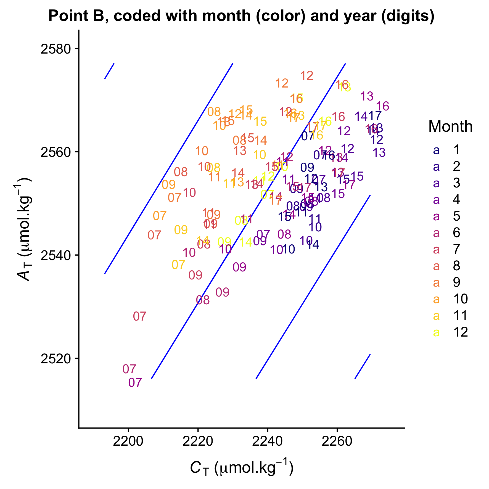
## seafet pH
```{r seafet pH, echo=FALSE, warning = FALSE, message = FALSE, out.width='70%'}

```

## SAMI pH
```{r sami pH, echo=FALSE, warning = FALSE, message = FALSE, out.width='70%'}

```

## EOL
Here we read data from the EOL ctd and calculate total alkalinity using the relationship with salinity. We also compare salinity and temperature with the SOMLIT data.

```{r EOL data, echo=FALSE, warning = FALSE, message = FALSE, out.width='70%'}

```

## ctd_hydro
```{r ctd_hydro, echo=FALSE, warning = FALSE, message = FALSE, out.width='70%'}

```


## pH comparaison

### **continuous pH time series**
Includes SAMI and seafet

### **spectro vs calculated pH (T insitu)**
<br>
```{r plots pH spectro15 vs calc15, echo=FALSE, warning = FALSE, message = FALSE, out.width='70%'}

fit <- lmodel2(data = continuous_discrete, pHcalc_ptB ~ pHspec_Tptb, nperm = 99)
titre <- "pH calculated from AT and CT vs spec pH, Point B"
p_spec_cal <- ggreg2(fit, "pHspec_Tptb", "pHcalc_ptB") +
  geom_line(aes(x = pHspec_Tptb, y = pHspec_Tptb), linetype = 2) +
  labs(x=expression(paste("Spectro ",pH[T], ", T in situ")), y=expression(paste("Calculated ",pH[T], ",T in situ"))) +
  mytheme + theme(legend.position="bottom")
  ggsave(file = "figures/fig_comparison_pH.png", p_spec_cal,  width = 15, height = 15, units = "cm")

print(p_spec_cal)
```
